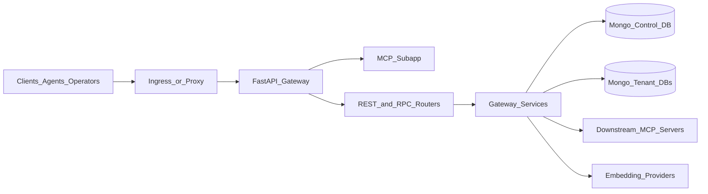
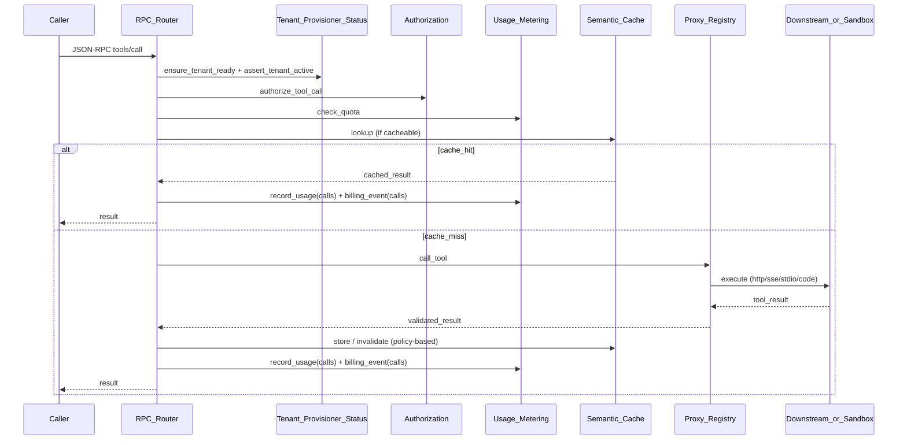

# Gateway Architecture

This document describes the current as-built architecture of `mdb-mcp-gateway`.
It is the system map for engineers and operators who need to understand request
flow, data boundaries, and subsystem responsibilities without reverse-reading
the entire codebase.

Companion docs:

- [`README.md`](README.md) for quick start and feature overview.
- [`DEPLOYMENT.md`](DEPLOYMENT.md) for deployment mechanics.
- [`PRODUCTION.md`](PRODUCTION.md) for operational hardening.
- [`SECURITY.md`](SECURITY.md) and [`NETWORK-SECURITY.md`](NETWORK-SECURITY.md)
  for security controls and trust boundaries.
- [`docs/API.md`](docs/API.md) for REST and JSON-RPC contracts.

## 1) System Overview

The gateway is a FastAPI app that exposes:

- REST control/ops routes (`/admin`, `/health`, `/metrics`, `/ui`)
- JSON-RPC data plane route (`POST /rpc`)
- mounted FastMCP sub-app (`/mcp`)

The process is stateless. Durable state lives in MongoDB (control DB + tenant
DBs). Horizontal replicas are coordinated via Mongo-backed metadata (for
example registry watcher resume state).

## 2) Runtime Composition

### 2.1 App wiring

`gateway/app.py` configures:

- middleware chain:
  - `RequestContextMiddleware`
  - `MetricsMiddleware` (optional via `ENABLE_METRICS`)
  - `GuardrailsMiddleware`
  - `RbacMiddleware`
  - `RateLimitMiddleware`
  - `AuthMiddleware`
- routers:
  - `/health`, `/metrics`, `/rpc`, `/admin`, `/ui` (when enabled)
- mounted `/mcp` FastMCP app

Startup lifecycle includes:

- Mongo connect
- active embedding config refresh
- optional bootstrap/provision of default tenant
- registry watcher start
- optional sandbox pool prewarm

Shutdown lifecycle includes watcher stop, proxy registry close, sandbox
executor shutdown, and Mongo disconnect.

### 2.2 Request flow (`tools/call`)

For the primary data-plane path (`POST /rpc`, method `tools/call`), the flow is:

Notes:

- quota is enforced before invocation.
- cache hits are billable calls (by design).
- for `transport="code"`, proxy execution routes to the local sandbox path and
  separately meters `sandbox_ms`.

## 3) Data Architecture

### 3.1 Control plane vs tenant plane

| Plane | Database | Key collections | Purpose |
| --- | --- | --- | --- |
| Control | `MONGODB_DB_NAME` | `tenants`, `users`, `usage_counters`, `usage_events`, `tenant_quotas`, `watcher_state`, `embedding_status`, `gateway_config`, `guardrail_signatures`, `rate_limit_buckets`, `session_context` | global identities, policy, status, and metering |
| Tenant | `tenant_<sanitized>_<hash>` | `routing_registry`, `tool_catalog`, `semantic_cache`, `pending_actions`, `server_secrets`, `audit_telemetry` | per-tenant routing, discovery, cache, approvals, per-server env secrets, and audit telemetry |

Tenant DB naming is deterministic and collision-safe (`database/mongo.py`).

### 3.2 Provisioning model

`services/tenant_provisioner.py` ensures tenant readiness by:

- creating/upserting control-plane tenant records
- creating required collections/indexes
- creating vector/search indexes (`tool_catalog`, `semantic_cache`)
- creating QE artifacts when enabled
- caching known-ready tenants in-process for hot-path optimization

## 4) Subsystem Deep Dives

### 4.1 Sandbox execution and warm pool

Relevant modules:

- `services/sandbox_executor.py`
- `services/sandbox_pool.py`
- `services/sandbox_worker.py`
- `services/proxy_registry.py` (code tool execution path)

Execution modes:

- throwaway worker per call (`WasmExecutor`)
- pooled prewarmed workers (`PooledWasmExecutor`, when `SANDBOX_POOL_SIZE > 0`)

Isolation model:

- each job runs with resource bounds (fuel, memory, wall timeout, output cap)
- requirements install is two-gate allowlisted (operator ceiling ∩ tenant policy) and wheel-only
- per-call temp workspace
- protocol-framed worker responses with strict validation
- no sockets in the wasm jail; all external I/O (DB, sibling tools, outbound HTTP)
  is relayed to the host over the `/job/rpc` file channel and re-validated there

Host bridges (relayed over `/job/rpc`, each opt-in via settings):

- `context.db` — tenant-scoped DB, gated by `action_type`
- `context.tools` — re-authorized sibling code-tool calls
- `context.http` — outbound HTTPS through the egress firewall (SSRF denylist +
  `tenant ∩ global` allowlist + IP pinning); always deny-by-default for code,
  https-only, write methods gated by `action_type`, host-side secret injection

Pool behavior:

- prewarm N workers
- lease free worker on submit
- recycle poisoned/expired workers
- background refill to target size
- pool lifecycle metrics + worker gauge

### 4.2 Semantic cache and cache migration

Relevant modules:

- `services/cache_manager.py`
- `services/cache_migration.py`

Cache writes store:

- tool arguments hash
- embedding vector + model metadata
- embedding version
- TTL expiration

Cache reads use Atlas `$vectorSearch` scoped by tenant + embedding version and
threshold-gate the top hit before returning results.

Migration modes:

- `status`: report counts by embedding version
- `purge`: delete stale versions
- `reembed`: rewrite stale entries into the active embedding space

### 4.3 Tenant provisioning and status

Relevant modules:

- `services/tenant_provisioner.py`
- `services/tenant_status.py`
- `gateway/routers/admin/` (resource-split router package; tenant lifecycle lives in
  `gateway/routers/admin/tenants.py`)

Responsibilities:

- create tenant control records and DB/index primitives
- enforce unknown-tenant behavior (`UnknownTenantError` when auto-provision is off)
- support suspend/resume abuse-control state
- cache active/suspended status for hot-path checks with TTL

### 4.4 Usage metering and quota enforcement

Relevant modules:

- `services/usage_metering.py`
- `gateway/routers/rpc.py`
- `services/proxy_registry.py`

Metering channels:

- `calls`: incremented for each successful billable invocation (live or cache hit)
- `sandbox_ms`: incremented for successful code-tool sandbox runtime

Storage:

- counters in `usage_counters` (by tenant + period)
- quota settings in `tenant_quotas`
- event ledger in `usage_events`

Quota gate:

- checked before tool execution in `tools/call`
- returns JSON-RPC rate-limited error on exceed

### 4.5 Embedding config and reprovisioning

Relevant modules:

- `services/embedding_config.py`
- `services/embedding_reprovision.py`
- `services/cache_migration.py`
- `services/guardrails.py`

The active embedding provider/model is admin-managed and persisted in control
DB. When changed, reprovisioning realigns:

- tenant `tool_catalog` embeddings
- tenant vector indexes (recreate with new dimensions)
- semantic cache entries (via migration service)
- guardrail signature embeddings

Reprovision status is persisted in control DB for admin polling.

## 5) Configuration Model

`config/settings.py` is the central settings contract. Important architecture
switches include:

- auth and identity (`AUTH_MODE`, JWT/JWKS settings)
- tenant lifecycle (`AUTO_PROVISION_TENANTS`, `AUTO_BOOTSTRAP`)
- embeddings (`EMBEDDING_*`, provider-specific fields)
- sandbox runtime (`CODE_TOOL_EXECUTION_ENABLED`, `CODE_EXECUTOR`,
  `SANDBOX_*`, pool settings)
- quotas and rate limit (`DEFAULT_QUOTA_*`, `RATE_LIMIT_*`)
- egress controls (`EGRESS_*`)
- QE and KMS (`QE_ENABLED`, `KMS_PROVIDER`, key settings)

Production mode enforces fail-closed safety checks at boot.

## 6) Observability Architecture

### 6.1 Metrics

`services/metrics.py` exports Prometheus counters/histograms/gauges for:

- request count and latency
- downstream errors
- cache events
- auth failures
- usage events and quota blocks
- egress blocks
- sandbox pool events and pool worker gauge

### 6.2 Logging and tracing

- optional JSON logs (`LOG_JSON=true`)
- request IDs propagated via middleware and telemetry
- optional OpenTelemetry spans around RPC handling/downstream calls

### 6.3 Tenant telemetry

Per-tenant audit telemetry events are stored in each tenant DB
(`audit_telemetry`) and surfaced via admin endpoints.

## 7) Security Boundaries

The gateway is a policy enforcement and brokering layer, not a complete
perimeter.

Built-in controls include:

- bearer auth + admin session auth
- RBAC and per-tool scope authorization
- CSRF checks for cookie-authenticated state-changing admin routes
- tenant isolation by DB and by query-level tenant filters
- downstream egress allowlisting with DNS re-resolution + IP pinning
- encrypted-at-rest secrets (Fernet and optional QE pathways)
- sandboxed code-tool execution path with explicit runtime limits

External controls expected around the gateway:

- TLS termination / ingress policy
- network segmentation
- secret management and key custody
- downstream service-side token verification

## 8) Known Gaps / Roadmap

Recently shipped (opt-in, default no-op so behavior is unchanged until configured):

- Tenant soft-delete + retention: `DELETE /admin/tenants/{id}` is a reversible
  soft-delete by default (with a `POST .../restore` and a background purge
  reaper that drops the DB before removing the control doc); `?hard=true`
  keeps the immediate hard delete.
- Streaming usage/telemetry export: `GET /admin/tenants/{id}/usage/export`
  (CSV) and `GET /admin/telemetry/export` (JSONL) stream over a cursor with no
  load-all ceiling.
- Sandbox pool max-age + health sweep: idle workers are proactively retired by
  age and ping-health, complementing the reactive `max_jobs` recycle.
- Quota preflight: code tools whose projected worst-case sandbox cost cannot fit
  the remaining `sandbox_seconds` quota are rejected before execution, via a
  single shared helper enforced identically on `/rpc` and `/mcp`.
- OOM-safe cache migration: status/purge/reembed and catalog reprovision stream
  in bounded pages with batched embed/delete instead of full-collection loads.

Intentionally deferred follow-up work:

1. Reprovision control plane ergonomics
   - cancellation/pause semantics and resumable checkpoints.
2. Tenant lifecycle extension
   - deprovision dry-run/confirmation policy beyond the retention window.
3. Metering/reporting expansion
   - richer event analytics windows beyond raw streamed export.

## 9) Source Map

Primary code entry points for this document:

- `gateway/app.py`
- `gateway/routers/rpc.py`
- `gateway/routers/admin/` (resource-split admin router package)
- `services/proxy_registry.py`
- `services/sandbox_executor.py`
- `services/sandbox_pool.py`
- `services/cache_manager.py`
- `services/cache_migration.py`
- `services/tenant_provisioner.py`
- `services/tenant_status.py`
- `services/usage_metering.py`
- `services/embedding_reprovision.py`
- `services/metrics.py`
