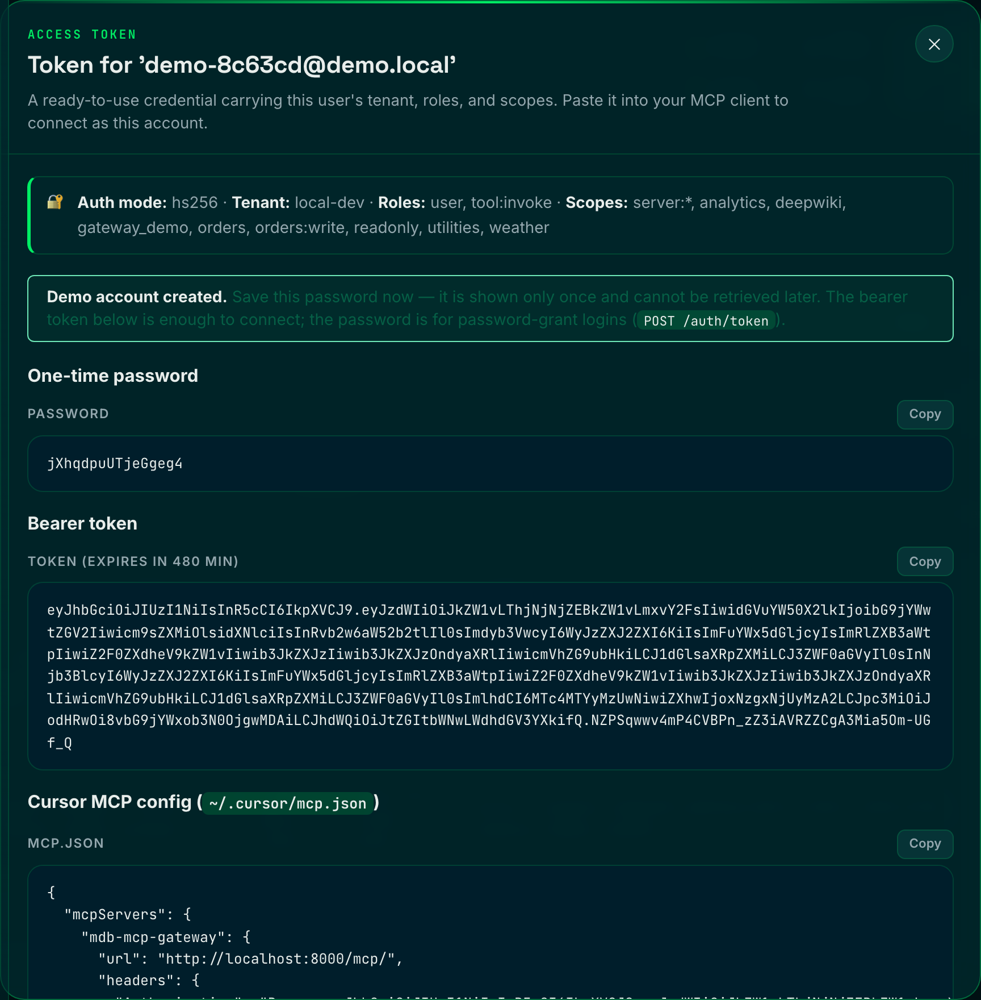
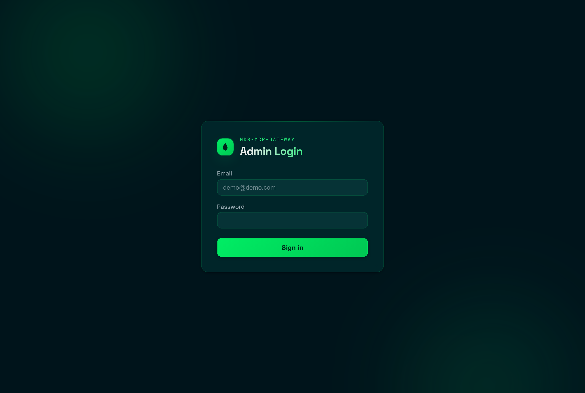
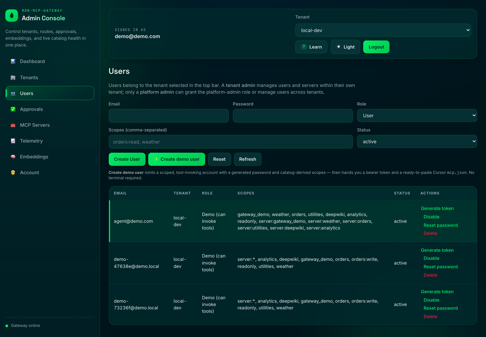

# Authentication & Authorization

How the gateway authenticates callers, authorizes requests, and brokers
credentials to downstream MCP servers. This is the source-of-truth companion to
the higher-level summary in [`SECURITY.md`](SECURITY.md).

There are **two independent trust boundaries**, and it helps to keep them apart:

| Boundary | Direction | Who authenticates whom | Where it lives |
| --- | --- | --- | --- |
| **Inbound** | client → gateway | a client (MCP client, admin UI, automation) proves identity to the gateway | `gateway/middleware/auth.py`, `gateway/middleware/rbac.py`, `gateway/routers/auth.py` |
| **Downstream** | gateway → upstream MCP server | the gateway presents a workload identity (or nothing) to a third-party server | `services/credential_broker.py`, `services/proxy_registry.py` |

End-user authorization is always enforced **inbound, before** any downstream
call is made. The downstream credential is the gateway's own workload identity,
never the end user's token.

---

## 1. Inbound: client → gateway

### 1.1 Auth modes (`AUTH_MODE`)

Security is **always enforced** — there is no "off" mode. A single setting picks
how inbound bearer tokens are verified (`config/settings.py`):

| `AUTH_MODE` | Bearer verification | Use |
| --- | --- | --- |
| `hs256` (default) | symmetric HMAC against `JWT_SECRET` | shared-secret deployments, local dev, simple CI |
| `jwks` | asymmetric RS256 against a JWKS (your IdP) | production / bring-your-own-IdP OAuth2/OIDC |

Every caller on `/rpc` and `/mcp` must present a verified credential and clear
the RBAC gate below; there is no trusted-by-default path.

### 1.2 Request pipeline

Middleware is applied outermost-first (`gateway/app.py`):

```
AuthMiddleware → RateLimitMiddleware → RbacMiddleware → GuardrailsMiddleware
→ MetricsMiddleware → RequestContextMiddleware → CORS → routers
```

`AuthMiddleware` runs first and hydrates `request.state` for everyone
downstream:

- `tenant_id`, `user_id`
- `roles`, `scopes`
- `is_admin_principal` — `true` for any principal allowed to load the admin
  console: an admin-tier role (`admin`/`platform-admin`) **or** the read-only
  `viewer` role.
- `is_read_only_principal` — `true` for a `viewer` that has **no** full-admin
  role. It reaches the console but every mutating `/admin` call is refused (a
  full admin that also carries `viewer` is never downgraded).
- `admin_auth_via_cookie` — drives CSRF enforcement
- `authenticated_via_basic`

It then tries, in order:

1. **Admin session** (cookie `admin_session` *or* `Authorization: Bearer`).
   Verified by `services/admin_session.verify_session` (HS256 over
   `ADMIN_SESSION_SECRET`, falling back to `JWT_SECRET`). The token embeds
   `tenant_id` + `roles`; only `admin`/`platform-admin` roles make the caller an
   admin principal. This is the token issued by both the admin UI login **and**
   `POST /auth/token`.
2. **Optional HTTP Basic on the MCP surface** (`/rpc`, `/mcp`), gated by
   `MCP_BASIC_AUTH_ENABLED` (default off).
   Credentials are decoded and resolved per request via
   `resolve_login_principal`. A bad pair returns `401` with
   `WWW-Authenticate: Basic realm="mcp"`.
3. **Bearer JWT** (the normal path). Decoded per `AUTH_MODE`:
   - `hs256`: `jwt.decode(token, JWT_SECRET, algorithms=[JWT_ALGORITHM])`
   - `jwks`: RS256 verified against the resolved JWKS signing key.

   `JWT_ISSUER` and `JWT_AUDIENCE` are enforced whenever they are configured.
   Roles come from the `roles` claim; scopes from `groups` or `scopes`.

### 1.3 Public paths (no token required)

These bypass bearer enforcement in every mode (see `AuthMiddleware`):

- **Observability**: `/health`, `/health/*`, `/metrics` (probes/scrapers can't
  carry a token; restrict at the network layer — see
  [`NETWORK-SECURITY.md`](NETWORK-SECURITY.md)).
- **Inbound auth endpoints**: `/auth/token`,
  `/.well-known/oauth-protected-resource`.
- **Admin UI** (when enabled): `<ui>/login`, `<ui>/logout`, `/static/*`. The UI
  itself is then gated by RBAC.

### 1.4 Failure semantics

`AuthMiddleware` keeps the client-facing body opaque but records the real reason
as a metric label + structured log:

- **Bad / missing / expired token → `401`** (`{"detail": "Invalid bearer token."}`).
- **JWKS unreachable → `503`** (retryable, server-side). This deliberately
  separates "the user sent a bad token" from "our IdP is down" so a JWKS outage
  never looks like a client error.
- When OAuth discovery is advertised, `401`s include a
  `WWW-Authenticate: Bearer resource_metadata="…/.well-known/oauth-protected-resource"`
  hint (RFC 9728).

### 1.5 JWKS resolver hardening (`jwks` mode)

`JWKSKeyResolver` caches keys with a TTL (`JWKS_CACHE_TTL_SECONDS`). An unknown
`kid` triggers a single out-of-band refresh, **throttled** to at most once per
`JWKS_MIN_REFRESH_SECONDS`, so a flood of bogus `kid`s (typos or a probe) can't
amplify into a request storm against your IdP. Refreshes are serialized under a
lock so concurrent misses collapse into one fetch. Keys can also be loaded from
`JWKS_LOCAL_PATH` for air-gapped setups.

---

## 2. Inbound auth endpoints (`gateway/routers/auth.py`)

These let an MCP client authenticate to the gateway's own "virtual MCP" surface
without an external IdP.

### 2.1 `POST /auth/token` — username/password → bearer

OAuth2 **Resource Owner Password Credentials** grant. Accepts form-encoded or
JSON. Exchanges credentials for the same signed session token the admin UI
issues — which `AuthMiddleware` already accepts on `/rpc` and `/mcp` in every
`AUTH_MODE`.

```bash
curl -X POST http://localhost:8000/auth/token \
  -d 'grant_type=password&username=svc@example.com&password=…'
# → {"access_token":"<jwt>","token_type":"bearer","expires_in":28800}
```

```bash
# Then call the gateway with the bearer:
curl http://localhost:8000/rpc \
  -H "Authorization: Bearer <jwt>" \
  -H 'Content-Type: application/json' \
  -d '{"jsonrpc":"2.0","id":1,"method":"tools/list"}'
```

- Credentials resolve via `resolve_login_principal` (`services/users.py`):
  managed users (control-DB `users`) first, then the `ADMIN_EMAIL` /
  `ADMIN_PASSWORD` bootstrap superuser.
- `expires_in` equals `ADMIN_SESSION_TTL_SECONDS` (matches the minted token TTL).
- Error bodies follow OAuth2 shape: `invalid_request` (missing fields, `400`),
  `unsupported_grant_type` (anything but `password`, `400`), `invalid_grant`
  (bad credentials, `401`).
- The endpoint is **rate-limited** (`RateLimitMiddleware`) for brute-force
  protection.

> Getting a token authenticates you; it does **not** bypass authorization. The
> principal still needs `admin`, `tool:invoke`, or `tool:read` to reach `/rpc`,
> and `admin`/`tool:invoke` specifically to **call** a tool (see §3).

Not a curl person? The admin console mints the same scoped bearer with one click
(**Users → Generate token**, or **Create demo user**) and shows the one-time
password, the token, and a ready-to-paste client snippet:



### 2.2 `GET /.well-known/oauth-protected-resource` — discovery (RFC 9728)

Advertises the configured authorization server so spec-compliant clients can
discover it. Present when `AUTH_MODE=jwks` **or** `OAUTH_METADATA_ENABLED=true`;
otherwise returns `404`.

```json
{
  "resource": "https://gateway.example.com",
  "authorization_servers": ["https://idp.example.com"],
  "jwks_uri": "https://idp.example.com/.well-known/jwks.json",
  "audience": "mcp-gateway",
  "bearer_methods_supported": ["header"]
}
```

**OAuth is bring-your-own-IdP.** The gateway is an OAuth2/OIDC *resource server*
(via `AUTH_MODE=jwks`); it does **not** implement an authorization server. This
endpoint only points clients at the IdP you already run.

---

## 3. Authorization (RBAC — `gateway/middleware/rbac.py`)

Runs right after `AuthMiddleware`, reading the hydrated `request.state`.

**Role hierarchy:** `platform-admin` → `tenant-admin` (role `admin`) → `user`.

**Principal / role matrix** (least privilege — hand out the narrowest one that
does the job):

| Role | Console (`/admin`, `/ui`) | Data plane (`/rpc`, `/mcp`) | Intended for |
| --- | --- | --- | --- |
| `platform-admin` | full read/write, **all tenants** | full | operators |
| `admin` (tenant-admin) | full read/write, **own tenant** | full | tenant owners |
| `viewer` | **read-only** (loads UI + views tool source; every mutation `403`) | — | safe showcase / auditors |
| `tool:invoke` | — | `tools/list` + `tools/search` + **`tools/call`** | apps & agents that run tools |
| `tool:read` | — | `tools/list` + `tools/search` only (**`tools/call` → `403`**) | discover-only MCP tokens |
| `user` | authenticated, no console | — (needs an invoke/read role to reach tools) | base identity |

- **`/admin`** requires an admin principal, else `401`. Unsafe methods
  (`POST/PUT/PATCH/DELETE`) authenticated **via cookie** also require a matching
  CSRF token (`x-csrf-token` header vs `csrf_token` cookie, compared with
  constant-time `hmac.compare_digest`). Bearer-authenticated admin API calls are
  not subject to CSRF.
  - **Read-only console (`viewer`).** A single choke point here refuses every
    unsafe method on `/admin` when `is_read_only_principal` is set →
    `403 Read-only access: mutations are disabled.` `GET`/`HEAD` (UI load,
    tool-source view, exports) stay allowed, so a viewer can explore everything
    without being able to change it. Because it is enforced centrally, every
    mutating admin endpoint is covered without a per-handler guard.
- **Admin UI** (non-login paths) requires an admin principal, else a `303`
  redirect to the login page.
- **`/rpc` and `/mcp`**: the JSON-RPC data plane and the mounted FastMCP
  meta-tool surface are held at **parity** — the coarse gate below always applies
  to both:
  1. Looks up `session_context` for `(tenant_id, user_id)`. A managed user whose
     mirrored `status` is not `active` is cut off immediately with `403 Account
     suspended` — a standing token stops working the instant an admin disables
     the account. Principals with no `session_context` doc (e.g. workload
     tokens) are left untouched.
  2. Merges any `session_context.roles` into the request roles.
  3. Requires `admin`, `tool:invoke`, **or** `tool:read`, else
     `403 Insufficient permissions`. `tool:read` clears this coarse gate so a
     discover-only token can list/search; the **per-call** invoke check in
     `services/authorization.py` still refuses `tools/call` to anything without
     `tool:invoke` (reason `invoke_not_permitted`).

`session_context` is kept in lockstep with the `users` collection by
`sync_session_context`, so a user managed in the console is authorized
consistently whether they arrive via the admin API (cookie) or `/rpc`/`/mcp`
(bearer with the same `sub`/`tenant_id`).

### 3.1 `/mcp` meta-tool authorization (`gateway/mcp_server.py`)

The meta-tools Cursor connects to (`search_tools`, `list_catalog_tools`,
`call_downstream_tool`) authorize identically to `/rpc`, reading the
gateway-verified `request.state` (tenant, roles, scopes) via FastMCP's
`get_http_request()`:

- **Tenant is bound to the verified claim.** The resolved tenant comes from the
  authenticated token, not from tool arguments. A `tenant_id` argument that does
  not equal the verified tenant is rejected with a `ToolError`
  (`cross_tenant_forbidden`) — there is no cross-tenant override on `/mcp`;
  cross-tenant work stays on the platform-admin `/admin` API.
- **Per-call authorization.** `call_downstream_tool` runs the same
  `authorize_tool_call` the `/rpc` `tools/call` path uses. The checks run in this
  order (any failure returns a `ToolError` with a machine `reason`):
  1. tool exists in the tenant catalog, else `tool_not_found`;
  2. the tool is not tenant-**disabled**, else `tool_disabled` (an absolute
     kill-switch that blocks *everyone, including admins* — see §3.2);
  3. `admin` short-circuits to allow (bypasses the remaining checks);
  4. the caller carries `tool:invoke`, else `invoke_not_permitted` (this is what
     keeps a `tool:read`/viewer token discover-only);
  5. the tool is within the tenant **allowlist** (if one is set), else
     `tool_not_allowlisted`;
  6. the caller satisfies the tool's required scopes (server scope + tool
     scopes), else `server_scope_required` / `scope_mismatch`.

  Discovery (`search_tools`, `list_catalog_tools`) is likewise tenant-bound,
  scope-filtered, **and** curation-filtered: tools outside the allowlist or that
  are disabled are hidden from the catalog entirely, so a curated showcase only
  ever surfaces the curated set.
- **Quota, metering, and audit.** After authorization, `call_downstream_tool`
  enforces the tenant usage quota (`ToolError` `quota_exceeded` when the ceiling is
  hit), meters the billable call, and writes an `audit_telemetry` row for the
  outcome (`live_execution_success` / `forbidden` / `quota_exceeded` /
  `tenant_suspended`) under the same `method="tools/call"` label as `/rpc`. The
  billable-call step is shared via `services/data_plane.py` so the two surfaces
  meter identically and cannot drift. Net result: `/mcp` is a full peer of `/rpc`,
  not a weaker bypass.

### 3.2 Read-only tenants & per-tenant tool curation

> See **[READONLY.md](READONLY.md)** for a screenshot-driven walkthrough (freeze a
> tenant, curate tools, hand out a viewer login).

Two orthogonal, admin-controlled overlays let you **safely showcase** a tenant
without risking mutation or exposing the full tool surface
(`services/tenant_status.py`, `services/tenant_tool_policy.py`):

- **Read-only tenant** (`read_only` flag, separate from `status`). The tenant
  stays `active` and fully **discoverable**, but every write/invoke is frozen:
  - `tools/call` on `/rpc` and `/mcp` is refused at the dispatch gate with
    `403` / `tenant_read_only` (`assert_tenant_writable`), *before* authz, quota,
    or any downstream hop;
  - tenant-scoped **config mutations** (server create/patch/delete + env,
    tool-policy edits, server/tool enable-disable, egress, **and user management
    — create / demo / viewer / update / delete**) are refused for tenant-admins
    via `_require_tenant_writable`. Token minting and password self-service stay
    available (they create no tenant state and the data plane is already frozen).
  - **Platform-admin always bypasses** the writable guard — the operator who
    froze the tenant can still configure it and lift the freeze
    (`POST /admin/tenants/{id}/read-only` / `/read-write`).
- **Per-tenant tool policy** (`GET`/`PUT /admin/tenants/{id}/tool-policy`):
  - `allowlist` — fully-qualified `server/name` or a `server/*` wildcard. An
    **empty** allowlist means *unrestricted* (curation is opt-in). When set, any
    tool outside it is hidden from discovery and refused on call
    (`tool_not_allowlisted`).
  - `max_tools` — a cap enforced at server registration (`422` when a mount
    would exceed it); `0` means unlimited.
  - `disabled_tools` — a per-tool kill-switch overlay
    (`POST /admin/tools/{server}/{name}/disable` / `/enable`). A disabled tool is
    hidden from discovery and refused for **everyone, including admins**
    (`tool_disabled`).
- **Server enable/disable** (`POST /admin/servers/{name}/enable` / `/disable`)
  mounts/unmounts a virtual server for the tenant. Tenant-admins may toggle their
  own `tenant`-origin servers; platform-origin servers require platform-admin.
  Blocked when the tenant is read-only (platform-admin bypasses).

Server-side enforcement is the security boundary; the console additionally hides
mutating affordances for read-only principals as UX (`canMutate()`), but the
`403` is the real guard.

---

## 4. Admin sessions & user store

The admin surface (`/ui`, `/admin/*`) is gated by a login in **every** `AUTH_MODE` —
there is no unauthenticated path:



- **Sessions** (`services/admin_session.py`): HS256-signed token, default 8h TTL
  (`ADMIN_SESSION_TTL_SECONDS`). In the UI it rides an **HttpOnly** cookie,
  `Secure` over HTTPS, `SameSite=Lax`. The token carries `tenant_id` + `roles`.
- **Users** (`services/users.py`): control-DB `users` collection. Passwords are
  hashed with PBKDF2-HMAC-SHA256 (`services/passwords.py`); plaintext is never
  stored and the hash is never returned by the API.
- **Bootstrap admin**: `ADMIN_EMAIL` / `ADMIN_PASSWORD` survives only as a
  fallback superuser when the user store is empty or unreachable.

Users belong to the tenant selected in the top bar; a tenant admin manages users
and servers within their tenant, while only a platform admin can grant the
platform-admin role or manage users across tenants. Each row exposes
**Generate token**, enable/disable, password reset, and delete:



---

## 5. Downstream: gateway → upstream MCP server

When the gateway proxies a tool call to a third-party MCP server, the credential
it presents is chosen per `(tenant, server)` by
`metadata.auth.scheme` (`services/credential_broker.py`). **Only two schemes are
supported** — this is intentionally minimal:

| `metadata.auth.scheme` | What the gateway injects |
| --- | --- |
| `jwt` *(default)* | a short-lived **RS256 workload-identity** token: `Authorization: Bearer <jwt>` header + `MCP_DOWNSTREAM_TOKEN` env var |
| `none` | nothing — the downstream server or the tenant owns its own auth |

Key properties:

- **Workload identity, not the user's token.** The token's subject is
  `tenant:<id>:gateway`; audience is `metadata.auth.audience` or the server name.
  A single warm client per `(tenant, server)` is shared across callers, so the
  token can't represent any one caller — caller identity stays in audit logs and
  traces.
- **Third-party auth stays out of the gateway.** Vendor API keys, basic auth, or
  OAuth client-credentials for a downstream service are **not** brokered here.
  Use `scheme=none` and let the downstream/tenant present its own credential
  (e.g. a `stdio` server reading its own env, or a network appliance fronting
  the server).
- **Caching & rotation.** Credentials are cached and reused until they enter the
  `DOWNSTREAM_TOKEN_REFRESH_SKEW_SECONDS` window before expiry. A server config
  change invalidates the cache (and the warm client) so rotation is immediate.
- **TLS guard.** Brokered credentials are never sent to an insecure `http://`
  endpoint unless `DOWNSTREAM_ALLOW_INSECURE_CREDENTIALS=true` (dev only).
- The Admin API only accepts `jwt` or `none` for `metadata.auth.scheme`; any
  other value is rejected at save time.

---

## 6. Settings reference

### Inbound

| Env var | Default | Purpose |
| --- | --- | --- |
| `AUTH_MODE` | `hs256` | `hs256` \| `jwks` (security always enforced) |
| `JWT_SECRET` / `JWT_SECRET_FILE` | `dev-secret` | HS256 verification key |
| `JWT_ALGORITHM` | `HS256` | algorithm for `hs256` mode |
| `JWT_ISSUER` | — | enforced `iss` when set (required for `jwks`) |
| `JWT_AUDIENCE` | — | enforced `aud` when set (required for `jwks`) |
| `JWKS_URI` / `JWKS_URI_FILE` | — | remote JWKS endpoint (`jwks` mode) |
| `JWKS_LOCAL_PATH` | — | local JWKS file (air-gapped) |
| `JWKS_CACHE_TTL_SECONDS` | `300` | JWKS key cache TTL |
| `JWKS_MIN_REFRESH_SECONDS` | `60` | throttle for unknown-`kid` refreshes |
| `MCP_BASIC_AUTH_ENABLED` | `false` | allow HTTP Basic on `/rpc`,`/mcp` |
| `OAUTH_METADATA_ENABLED` | `false` | advertise RFC 9728 discovery (auto-on under `jwks`) |
| `ADMIN_SESSION_SECRET` / `_FILE` | falls back to `JWT_SECRET` | session signing key |
| `ADMIN_SESSION_TTL_SECONDS` | `28800` | session/`/auth/token` TTL |
| `ADMIN_EMAIL` / `ADMIN_PASSWORD` (`_FILE`) | — | bootstrap admin |
| `ADMIN_UI_ENABLED` / `ADMIN_UI_PATH` | `true` / `/ui` | admin console |
| `PLATFORM_ADMIN_ROLE` | `platform-admin` | top-tier role name |
| `PLATFORM_VIEWER_ROLE` | `viewer` | read-only console role name |

### Downstream

| Env var | Default | Purpose |
| --- | --- | --- |
| `DOWNSTREAM_JWT_ENABLED` | `true` | enable the `jwt` workload-identity scheme |
| `DOWNSTREAM_JWT_ALGORITHM` | `RS256` | signing algorithm |
| `DOWNSTREAM_JWT_PRIVATE_KEY` / `_FILE` | dev key | signing key |
| `DOWNSTREAM_JWT_KID` | `dev-local-key-1` | JWT header `kid` |
| `DOWNSTREAM_JWT_ISSUER` | `mdb-mcp-gateway` | token `iss` |
| `DOWNSTREAM_TOKEN_TTL_SECONDS` | `120` | downstream token lifetime |
| `DOWNSTREAM_TOKEN_REFRESH_SKEW_SECONDS` | `15` | refresh window before expiry |
| `DOWNSTREAM_AUTH_HEADER` | `Authorization` | header carrying the token |
| `DOWNSTREAM_TOKEN_ENV_VAR` | `MCP_DOWNSTREAM_TOKEN` | env var carrying the token |
| `DOWNSTREAM_ALLOW_INSECURE_CREDENTIALS` | `false` | allow creds over `http://` (dev only) |

---

## 7. Production guardrails

`Settings` rejects unsafe production configs (`config/settings.py`):

- `AUTH_MODE=disabled` no longer exists — security is always enforced, so there
  is no open mode to forbid.
- `hs256` requires a strong, non-default `JWT_SECRET` (≥ 16 chars).
- `jwks` requires `JWT_ISSUER`, `JWT_AUDIENCE`, and one of
  `JWKS_URI` / `JWKS_LOCAL_PATH`.
- When the admin UI is enabled, `ADMIN_EMAIL`, a strong `ADMIN_PASSWORD`
  (≥ 12 chars), and a strong `ADMIN_SESSION_SECRET` are required.

---

## Quick recipes

**Production with your own IdP (OAuth2/OIDC):**

```bash
AUTH_MODE=jwks
JWT_ISSUER=https://idp.example.com
JWT_AUDIENCE=mcp-gateway
JWKS_URI=https://idp.example.com/.well-known/jwks.json
```

Clients present IdP-issued bearer tokens; discovery is advertised automatically.

**Self-contained username/password (no external IdP):**

```bash
AUTH_MODE=hs256
JWT_SECRET=<32+ random bytes>
# optional: let clients send Basic directly instead of exchanging at /auth/token
MCP_BASIC_AUTH_ENABLED=true
```

Clients call `POST /auth/token` to get a bearer, or send HTTP Basic on `/rpc`.
The fastest path of all: open the admin console **Users** tab and click
**Generate token** to mint a ready-to-paste scoped bearer (plus copy-paste Cursor
`mcp.json` / curl snippets) for any managed user.

**Safely showcase a tenant to your team (no mutation, curated tools):**

As a **platform-admin**, from the console (or the equivalent `/admin` calls):

1. **Curate** the tenant's surface — Tenants → **Tool policy**: pick an allowlist
   (e.g. 3 read-only tools) and/or a `max_tools` cap; disable anything risky.
2. **Freeze** the tenant — Tenants → **Make read-only** (`tools/call` and tenant
   config edits now `403`; discovery still works).
3. Hand out a least-privilege login: click **Create viewer user**. The single
   credential it returns carries `viewer` + `tool:read`, so it is read-only on
   **both** planes at once:
   - **Console** — logs into the admin UI read-only (browse the UI + tool source);
     every mutation `403`s.
   - **MCP** — `Generate token` mints a `tool:read` bearer that can
     `tools/list` / `tools/search` the curated catalog, but `tools/call` is
     rejected (`invoke_not_permitted`).

Net effect: the audience can explore everything and run nothing, while you (the
platform-admin) retain full control and can lift the freeze at any time.
