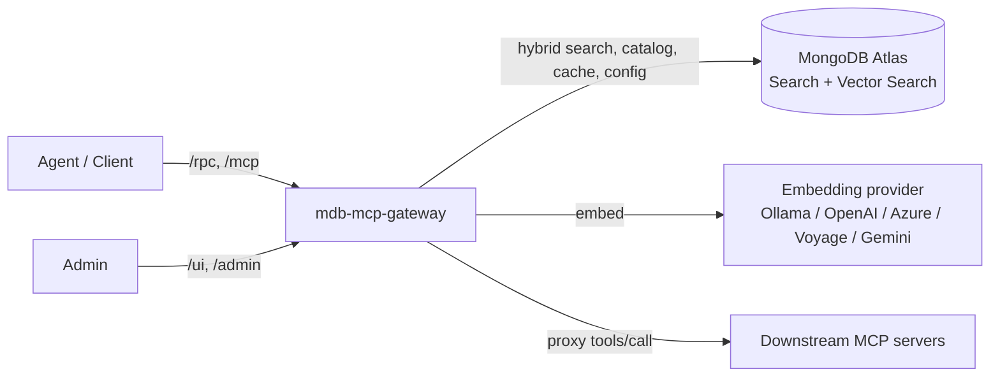

# Deployment Guide

This guide takes you from a laptop to production. Pick the path that matches
where you are:

| You want to… | Go to |
| --- | --- |
| Try it locally in minutes | [Path A — Docker Compose](#path-a--docker-compose-fastest) |
| Run one container against your own MongoDB Atlas | [Path B — Single container](#path-b--single-container) |
| Deploy to Kubernetes (raw manifests) | [Path C — Kubernetes](#path-c--kubernetes) |
| Deploy to Kubernetes (Helm) | [Path D — Helm](#path-d--helm) |

Then read [Configure embeddings](#configure-embeddings) and the
[Production hardening checklist](#production-hardening-checklist) before you go live.

---

## What you are deploying



Four moving parts:

1. **The gateway** — this FastAPI/FastMCP app (`gateway.app:app`).
2. **MongoDB Atlas** — stores the tool catalog, vectors, semantic cache, control
   plane, and the active embedding config. **Must be Atlas-capable** (Atlas Local
   or an Atlas cluster) with Search + Vector Search and replica-set semantics
   (the registry watcher uses change streams). A plain standalone `mongod` will
   not work.
3. **An embedding provider** — Ollama (local, default), OpenAI, Azure OpenAI,
   Voyage AI, or Google Gemini. See [Configure embeddings](#configure-embeddings).
4. **Downstream MCP servers** — the tools you proxy (the repo ships demo
   `weather` and `orders` servers).

---

## Prerequisites

- Docker / Docker Compose (for Paths A and B), or a Kubernetes cluster (Paths C/D).
- An embedding provider:
  - **Ollama** (default): `ollama pull nomic-embed-text` and have it reachable.
  - **or** an API key for OpenAI / Azure OpenAI / Voyage / Gemini.
- For production: an Atlas cluster (or Atlas Local) reachable from the gateway.

---

## Path A — Docker Compose (fastest)

This brings up MongoDB Atlas Local, the demo downstream servers, a one-shot
bootstrap job (indexes + seed + catalog sync), and the gateway.

```bash
ollama pull nomic-embed-text     # default embedding model on your host
docker compose up --build
```

Then verify:

```bash
curl http://localhost:8000/health
open http://localhost:8000/ui    # login: demo@demo.com / demo
```

The compose stack is **development-shaped** (`AUTH_MODE=disabled`, demo admin
credentials, wildcard CORS). Do not ship it as-is — see the
[hardening checklist](#production-hardening-checklist).

---

## Path B — Single container

Run the gateway as one container pointed at your own Atlas. Set
`AUTO_BOOTSTRAP=true` so it creates indexes, seeds the control plane, and syncs
the catalog on startup (the same work the compose `bootstrap` job does).

```bash
docker build -t mdb-mcp-gateway .

docker run --rm -p 8000:8000 \
  -e ENVIRONMENT=production \
  -e MONGODB_URI="mongodb+srv://<user>:<pass>@<cluster>/?retryWrites=true&w=majority" \
  -e MONGODB_DB_NAME="mcp_gateway" \
  -e AUTO_BOOTSTRAP=true \
  -e AUTH_MODE=jwks \
  -e JWT_ISSUER="https://your-idp/" \
  -e JWT_AUDIENCE="mdb-mcp-gateway" \
  -e JWKS_URI="https://your-idp/.well-known/jwks.json" \
  -e CORS_ALLOW_ORIGINS="https://your-app.example.com" \
  -e ADMIN_UI_ENABLED=true \
  -e ADMIN_EMAIL="admin@example.com" \
  -e ADMIN_PASSWORD="a-strong-admin-password" \
  -e ADMIN_SESSION_SECRET="a-very-long-random-session-secret" \
  -e EMBEDDING_SECRET="a-stable-random-secret-for-key-encryption" \
  mdb-mcp-gateway
```

> **Embeddings:** with no embedding env vars set, the gateway defaults to Ollama.
> To use a cloud provider, either set the `EMBEDDING_*` vars (below) or configure
> it after boot from the admin panel.

---

## Path C — Kubernetes

Manifests live in [`deploy/k8s/`](deploy/k8s): namespace, ConfigMap, Deployment
(2 replicas, non-root, read-only rootfs, dropped capabilities), Service,
PodDisruptionBudget, and a default-deny NetworkPolicy.

1. **Create the namespace and config:**

```bash
kubectl apply -f deploy/k8s/namespace.yaml
kubectl apply -f deploy/k8s/configmap.yaml      # edit issuer/audience/provider first
```

2. **Create the Secret** the Deployment expects (`mdb-mcp-gateway-secrets`). Put
   every sensitive value here, never in the ConfigMap:

```bash
kubectl create secret generic mdb-mcp-gateway-secrets \
  -n mdb-mcp-gateway \
  --from-literal=MONGODB_URI="mongodb+srv://<user>:<pass>@<cluster>/" \
  --from-literal=JWT_AUDIENCE="mdb-mcp-gateway" \
  --from-literal=ADMIN_EMAIL="admin@example.com" \
  --from-literal=ADMIN_PASSWORD="a-strong-admin-password" \
  --from-literal=ADMIN_SESSION_SECRET="a-very-long-random-session-secret" \
  --from-literal=EMBEDDING_SECRET="a-stable-random-secret-for-key-encryption" \
  --from-literal=EMBEDDING_API_KEY="sk-... (only if using a cloud provider)"
```

3. **Deploy:**

```bash
kubectl apply -f deploy/k8s/gateway-deployment.yaml
kubectl apply -f deploy/k8s/gateway-service.yaml
kubectl apply -f deploy/k8s/pdb.yaml
kubectl apply -f deploy/k8s/networkpolicy.yaml
```

The Deployment loads config via `envFrom` (ConfigMap + Secret) and exposes
`/health/ready` and `/health/live` probes. Adjust the NetworkPolicy ports
(`mongodbPort`, `ollamaPort`, `jwksPort`) to your environment.

---

## Path D — Helm

The chart in [`deploy/helm/`](deploy/helm) renders the same resources from
`values.yaml`.

```bash
# Provide secrets out of band (the chart references <release>-secrets):
kubectl create secret generic my-gw-secrets \
  --from-literal=MONGODB_URI="mongodb+srv://<user>:<pass>@<cluster>/" \
  --from-literal=ADMIN_PASSWORD="a-strong-admin-password" \
  --from-literal=ADMIN_SESSION_SECRET="a-very-long-random-session-secret" \
  --from-literal=EMBEDDING_SECRET="a-stable-random-secret-for-key-encryption" \
  --from-literal=EMBEDDING_API_KEY="sk-... (cloud provider only)"

helm install my-gw deploy/helm \
  --set image.repository=<registry>/mdb-mcp-gateway \
  --set image.tag=<version> \
  --set env.JWT_ISSUER="https://your-idp/" \
  --set env.JWKS_URI="https://your-idp/.well-known/jwks.json"
```

> The Secret name must match the release: the chart references
> `{{ .Release.Name }}-secrets` (so `my-gw-secrets` for `helm install my-gw`).

---

## Configure embeddings

Embeddings power vector/hybrid search, the semantic cache, and the semantic
guardrail classifier. The provider is **pluggable** and can be set two ways —
**the control DB (admin panel) always wins over the environment**:

| Method | When | Persisted | Reprovisions on change |
| --- | --- | --- | --- |
| Environment (`EMBEDDING_*`) | Boot-time default | No (env) | No (applied at boot) |
| Admin panel (`/ui` → Embeddings) | Runtime, recommended | Yes (control DB) | Yes (background) |

### Supported providers

| Provider | `EMBEDDING_PROVIDER` | Auth | Default model |
| --- | --- | --- | --- |
| Ollama (local) | `ollama` | none | `nomic-embed-text` |
| OpenAI | `openai` | `EMBEDDING_API_KEY` | `text-embedding-3-small` |
| Azure OpenAI | `azure_openai` | `EMBEDDING_API_KEY` + endpoint + deployment | (your deployment) |
| Voyage AI | `voyage` | `EMBEDDING_API_KEY` | `voyage-3` |
| Google Gemini | `gemini` | `EMBEDDING_API_KEY` | `text-embedding-004` |

### Set a provider via environment

```bash
# OpenAI
EMBEDDING_PROVIDER=openai
EMBEDDING_MODEL=text-embedding-3-small
EMBEDDING_API_KEY_FILE=/run/secrets/openai_key   # prefer a file mount

# Azure OpenAI
EMBEDDING_PROVIDER=azure_openai
AZURE_OPENAI_ENDPOINT=https://<resource>.openai.azure.com
AZURE_OPENAI_DEPLOYMENT=<deployment-name>
AZURE_OPENAI_API_VERSION=2023-05-15
EMBEDDING_API_KEY_FILE=/run/secrets/azure_key
```

### Set / switch a provider at runtime (recommended)

From the admin panel (`/ui` → **Embeddings**, platform-admin only): pick a
provider, enter the model/key, click **Test** (a dry run that validates
reachability and reports the detected vector width), then **Save**. Or via the API:

```bash
curl -X PUT https://<gateway>/admin/embedding \
  -H "Authorization: Bearer $TOKEN" -H "Content-Type: application/json" \
  -d '{"provider":"openai","model":"text-embedding-3-small","api_key":"sk-..."}'
```

What happens on save:

- The gateway **embeds a probe string to detect the exact vector width** — you
  never hand-configure dimensions, and the stored width always equals what the
  provider returns, so Atlas vector indexes can't drift out of sync.
- The API key is **encrypted at rest** (Fernet, keyed by `EMBEDDING_SECRET`) and
  always masked in responses.
- Because changing the model invalidates every stored vector, a **background
  reprovision** re-embeds each tenant's catalog, drops/recreates the vector
  indexes with the new width, refreshes the semantic cache, and re-embeds the
  guardrail corpus. Search degrades to lexical-only while indexes rebuild. Track
  progress at `GET /admin/embedding/status` or in the panel.

> **Operational caveat — keep `EMBEDDING_SECRET` stable.** API keys are encrypted
> with it. If you rotate or change it, previously stored keys can no longer be
> decrypted (they read as empty) and you must re-enter them in the panel. Set it
> once per environment and store it like any other long-lived secret. If unset,
> it falls back to `ADMIN_SESSION_SECRET`, then `JWT_SECRET`.

---

## Configuration reference

Full list with defaults: [`.env.example`](.env.example). The essentials:

| Variable | Purpose |
| --- | --- |
| `ENVIRONMENT` | `production` turns on the boot-time safety checks below |
| `MONGODB_URI` / `MONGODB_URI_FILE` | Atlas connection string (file-mountable) |
| `MONGODB_DB_NAME` | Control-plane / default database name |
| `AUTH_MODE` | `disabled` \| `hs256` \| `jwks` |
| `JWT_SECRET` / `JWT_ISSUER` / `JWT_AUDIENCE` / `JWKS_URI` | Auth config |
| `CORS_ALLOW_ORIGINS` | Comma-separated allowed origins (no `*` in prod) |
| `ADMIN_UI_ENABLED` / `ADMIN_EMAIL` / `ADMIN_PASSWORD` | Admin console |
| `ADMIN_SESSION_SECRET` | Signs admin session cookies |
| `EMBEDDING_PROVIDER` / `EMBEDDING_MODEL` / `EMBEDDING_API_KEY` | Embeddings |
| `EMBEDDING_SECRET` | Encrypts stored embedding API keys (keep stable) |
| `AUTO_BOOTSTRAP` | Create indexes + seed + sync catalog on startup |
| `AUTO_PROVISION_TENANTS` | Create a tenant DB/indexes on first use |

**Secrets** belong in a Secret / file mount, never in a ConfigMap. Most sensitive
values have a `*_FILE` companion (`MONGODB_URI_FILE`, `EMBEDDING_API_KEY_FILE`,
`EMBEDDING_SECRET_FILE`, `ADMIN_PASSWORD_FILE`, `JWT_SECRET_FILE`, …) so you can
mount them as files instead of env vars.

For Atlas TLS / X.509 / SCRAM hardening, see [`deploy/README.md`](deploy/README.md).

---

## Production hardening checklist

When `ENVIRONMENT=production`, the gateway **fails to start** unless these hold
(fail-closed by design):

- [ ] `AUTH_MODE` is not `disabled`.
- [ ] If `hs256`: `JWT_SECRET` is strong (≥16 chars, not a known weak value).
- [ ] If `jwks`: `JWT_ISSUER` and `JWT_AUDIENCE` are set, plus `JWKS_URI` or
      `JWKS_LOCAL_PATH`.
- [ ] `CORS_ALLOW_ORIGINS` is **not** `*` — list explicit origins.
- [ ] If the admin UI is enabled: `ADMIN_EMAIL` set, `ADMIN_PASSWORD` ≥12 chars
      (not weak), `ADMIN_SESSION_SECRET` ≥16 chars (not weak).

Also recommended (not boot-enforced):

- [ ] Set a stable, random `EMBEDDING_SECRET`.
- [ ] Mount secrets as files (`*_FILE`) rather than plain env vars.
- [ ] Use TLS + auth to Atlas (`ATLAS_TLS`, `ATLAS_USERNAME`/`ATLAS_PASSWORD`, or
      an `mongodb+srv://` URI with credentials).
- [ ] Restrict egress (the bundled NetworkPolicy allows only Mongo/Ollama/JWKS).
- [ ] Run multiple replicas behind the PodDisruptionBudget.

---

## Health, readiness, and observability

| Endpoint | Use |
| --- | --- |
| `GET /health/live` | Liveness — process is up |
| `GET /health/ready` | Readiness — Mongo reachable + embedding probe ok |
| `GET /health` | Combined human-readable health |
| `GET /metrics` | Prometheus metrics (`ENABLE_METRICS=true`) |

Set `ENABLE_TRACING=true` for OpenTelemetry spans around RPC handling and
downstream hops. `LOG_JSON=true` emits structured logs with request IDs.

---

## Bootstrapping and provisioning

- **First boot:** run the bootstrap once — either the compose `bootstrap` service,
  `AUTO_BOOTSTRAP=true` on the gateway, or `python -m scripts.bootstrap`. It
  creates Search + Vector Search indexes, seeds the control plane, and syncs the
  downstream catalog with embeddings.
- **Tenants:** with `AUTO_PROVISION_TENANTS=true` (default) a tenant's database
  and indexes are created on first use. Set it to `false` where tenant ids come
  from untrusted callers, then provision explicitly via `POST /admin/tenants` or
  `python -m scripts.admin`.

---

## Upgrades and rollbacks

- The image is stateless; all state is in MongoDB. Roll forward/back by changing
  the image tag (`kubectl set image …` or `helm upgrade --set image.tag=…`).
- **Embedding changes are data migrations, not code deploys.** Switch providers
  from the admin panel and let the background reprovision finish before relying
  on vector search; it is idempotent and safe to re-run if interrupted.
- A reprovision that crashes mid-run is detected as stale after one hour, so a new
  one can always be started — re-applying the config from the panel is enough.

---

## Troubleshooting

| Symptom | Likely cause / fix |
| --- | --- |
| `tools/search` returns empty or errors about `$rankFusion` | Atlas version/feature gap. The gateway falls back to application-side RRF; confirm Search + Vector Search are enabled (MongoDB 8.0+ for `$rankFusion`). |
| Startup error about `auth_mode`, CORS, or admin password | A production safety check failed — see the [hardening checklist](#production-hardening-checklist). |
| `Embedding provider validation failed` on save | The provider/model/key is wrong or unreachable. Use **Test** to see the exact error; nothing is persisted until validation passes. |
| Stored embedding key reads as empty after a change | `EMBEDDING_SECRET` changed — re-enter the key in the panel and keep the secret stable thereafter. |
| `409 reprovision in progress` on a config change | A reprovision is running; wait for `GET /admin/embedding/status` to leave `running`, then retry. |
| Search stale right after switching providers | The reprovision is still rebuilding indexes; search uses lexical fallback until it completes. |
| Change-stream / registry watcher errors | The deployment is not replica-set capable — use Atlas Local or an Atlas cluster, not a standalone `mongod`. |

---

See the [README](README.md) for the full feature tour and local development
workflow, and [`deploy/README.md`](deploy/README.md) for Atlas connection
security details.
