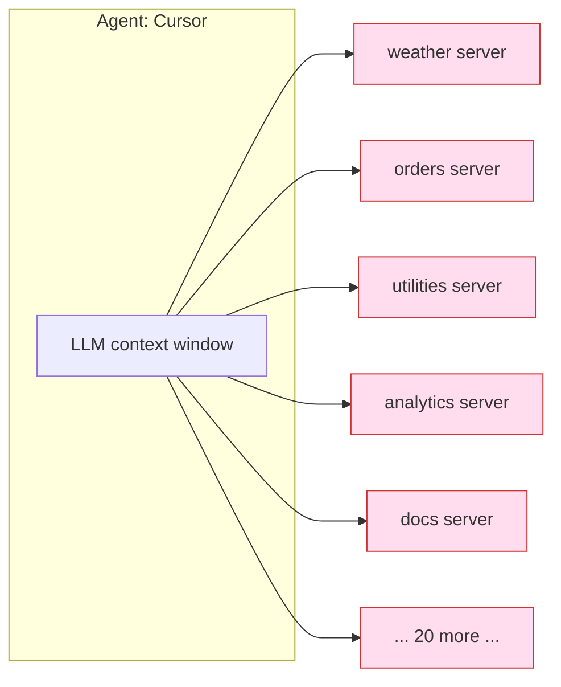
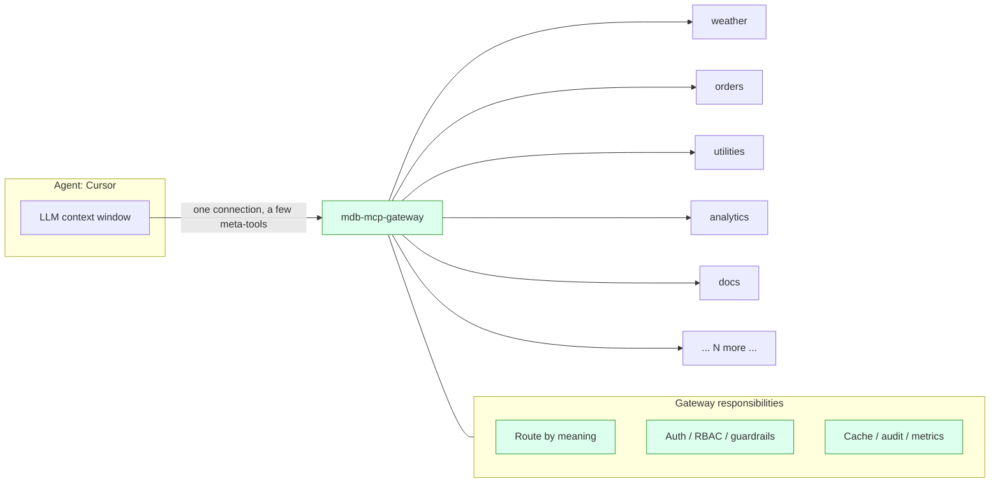

# Design: Why a Smart MCP Gateway (and how it fits Cursor)

This document explains the *design intent* behind `mdb-mcp-gateway`: the
problems it solves, the decisions we made, the analogies that make those
decisions intuitive, and the cases where this design is the **wrong** choice.

It is the "why" companion to the "what" docs:

- [`README.md`](README.md) — quick start and feature tour.
- [`ARCHITECTURE.md`](ARCHITECTURE.md) — the as-built system map (request flow,
  data boundaries, subsystems).
- [`AUTH.md`](AUTH.md), [`SECURITY.md`](SECURITY.md),
  [`NETWORK-SECURITY.md`](NETWORK-SECURITY.md) — the security model.

If `ARCHITECTURE.md` tells you *where the wires go*, this doc tells you *why we
ran them that way and what we deliberately chose not to do*.

---

## 1. The problem in one picture

An AI agent (Cursor, Claude Desktop, a LangChain app) is only as useful as the
tools it can reach. The naive way to give it tools is to connect it directly to
every MCP server you own:



This looks fine with three servers. It falls apart at thirty. Three things break
at once:

1. **The context window fills with tool definitions.** Every connected server
   injects *all* of its tool schemas into the model's prompt on *every turn*.
   Hundreds of tools the agent will never use this turn still cost tokens,
   latency, and — worst of all — *attention*. The model has to read past
   `severe_weather_alerts` to find `find_order`.
2. **Security fragments.** Auth, rate limiting, PII scrubbing, and audit logging
   now live in N different servers (or nowhere). N places to get it right; N
   places to get it wrong.
3. **Operations sprawl.** N connection strings, N credential stores, N upgrade
   cadences, N dashboards.

> **Analogy — the universal remote.** A naive setup is a coffee table with one
> remote per device: TV, soundbar, console, streaming box, lights. Technically
> everything is reachable. In practice you fumble through five remotes to do one
> thing. The gateway is the *universal remote*: one thing in your hand, and it
> knows how to talk to everything behind the TV stand.

The gateway exists to collapse that fan-out into a single, intelligent front
door:



---

## 2. Design principles

Every decision below traces back to one of these:

1. **The agent's context window is the scarcest resource.** Spend it on the task,
   not on a tool catalog. Discovery should be *pull* ("find me tools for X"), not
   *push* ("here are all 300 tools, good luck").
2. **One control plane, one engine.** Routing, search, cache, and audit live in
   MongoDB Atlas — not a constellation of specialized stores that drift out of
   sync. Fewer moving parts is itself a feature.
3. **Security is a perimeter, not a per-tool afterthought.** Authn/z, rate
   limiting, guardrails, and audit are middleware the request passes through
   *before* a tool runs.
4. **Adding a tool should not mean shipping a server.** You should be able to
   author a tool as a function and have it live behind the gateway in seconds.
5. **Stateless and reactive.** The process holds no durable state; configuration
   changes propagate live via change streams, not restarts.

---

## 3. The headline decision: one connection, a few meta-tools

When Cursor connects to the gateway it does **not** see `get_current_weather`,
`find_order`, and 300 siblings. It sees a tiny, fixed toolbox:

| Meta-tool | What the agent uses it for |
| --- | --- |
| `search_tools` | "Find me tools that can do X" — route by meaning. |
| `list_catalog_tools` | Browse/paginate what exists (optionally filtered). |
| `call_downstream_tool` | "Now run *this* tool on *that* server." |

These three are defined in `gateway/mcp_server.py` and exposed over the mounted
FastMCP app at `/mcp`. The actual universe of tools lives in MongoDB and is
reached *through* `call_downstream_tool`.

> **Analogy — the hotel concierge.** You don't memorize the phone numbers of
> every restaurant, theater, and taxi company in the city. You ask the concierge
> ("somewhere good for sushi near the river") and they make the booking. The
> concierge is a *narrow, stable interface* to an *enormous, changing* set of
> services. `search_tools` is "ask the concierge"; `call_downstream_tool` is
> "yes, book it."

### Why this design

- **Bounded prompt cost.** The agent pays for ~3 tool schemas, not 300. Token
  spend per turn is flat regardless of how many tools you operate.
- **Better tool selection.** The model reasons over a *curated shortlist* the
  gateway already ranked by relevance, instead of doing fuzzy keyword matching
  across a giant flat list in-prompt.
- **The catalog can change underneath the agent.** Add, remove, or re-scope a
  tool and the agent's tool list never changes — it still just calls
  `search_tools`. No reconnect, no schema reload.

### Why *not* this design (the honest trade-offs)

- **One extra hop of indirection.** The agent must `search` then `call`, rather
  than calling a named tool directly. For a workflow with *one* well-known tool,
  that indirection is pure overhead. (Mitigation: `call_downstream_tool` can be
  called directly when the agent already knows the `server`/`name` — e.g. from
  the `gateway_hello` demo below.)
- **The meta-tool layer is a dependency.** If the gateway is down, *all* tools
  are down. A direct connection fails independently. You are trading blast-radius
  isolation for a single hardened, observable choke point — a deliberate trade,
  not a free lunch.
- **Discovery quality is now your problem.** If `search_tools` ranks badly, the
  agent can't find the right tool even though it exists. That is exactly why the
  retrieval layer is hybrid (next section) and not a naive vector lookup.

### Alternatives we considered

- **Expose every tool directly through the gateway (pure proxy).** Solves
  security/ops centralization but *not* the context-window problem — the agent
  still sees every schema. Rejected as the default; still reachable via
  `list_catalog_tools` for clients that want the full list.
- **Static, hand-maintained tool groups.** "Connect to the `orders` bundle."
  Better than everything-at-once, but someone has to curate bundles by hand and
  keep them current. Route-by-meaning makes the grouping *dynamic and per-query*.

---

## 4. Route by meaning: why hybrid search, not just vectors

`search_tools` is backed by **hybrid search** on MongoDB Atlas: a single
`$rankFusion` aggregation that fuses semantic (vector) and lexical
(full-text/BM25) retrieval with Reciprocal Rank Fusion. See
`services/hybrid_search.py`.

Why both arms instead of vectors alone?

- **Vector search understands intent** ("look up a purchase") but can miss the
  *exact token* a user typed — an order ID, an error code, a tool name. Cosine
  similarity rewards meaning, not spelling.
- **Lexical search nails exact tokens** but is blind to intent — ask for
  "dangerous storm warnings" and BM25 can rank an unrelated `list_customer_orders`
  highly because of common filler words.

Fusing them keeps the right tool on top whether the agent asks in keywords *or*
in intent.

> **Analogy — finding a book.** Vector search is the helpful librarian who
> understands "I want something about coming-of-age in the rural South." Lexical
> search is the catalog computer that finds the book when you type the exact ISBN.
> You want *both* on staff. RRF is the head librarian who merges their two
> recommendation lists into one ranking.

**Why MongoDB for this (one engine):** the same documents carry both a `$search`
(BM25) index and a `$vectorSearch` index, and `$rankFusion` runs both arms and
fuses them server-side in one round trip. The traditional alternative — a search
engine *plus* a separate vector DB *plus* a client-side fusion service *plus* a
sync pipeline keeping the two stores consistent by `_id` — is four moving parts
that drift out of sync the moment one write lands in one store but not the other.
Collapsing that to one query over one collection is the core architectural bet of
this project.

**Why not** force it everywhere: `$rankFusion` is a MongoDB 8.1+ stage (this repo
runs 8.3). So the gateway degrades gracefully — if the fusion stage is unavailable
it falls back to application-side RRF, and ultimately to the semantic arm, so search
never hard-fails.

### Escaping relevance on purpose: always-included tools

Sometimes the right answer is *not* "rank by relevance." An admin may want a
house tool — a help/guide, a policy lookup, a tenant-specific workflow — present
on *every* turn no matter what the agent asked. A tool flagged
`metadata.always_included` is **pinned** to the top of every `search_tools`
result regardless of its score. This is a deliberate override of the whole
section above, so it is bounded by two rules that keep it honest:

- **Pins still respect identity.** The always-included fetch runs the same
  scope filter as the ranked arms, so a pin never surfaces a tool the caller
  couldn't otherwise discover. You cannot pin your way around RBAC.
- **Pins spend the budget.** Pinned tools take "reserved seats" inside the
  caller's `limit` rather than inflating it, so prompt cost stays flat
  (principle #1). The trade-off is real and local: every pin is a tool schema
  the agent pays for on *every* call, which is why the Admin Studio warns past a
  small recommended count rather than silently letting the catalog creep back
  into the prompt. (If an admin pins more than `limit`, the explicit intent
  wins and all pins are returned — the warning, not a hard cap, is the guard.)

---

## 5. Virtual servers: a tool is a function, not a deployment

A **virtual server** is a server with `transport="code"`: its tools are Python
functions you author in Admin Studio, stored (encrypted) in MongoDB, and executed
inside a **WebAssembly sandbox** (`services/sandbox_executor.py`) — no shell, no
network, no host filesystem. The seeded `weather`, `orders`, `utilities`,
`analytics`, and the new `gateway_demo` servers are all virtual.

> **Analogy — food trucks vs. building a restaurant.** A traditional MCP server
> is a restaurant: lease, build-out, staff, a street address (a deployed process
> with a port and a connection string). A virtual server is a food truck that
> pulls into the gateway's lot: you write the menu (the function), it serves
> immediately, and the lot (the gateway) already handles power, security, and the
> line out front. Adding a dish doesn't require pouring a new foundation.

### Why this design

- **Zero-deployment tools.** Authoring a function in the UI publishes a working
  tool in seconds. No container, no port, no service registration.
- **Uniform `context`.** Every tool gets the same injected `context`:
  `context.db` (tenant-scoped MongoDB via a host-mediated bridge), `context.env`
  (per-server encrypted secrets), and `context.tools` (call sibling tools in the
  same tenant). The tenant is the namespace; small tools compose into workflows
  with no glue code. See [`CONTEXT.md`](CONTEXT.md).
- **Safe by construction.** An authoring-time lint rejects obvious abuse, and the
  WASM sandbox is the real isolation boundary at runtime.

### Why *not* / limits

- **The sandbox is intentionally constrained.** No arbitrary network or host
  access. If your tool *needs* to call an external API, that belongs in a real
  downstream server (`transport="streamable_http"`, like the seeded `deepwiki`),
  not a code tool.
- **CPU/cold-start cost.** Compiling and running Python-on-WASI is not free; the
  gateway keeps a prewarmed worker pool to amortize it. Heavy compute is not the
  sweet spot. Cold start (runtime spawn/compile + in-guest CPython boot) is kept
  *separate* from a tool's `wall_timeout_ms`: that budget bounds the tool's own
  compute, while a `sandbox_worker_startup_grace_ms` allowance covers boot, so a
  fast tool is never killed mid-boot just because the host was busy. Raw
  compute/memory stay bounded precisely by wasm fuel + the memory limit.
- **Not a general FaaS.** This is for *tool-shaped* logic — small, pure-ish
  functions with declared inputs — not long-running jobs.

### The escape hatch (why "virtual" is not a trap)

Because a virtual server's value could feel locked inside the gateway, there is a
one-click **Export** (`GET /admin/servers/{server}/export`) that emits a
self-contained, runnable FastMCP project. It reconstructs `context.db`,
`context.env`, and `context.tools` locally so your authored code runs *unmodified*
outside the gateway — and ships with a paste-ready `mcpServers` snippet for
Cursor/Claude Desktop. You can always eject.

---

## 6. Security as a perimeter

Requests pass through an ordered middleware chain *before* any tool runs
(`gateway/app.py`): request-context, metrics, guardrails, RBAC, rate limit,
auth. The data plane adds identity-bound scoping and per-call authorization.

> **Analogy — the airport.** You don't negotiate security at each gate. You clear
> one checkpoint (ID, screening, watchlist) and only then reach the concourse.
> The gateway is that checkpoint; downstream tools are the gates. Centralizing it
> means one well-run checkpoint instead of 30 improvised ones.

Highlights and the reasoning:

- **Identity-bound discovery.** Scope filtering is pushed *into* the search query,
  so a caller who lacks `orders:write` never even sees `update_order_status` in
  results — you can't call what you can't discover.
- **Both invocation surfaces enforce the same checks.** The `/mcp` meta-tools are
  at parity with the `/rpc` data plane: `call_downstream_tool` runs per-call
  `authorize_tool_call` (the tool must exist in the tenant catalog and the caller
  must satisfy its scopes), enforces the tenant usage quota, meters the billable
  call, and writes the same `audit_telemetry` row — all under a tenant bound to
  the verified token claim, so a `tenant_id` argument that does not match the
  authenticated tenant is rejected rather than silently honored. There is no
  weaker path to a downstream tool. (The shared step — "record a billable call" —
  lives in one place, `services/data_plane.py`, so the two surfaces can't drift.)
- **Guardrails before execution.** A regex floor plus an optional semantic
  prompt-injection classifier (over a versioned signature corpus) runs inbound,
  so a poisoned argument is caught at the perimeter, not inside a tool.
- **Audit is centralized and cheap.** Every call — on `/rpc` *and* `/mcp` — lands
  in a MongoDB time-series collection (`audit_telemetry`) under the same
  `method="tools/call"` label. One query answers "what did this tenant run last
  night," across *all* servers and *both* invocation surfaces.
- **Secrets stay encrypted at rest.** Downstream credentials and authored code
  are encrypted (Queryable Encryption / Fernet); the gateway brokers only a
  short-lived workload identity to third parties, never long-lived secrets.

**Why not** enforce security in each server: you'd reimplement authn/z, rate
limiting, and audit N times and hope they agree. The perimeter model trades a bit
of centralized blast radius for a single auditable, testable control point.

---

## 7. Multi-tenancy and reactivity (brief)

- **Tenancy by physical database.** Each tenant's data lives in its own database
  derived from the verified `tenant_id` claim, so isolation is structural, not a
  `WHERE tenant_id = ?` you can forget. Tenant-scoped calls run
  `ensure_tenant_ready()` first.
- **Reactive config.** `services/registry_watcher.py` tails MongoDB change streams
  and hot-mounts/unmounts servers as `routing_registry` changes — zero-restart
  reconfiguration. Each replica persists its own resume token so active-active
  pods don't clobber each other.

---

## 8. Connecting Cursor (and the built-in demo tool)

The default `docker compose up --build` stack is already configured for this:
`AUTH_MODE=disabled`, CORS open, gateway on `:8000`, with the FastMCP surface
mounted at `/mcp`.

### 8.1 Point Cursor at the gateway

Add the gateway to Cursor's MCP config — either via **Settings, Tools & MCP,
New MCP Server**, or by editing `~/.cursor/mcp.json` (global) or
`.cursor/mcp.json` (project):

```json
{
  "mcpServers": {
    "mdb-mcp-gateway": {
      "url": "http://localhost:8000/mcp/"
    }
  }
}
```

Notes:

- The gateway speaks **Streamable HTTP** (FastMCP's default transport). Cursor
  auto-detects transport from the presence of `url`; no `command`/`args` needed.
- The trailing slash on `/mcp/` matters for the mounted sub-app.
- If you use the `cursor-agent` CLI, add `"type": "http"` to the entry (the CLI
  doesn't accept the `streamable-http` alias the IDE does).
- With `AUTH_MODE=disabled` no `headers` are required. When you turn auth on,
  add `"headers": { "Authorization": "Bearer <token>" }` and mint a token via
  `POST /auth/token`.

Once connected, Cursor will list exactly the three meta-tools:
`search_tools`, `list_catalog_tools`, `call_downstream_tool`.

### 8.2 The 10-second smoke test: `gateway_hello`

There is a seeded, read-only demo tool built for exactly this moment — a virtual
server `gateway_demo` with one tool, `gateway_hello` (see `database/seed.py`). It
takes an optional `name`, touches nothing, and returns a friendly payload that
*explains the very path the call just took*.

In Cursor's chat, just ask:

> "Use the mdb-mcp-gateway tools to say hello — search for a hello/health tool and
> call it with my name."

Cursor will: call `search_tools(query="hello health smoke test")`, find
`gateway_demo/gateway_hello`, then call
`call_downstream_tool(server="gateway_demo", name="gateway_hello", arguments={"name": "Fabian"})`
and get back:

```json
{
  "greeting": "Hello, Fabian - you are connected to the MongoDB MCP Gateway.",
  "you_reached": "mdb-mcp-gateway",
  "how_it_routed": [
    "Your MCP client opened ONE connection to the gateway and saw a few meta-tools.",
    "search_tools matched this tool by meaning via $rankFusion hybrid search on Atlas.",
    "call_downstream_tool routed the invocation to the 'gateway_demo' virtual server.",
    "This Python ran inside the gateway's WASM sandbox - no shell, network, or host access."
  ],
  "try_next": [
    "search_tools(query='current weather for a city')",
    "call_downstream_tool(server='weather', name='get_current_weather', arguments={'city': 'Montreal'})"
  ],
  "source": "sandbox-code"
}
```

That single round trip exercises the whole thesis: one connection, route by
meaning, authorize, execute authored Python in the sandbox, audited result.

### 8.3 Verify without Cursor (curl)

The same tool is reachable over the JSON-RPC data plane, which is handy for a CI
smoke check or when debugging connectivity:

```bash
curl -s -X POST http://localhost:8000/rpc \
  -H "Content-Type: application/json" \
  -d '{
    "jsonrpc":"2.0","id":"hello-1","method":"tools/call",
    "params":{"server":"gateway_demo","name":"gateway_hello","arguments":{"name":"Cursor"}}
  }'
```

---

## 9. When this design is the *wrong* choice

Be honest about fit. Reach for a plain, direct MCP connection instead when:

- **You have one or two tools.** The gateway's machinery (Mongo, embeddings,
  sandbox, KMS) is overhead you don't need. Connect Cursor straight to the
  server.
- **You need hard fault isolation between tools.** A single front door is a
  single dependency. If a tool *must* stay up when everything else is down, keep
  it independently connected.
- **Tools need rich, bespoke transports** the gateway doesn't model well (raw
  WebSocket streaming, long-lived bidirectional sessions, etc.).
- **You can't run an Atlas-capable MongoDB.** Hybrid search, the registry watcher
  (change streams), and the semantic cache assume Atlas Local or an Atlas cluster
  with Search + Vector Search and replica-set semantics. A plain `mongod` is not
  enough.

The gateway earns its complexity at *scale and multiplicity* — many tools, many
tenants, many agents, real security and audit requirements. Below that
threshold, simpler is better, and that's by design.

---

## 10. Summary

| Decision | Why | Why not / cost |
| --- | --- | --- |
| One connection + meta-tools | Flat prompt cost; curated selection; catalog changes invisibly | Extra hop; gateway is a shared dependency |
| Hybrid search (RRF) for discovery | Intent *and* exact tokens; one engine | Preview feature, needs graceful fallback |
| Virtual servers (code in WASM) | Zero-deploy tools; uniform `context`; safe | Constrained runtime; not a general FaaS |
| Security as perimeter | One auditable checkpoint, not N | Centralized blast radius |
| MongoDB as sole control plane | No store drift; fewer moving parts | Requires Atlas-capable MongoDB |

The throughline: **spend the agent's attention on the task, centralize the
boring-but-critical concerns once, and make adding a tool feel like writing a
function.** The `gateway_hello` demo is the smallest possible proof that the
whole chain works the moment Cursor connects.
