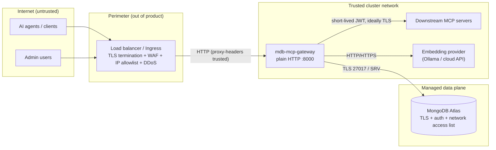

# Network Security

This document defines the gateway's network trust boundaries, the ports/protocols it
uses, and — explicitly — **which network controls are handled outside the product**.

> **Design principle:** the gateway is an *application-layer* policy enforcement point.
> Network-layer controls (TLS termination, IP allowlisting, WAF, DDoS, L3/L4 firewalling)
> are **not** implemented in the product and are expected to be enforced by the
> surrounding infrastructure: cloud load balancers, ingress controllers, security
> groups/NACLs, a WAF, and/or a service mesh. This is a deliberate separation of concerns,
> not a gap.

See also: [`SECURITY.md`](SECURITY.md) (application controls) and
[`PRODUCTION.md`](PRODUCTION.md) (deployment/operations).

---

## Trust boundaries



| Boundary | Who enforces it | How |
| --- | --- | --- |
| Internet → gateway | **Perimeter (out of product)** | TLS termination, WAF, IP allowlist, DDoS, rate shaping at the LB/ingress |
| Gateway request handling | **Product** | AuthN (JWT/JWKS), RBAC, per-tool scopes, CSRF, guardrails, app rate limiting |
| Gateway → downstream MCP | **Product + network** | Short-lived workload JWT (product); private network + TLS (infra) |
| Gateway → Atlas | **Atlas + network** | TLS, SCRAM/X.509 auth, Atlas network access list / private endpoint |
| Egress from the gateway pod | **NetworkPolicy (infra)** | Default-deny except DNS, Mongo, embedding provider, HTTPS |

---

## Ports and protocols

### Inbound (to the gateway)

| Port | Protocol | Purpose |
| --- | --- | --- |
| `8000` | **HTTP** (plaintext) | All gateway endpoints (`/rpc`, `/mcp`, `/admin`, `/ui`, `/health/*`, `/metrics`) |

The gateway **does not terminate TLS itself.** It listens on plain HTTP and must sit
behind a TLS-terminating ingress/LB/mesh. The container entrypoint is
`uvicorn gateway.app:app --host 0.0.0.0 --port 8000` (`Dockerfile`).

### Outbound (egress from the gateway)

| Destination | Port | Protocol | Required? |
| --- | --- | --- | --- |
| DNS | `53` | UDP/TCP | Yes |
| MongoDB Atlas | `27017` (+ SRV lookups) | TLS/TCP | Yes |
| Embedding provider (Ollama) | `11434` | HTTP/TCP | If using Ollama |
| Embedding / JWKS / cloud APIs | `443` | HTTPS/TCP | If using a cloud embedding provider or remote JWKS |
| Downstream MCP servers | per server (`endpoint`) | HTTP/SSE or stdio | Yes (for proxied tools) |

The bundled NetworkPolicy (`deploy/k8s/networkpolicy.yaml`, `deploy/helm/templates/networkpolicy.yaml`)
is **default-deny** and allows egress only to DNS (53), `27017`, `11434`, and `443`.
Tighten the `0.0.0.0/0` CIDRs to your Atlas / provider / downstream ranges in production.

---

## What is handled OUTSIDE the product

These are **out of scope by design**. Configure them at the perimeter:

| Concern | Where to enforce it | Notes |
| --- | --- | --- |
| **TLS / HTTPS for clients** | Ingress / LB / mesh | The gateway speaks HTTP; terminate TLS in front of it. |
| **IP allowlisting / denylisting** | Cloud security groups, ingress allowlist, WAF | The gateway does **not** filter by source IP. |
| **WAF / L7 filtering** | WAF (Cloudflare, AWS WAF, etc.) | Signature/anomaly filtering, request shaping. |
| **DDoS / volumetric protection** | Cloud DDoS service / LB | App rate limiting is not a DDoS defense. |
| **L3/L4 firewalling** | Security groups / NACLs / firewall | Restrict who can even reach `:8000`. |
| **Geo-blocking** | CDN / WAF | Not implemented in-product. |
| **mTLS between mesh peers** | Service mesh (Istio/Linkerd) | Optional defense-in-depth for east-west traffic. |
| **Atlas network access** | Atlas network access list, private endpoint/peering | Lock the DB to the cluster's egress. |

---

## Important network behaviors (read before you ship)

These behaviors interact with how you place the gateway behind a proxy.

### 1. Set `FORWARDED_ALLOW_IPS` to your proxy

The container image runs uvicorn with `--proxy-headers` (so `X-Forwarded-Proto`/`-For`
are honored), but uvicorn only trusts those headers from peers listed in
`FORWARDED_ALLOW_IPS` (default `127.0.0.1`). If you don't set it to your ingress/LB
address, two things silently misbehave:

- **Per-IP rate limiting** keys on `request.client.host` (`gateway/middleware/ratelimit.py`).
  Without trusting the proxy, every request appears to come from the proxy's IP, so the
  per-`(tenant, client-ip)` limiter collapses to per-`tenant`.
- **Secure cookies**: the admin session cookie sets `Secure` only when the request scheme
  is `https` (`gateway/routers/ui.py`). Without `X-Forwarded-Proto` trust the gateway sees
  `http` and the cookie isn't marked `Secure`.

**Fix** — set `FORWARDED_ALLOW_IPS` to the proxy's IP/CIDR (env var, read natively by
uvicorn; present in `.env.example`, the k8s ConfigMap, and Helm `values.yaml`):

```bash
FORWARDED_ALLOW_IPS="10.0.0.0/8"   # your ingress/LB pod or CIDR
```

With it set, `request.client.host` reflects `X-Forwarded-For` (per-IP limiting works) and
the scheme reflects `X-Forwarded-Proto` (cookies get `Secure`). **Never use `*`** if the
gateway can be reached directly — callers could spoof their source IP and scheme. If your
proxy does not forward the real client IP, rely on the LB/WAF for per-IP rate limiting and
treat the gateway's limiter as per-tenant abuse protection.

### 2. Health and metrics are unauthenticated by design

`/health`, `/health/live`, `/health/ready`, and `/metrics` are **exempt from
`AuthMiddleware`** (`gateway/middleware/auth.py::_is_observability_path`) so k8s `httpGet`
probes and Prometheus scrapes work in every auth mode — including `hs256`/`jwks`. These
endpoints expose only liveness/readiness status and aggregate counters (**no tenant
data**: metric labels are bounded to `method`, normalized `path`, `status`, and a few
fixed categories). They are also skipped by the rate limiter so infra traffic never
consumes a tenant's budget.

Because they are unauthenticated, **restrict them at the network layer**: scope `/metrics`
to your scrape network and don't expose `/health`/`/metrics` to the public internet (the
bundled NetworkPolicy already limits ingress to the same namespace + ingress controller).

### 3. CORS is wide open in dev

`CORS_ALLOW_ORIGINS` defaults to `*` (rejected at boot in production). Credentialed
cross-origin requests are not enabled (`allow_credentials` is off), but you should still
set an explicit, minimal origin list in production.

---

## Recommended production topology

```
            (Internet)
                │  HTTPS
   ┌────────────▼─────────────┐
   │  LB / Ingress / WAF      │  TLS termination, IP allowlist, WAF, DDoS, geo
   │  (out of product)        │
   └────────────┬─────────────┘
                │  HTTP (+ X-Forwarded-* trusted)
   ┌────────────▼─────────────┐
   │  mdb-mcp-gateway         │  AuthN/Z, scopes, CSRF, guardrails, app rate limit
   │  (≥2 replicas, non-root) │  image runs --proxy-headers; set FORWARDED_ALLOW_IPS=<LB>
   └───┬───────────┬──────────┘
       │           │  default-deny NetworkPolicy (egress only to below)
       │           └──────────────► Downstream MCP servers (private, TLS, JWT-verified)
       │
       ├──────────────────────────► Embedding provider (Ollama in-cluster, or 443 to cloud)
       │
       └──────────────────────────► MongoDB Atlas (TLS + auth + network access list / PrivateLink)
```

Guidance:

- **Never expose `:8000` directly to the internet.** Put it behind an ingress/LB.
- **Keep `/admin` and `/ui` off the public internet** where possible — restrict to an
  internal network, VPN, or an allowlisted ingress path. Disable the UI entirely
  (`ADMIN_UI_ENABLED=false`) if you administer via the API/CLI.
- **Put downstream MCP servers and the embedding provider on a private network**, reachable
  only from the gateway pods. The workload JWT is a credential, not a network control.
- **Use Atlas PrivateLink/peering and a strict network access list** so the database is
  not reachable from anywhere but the gateway's egress.
- **Restrict egress** with the NetworkPolicy; scope the CIDRs to real destinations.
