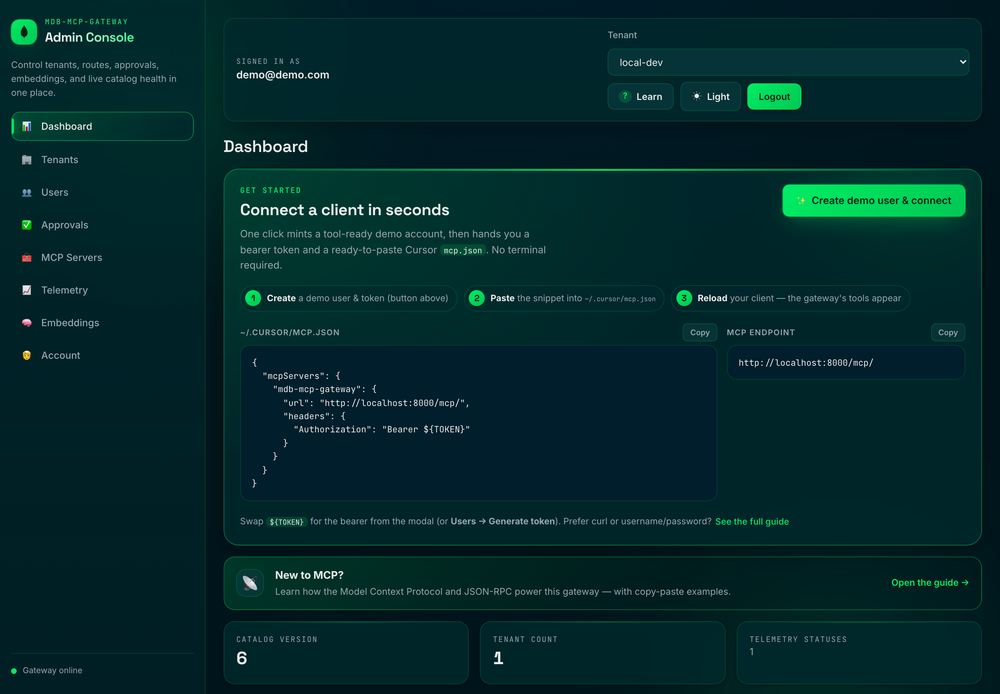
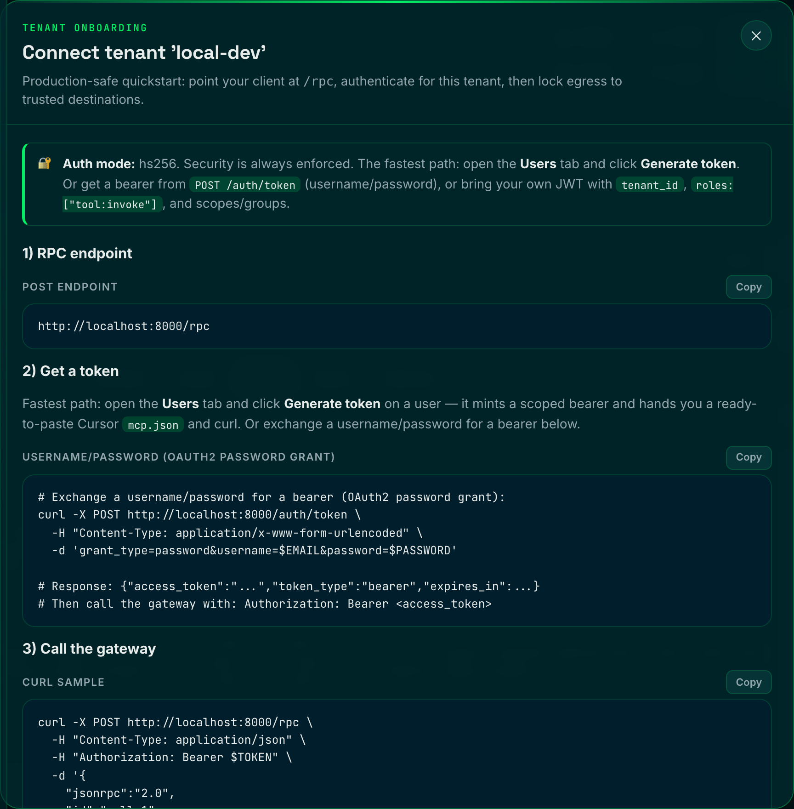
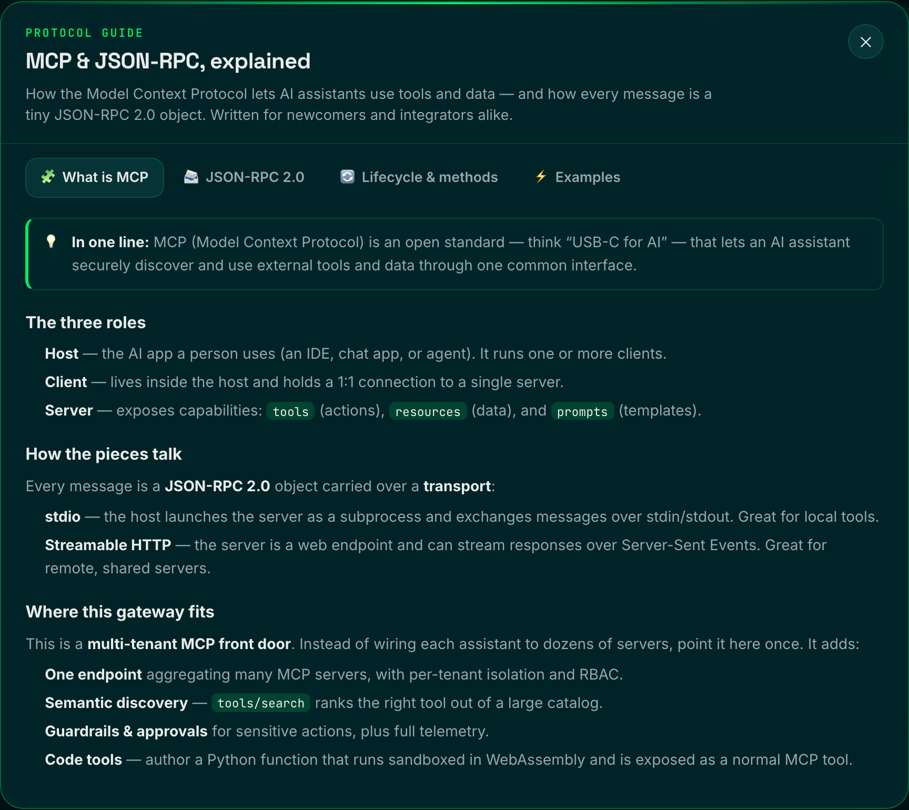

# Quickstart

Get a **secure-by-default** MCP gateway running, mint a real token from the admin
console, and connect Cursor — in about five minutes.

> Security is always on. There is no "disabled" auth mode: every request to the
> data plane (`/rpc`, `/mcp`) must present a verified token. `docker compose up`
> generates the signing secret for you and runs in `AUTH_MODE=hs256` out of the box —
> you don't configure anything to be safe. See [AUTH.md](AUTH.md) and
> [SECURITY.md](SECURITY.md) for the full model.

---

## 1. Prerequisites

- **Docker** + Docker Compose
- **Embeddings** — pick one provider (the bootstrap fails loudly if it can't reach one):
  - **Voyage AI (recommended — no local model):** drop a `VOYAGE_API_KEY` into a local
    `.env` file. `docker compose` reads it and the gateway **auto-selects Voyage**
    (model `voyage-3`, vector width auto-detected). Voyage is MongoDB's first-party
    embedding stack — see [VOYAGE-AI.md](VOYAGE-AI.md).

    ```bash
    echo 'VOYAGE_API_KEY=pa-...' >> .env
    ```

  - **Ollama (offline fallback):** run [Ollama](https://ollama.com) on your host and
    pull the default model:

    ```bash
    ollama pull nomic-embed-text
    ```

## 2. Start the stack

```bash
docker compose up --build
```

This single command:

- Runs `secrets-init`, which generates stable, file-backed secrets into the
  `gateway_secrets` volume — including the **`jwt_secret`** used to sign/verify bearer
  tokens. Nothing weak or hard-coded ships.
- Starts MongoDB Atlas Local, LocalStack KMS (for Queryable Encryption), and the gateway
  with **`AUTH_MODE=hs256`** enforced.
- Bootstraps the `local-dev` tenant, seeds demo tool servers (`weather`, `orders`,
  `utilities`, `analytics`, `deepwiki`), and seeds a ready-to-use demo account.

Verify it's healthy:

```bash
curl http://localhost:8000/health
```

## 3. Open the admin console

Go to **http://localhost:8000/ui** and sign in with the local bootstrap admin:


| Field | Value |
| --- | --- |
| Email | `demo@demo.com` |
| Password | `demo` |

> These are local-dev defaults from `docker-compose.yml`. **Never ship them** — set a
> strong `ADMIN_EMAIL` / `ADMIN_PASSWORD` for any real deployment (the gateway refuses
> to boot in `ENVIRONMENT=production` with weak ones).

Once you're in, the dashboard greets you with a **Connect Now** hero — the fastest
path from zero to a connected client:



## 4. Get a working credential (no terminal needed)

Open the **Users** tab. You have two one-click options:

- **✨ Create demo user** — generates a fresh account with a strong password and
  *catalog-derived* scopes (so it can both discover **and** invoke every tool in the
  tenant), then immediately pops a modal with the one-time password, a bearer token,
  and a ready-to-paste Cursor `mcp.json`. This is the fastest path.
- **Generate token** on the seeded **`agent@demo.com`** user — it already carries the
  `tool:invoke` role, so its tokens clear the data-plane gate.

Either way the console mints a *real* scoped bearer JWT signed with the gateway's
`jwt_secret`, embedding the user's `tenant_id`, `roles`, and `scopes`. Every account
creation and token issuance is audit-logged.


> Want a demo user in the manual form instead? Pick the **Demo (can invoke tools)**
> role — the scopes field auto-fills from the tenant's catalog so the account works.

> Prefer the terminal? Exchange credentials for a bearer at `POST /auth/token`:
>
> ```bash
> curl -X POST http://localhost:8000/auth/token \
>   -H "Content-Type: application/x-www-form-urlencoded" \
>   -d 'grant_type=password&username=agent@demo.com&password=agent-demo'
> # -> {"access_token":"...","token_type":"bearer","expires_in":28800}
> ```

## 5. Connect Cursor

Paste the generated snippet into your Cursor MCP config (`~/.cursor/mcp.json`, or a
project's `.cursor/mcp.json`). It looks like this:

```json
{
  "mcpServers": {
    "mdb-mcp-gateway": {
      "url": "http://localhost:8000/mcp/",
      "headers": {
        "Authorization": "Bearer <YOUR_TOKEN>"
      }
    }
  }
}
```

Prefer a guided walkthrough? The **Tenants → Connect** dialog hands you the RPC
endpoint, token recipes, the client snippet, and an egress allowlist in one place:



Reload Cursor's MCP servers. The gateway exposes meta-tools (`search_tools`,
`invoke_tool`, …) that route your agent to the right downstream tool by **meaning**.

## 6. Call it directly (optional)

```bash
TOKEN="<paste your token>"
curl -X POST http://localhost:8000/rpc \
  -H "Content-Type: application/json" \
  -H "Authorization: Bearer $TOKEN" \
  -d '{"jsonrpc":"2.0","id":"list-1","method":"tools/list","params":{}}'
```

Pass a task in the `X-MCP-Query` header to get a curated, ranked shortlist instead of
the full catalog — the "route by meaning" front door.

> New to MCP or JSON-RPC? Click **Learn** in the console's top bar for a built-in,
> copy-paste guide to the protocol, message shapes, and this gateway's methods:
>
> 

---

## Troubleshooting

| Symptom | Cause & fix |
| --- | --- |
| `401 {"detail":"Missing bearer token."}` | The data plane always requires auth. Attach `Authorization: Bearer <token>` (step 4). |
| `401 {"detail":"Invalid bearer token."}` | Token expired or signed with a different secret. Generate a fresh one from the console. |
| `403 {"detail":"Insufficient permissions."}` | The principal lacks `tool:invoke` (or `admin`). Use `agent@demo.com`, or grant the role in the Users tab. |
| Bootstrap exits during embedding preflight | The selected embedding provider is unreachable. For **Voyage**, check `VOYAGE_API_KEY` in your `.env`; for **Ollama**, run `ollama pull nomic-embed-text`. Then retry. |
| `503 {"detail":"Authentication temporarily unavailable."}` | Only in `AUTH_MODE=jwks`: the JWKS endpoint is unreachable. Check `JWKS_URI` / `JWKS_LOCAL_PATH`. |

## Going to production

The demo defaults are for your laptop only. Before deploying, set strong admin
credentials, supply your own `JWT_SECRET` (or run `AUTH_MODE=jwks` against your IdP),
and lock down the network. Follow, in order:

1. [DEPLOYMENT.md](DEPLOYMENT.md) — Compose, single-container, Kubernetes, Helm
2. [PRODUCTION.md](PRODUCTION.md) — operations & hardening checklist
3. [SECURITY.md](SECURITY.md) — security model & reporting
4. [NETWORK-SECURITY.md](NETWORK-SECURITY.md) — trust boundaries & the perimeter
5. [AUTH.md](AUTH.md) — full authentication & authorization reference
