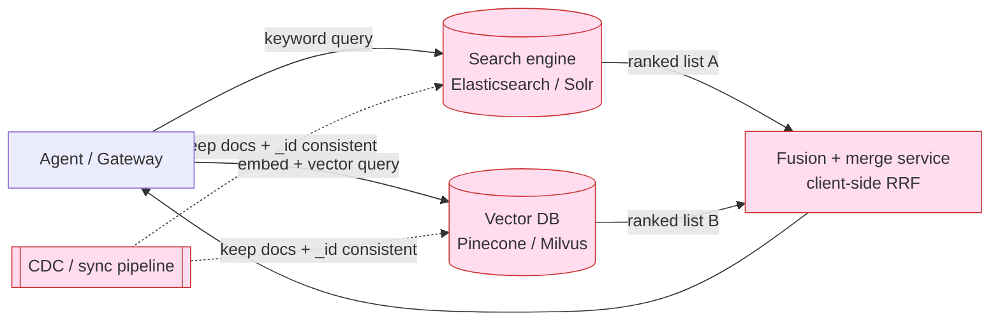
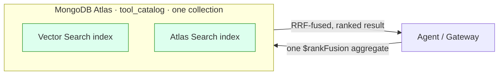

# mdb-mcp-gateway

> A Smart MCP Gateway that routes AI agents to the right tools by **meaning**, not by a hand-maintained table — powered by **hybrid search on MongoDB Atlas**.

---

## The differentiator: Hybrid Search, in one place

Semantic (vector) routing — embed the catalog, hand back the tools a task needs —
is the well-trodden first step, and it works: it slashes the per-turn token bill.
But vector-only retrieval has a blind spot: it fumbles the **exact tokens** agents
constantly use (a tool name, an error code, an order ID), because cosine
similarity rewards meaning, not spelling.

This gateway's core is the upgrade past that: **hybrid search** — fusing semantic
(vector) and lexical (full-text/BM25) retrieval into one ranked result with
Reciprocal Rank Fusion, so an agent finds the right tool whether it asks in
keywords *or* in intent. The interesting part isn't that we do hybrid search;
it's **how little infrastructure it takes**, because MongoDB Atlas does all of it
in one `$rankFusion` query over one collection — no separate vector DB, search
engine, or sync pipeline to keep in lockstep.

### Why hybrid search is genuinely hard to operate

Neither retrieval method is sufficient alone:

- **Lexical (BM25)** nails exact tokens — tool names, error codes, SKUs — but is
  blind to intent. Ask it for *"dangerous storm warnings"* and it happily ranks
  an unrelated `list_customer_orders` first because of common words like "for"
  and "my". (That's a real result from this repo — see below.)
- **Vector (semantic)** understands intent but can miss the exact identifier a
  user typed verbatim.

The fix the industry settled on is **Reciprocal Rank Fusion (RRF)**: run both
retrievers, then merge by *rank position* (`1 / (60 + rank)`) so you never have
to normalize an unbounded BM25 score against a 0–1 cosine score. The pattern is
simple. **Operating it is not** — at least not the traditional way:



That's **four moving parts** to support one feature: a search engine, a vector
DB, a fusion/merge service, and a sync pipeline keeping the two stores
consistent by shared `_id`. Each has its own scaling, backup, and access model —
and they drift out of sync the moment one write lands in one store but not the
other. This is the "architectural sprawl" trap.

### How MongoDB Atlas collapses it to one query

The same documents carry both a `$search` (Atlas Search / BM25) index and a
`$vectorSearch` index. A single `$rankFusion` aggregation stage runs both arms
and fuses them with RRF — natively, server-side, in one round trip:



No second store. No client-side merge. No sync pipeline. No `_id` reconciliation.
The catalog, both indexes, and the fusion math live on **one engine**. That is
the entire pitch of this project distilled to one stage.

The pipeline this repo actually runs (`services/hybrid_search.py`):

```js
db.tool_catalog.aggregate([
  { $rankFusion: {
      input: { pipelines: {
        vectorPipeline:   [ { $vectorSearch: { index: "hybrid-vector-search", path: "embedding",
                                                queryVector: embed(query), numCandidates: 100, limit: 20 } } ],
        fullTextPipeline: [ { $search: { index: "hybrid-full-text-search",
                                         text: { query: query, path: ["name","description","server"] } } },
                            { $limit: 20 } ]
      } },
      combination: { weights: { vectorPipeline: 0.5, fullTextPipeline: 0.5 } },
      scoreDetails: true
  } },
  { $project: { name: 1, description: 1, score: { $meta: "score" },
                scoreDetails: { $meta: "scoreDetails" } } },
  { $sort: { score: -1 } }, { $limit: 5 }
])
```

### See it for yourself: one query, three modes

The gateway exposes a `mode` so you can run the **same query** as `vector`,
`text`, or `hybrid` and watch the arms disagree. Real output from this repo for
`"look up a purchase by its id"`:

| mode | top 3 results |
| --- | --- |
| `vector` | `find_order`, `update_order_status`, `list_customer_orders` |
| `text` | `find_order`, **`severe_weather_alerts`** ← lexical noise, `list_customer_orders` |
| `hybrid` | `find_order`, `list_customer_orders`, `severe_weather_alerts` |

Lexical-only drags an irrelevant *weather* tool into the order results on common
words; the semantic arm corrects it, so hybrid keeps both real order tools above
the noise. The `scoreDetails` are the receipts that *both* arms ran and how the
fusion was computed:

```json
{
  "value": 0.01639,
  "description": "value output by reciprocal rank fusion algorithm, computed as sum of (weight * (1 / (60 + rank))) across input pipelines from which this document is output, from:",
  "details": [
    { "inputPipelineName": "fullTextPipeline", "rank": 1, "weight": 0.5, "value": "..." },
    { "inputPipelineName": "vectorPipeline",   "rank": 2, "weight": 0.5, "value": "..." }
  ]
}
```

> **Versions / notes.** `$rankFusion` is native to MongoDB 8.0+ and is a Preview
> feature; `scoreDetails: true` requires the `featureFlagRankFusionFull` flag,
> which the `mongodb/mongodb-atlas-local:preview` image used here enables — that's
> why this repo runs on that tag. If you need score-based (not rank-based) fusion
> with normalization, MongoDB also offers `$scoreFusion`. The gateway degrades to
> the semantic arm if the fusion stage is unavailable, so search never hard-fails.

---

## Quick Start (Implemented)

> Deploying for real? See **[DEPLOYMENT.md](DEPLOYMENT.md)** for Docker Compose,
> single-container, Kubernetes, and Helm paths, plus an embeddings setup and
> production hardening checklist. For going live, also read
> **[PRODUCTION.md](PRODUCTION.md)** (operations & hardening),
> **[SECURITY.md](SECURITY.md)** (security model & vulnerability reporting), and
> **[NETWORK-SECURITY.md](NETWORK-SECURITY.md)** (trust boundaries & what's handled
> at the perimeter), **[TROUBLESHOOTING.md](TROUBLESHOOTING.md)** (failure-mode
> runbook), and **[docs/API.md](docs/API.md)** (REST + JSON-RPC reference).

This repository now includes a working end-to-end MCP Gateway with:

- FastAPI + FastMCP gateway mounted at `http://localhost:8000/mcp`
- MongoDB Atlas Local (`mongod` + `mongot`) via Docker Compose
- **Semantic `tools/list` discovery**: a task query (`X-MCP-Query` header) returns a curated, ranked shortlist instead of the full catalog — the "route by meaning" front door
- **Identity-bound scope on both discovery and invocation**: scope filtering in search/list and explicit authorization checks in `tools/call`
- Hybrid tool search (`$rankFusion`: vector + full-text) over `tool_catalog`
- **GA-safe hybrid fallback**: application-side RRF keeps hybrid retrieval working when `$rankFusion` preview features are unavailable
- **Resiliency**: a hard downstream deadline (`DOWNSTREAM_TIMEOUT_MS`, default 2000ms) with protocol-safe JSON-RPC error frames
- **Active-active-safe registry watching**: each gateway replica persists its own change-stream resume token (`routing_registry::<instance_id>`) so pods do not overwrite each other's stream position
- **JIT downstream credentials**: every `tools/call` mints a short-lived RS256 bearer JWT (tenant-scoped workload identity) and rotates pooled downstream clients when a token nears expiry
- **Embedding resiliency**: retries + circuit breaker + lexical fallback when embedding providers are unavailable
- **Pluggable, admin-configurable embeddings**: Ollama, OpenAI, Azure OpenAI, Voyage AI, and Google Gemini — switchable at runtime from the admin panel, with vector width auto-detected per provider (see [Embeddings](#embeddings))
- **Layered guardrails**: regex floor + optional semantic injection classifier over a versioned `guardrail_signatures` vector corpus, plus optional Presidio NER redaction
- **Semantic cache model provenance**: cache entries are stamped with `embedding_model` / `embedding_dim` / `embedding_version`, with version-aware lookups and migration tooling
- Default Ollama embeddings (`nomic-embed-text`) through `http://host.docker.internal:11434`
- Demo downstream MCP servers: weather and orders
- **Observability**: request IDs, JSON logs, Prometheus `/metrics`, prebuilt Prometheus alert rules, a provisioned Grafana dashboard (`http://localhost:3000`), OpenTelemetry tracing (`ENABLE_TRACING=true`) with spans around RPC handling and downstream hops, and health split (`/health/live`, `/health/ready`)
- **Delivery artifacts**: k8s manifests, Helm chart, CI workflow (lint + format + types + 82% coverage gate), pre-commit, Ruff, and MyPy configuration

### Prerequisites

- Docker / Docker Compose
- Ollama running on your host machine
- Pulled embedding model:

```bash
ollama pull nomic-embed-text
```

Optional for ML NER redaction (`GUARDRAIL_PII_NER_ENABLED=true`):

```bash
pip install -e ".[guardrails-ml]"
python -m spacy download en_core_web_sm
```

### Run

```bash
docker compose up --build
```

The bootstrap service will:

1. Wait for MongoDB
2. Create Search + Vector Search indexes
3. Seed `routing_registry` and `session_context`
4. Sync downstream tools into `tool_catalog` with embeddings

### Verify

- Health:

```bash
curl http://localhost:8000/health
```

- Dashboards and alerts:

```bash
open http://localhost:3000   # Grafana (admin/admin)
open http://localhost:9090   # Prometheus + alert rules
```

- JSON-RPC hybrid search (default `mode` is `hybrid`):

```bash
curl -X POST http://localhost:8000/rpc \
  -H "Content-Type: application/json" \
  -d '{
    "jsonrpc":"2.0",
    "id":"search-1",
    "method":"tools/search",
    "params":{"query":"weather in montreal","limit":5}
  }'
```

- Compare retrieval modes on the same query (`mode`: `hybrid` | `vector` |
  `text`). Run all three to see the vector and lexical arms disagree, then watch
  `$rankFusion` reconcile them:

```bash
for MODE in vector text hybrid; do
  echo "== $MODE =="
  curl -s -X POST http://localhost:8000/rpc \
    -H "Content-Type: application/json" \
    -d "{\"jsonrpc\":\"2.0\",\"id\":\"m\",\"method\":\"tools/search\",
         \"params\":{\"query\":\"look up a purchase by its id\",\"limit\":3,\"mode\":\"$MODE\"}}"
done
```

- Semantic `tools/list` (route by meaning). With no query you get the full
  catalog; with an `X-MCP-Query` header you get a curated shortlist:

```bash
curl -X POST http://localhost:8000/rpc \
  -H "Content-Type: application/json" \
  -H "X-MCP-Query: I need to check the weather forecast" \
  -d '{"jsonrpc":"2.0","id":"list-1","method":"tools/list","params":{}}'
```

- Initialize handshake + capabilities:

```bash
curl -X POST http://localhost:8000/rpc \
  -H "Content-Type: application/json" \
  -d '{"jsonrpc":"2.0","id":"init-1","method":"initialize","params":{}}'
```

- Paginated `tools/list`:

```bash
curl -X POST http://localhost:8000/rpc \
  -H "Content-Type: application/json" \
  -d '{"jsonrpc":"2.0","id":"list-paged","method":"tools/list","params":{"limit":2,"cursor":"0"}}'
```

- Identity-bound scope. In `AUTH_MODE=disabled`, you can simulate caller groups
  via `X-MCP-Scopes`; in authenticated modes (`hs256` / `jwks`), verified token
  claims (`groups`/`scopes`) are enforced and headers are ignored:

```bash
# readonly caller: update_order_status (orders:write) is filtered out
curl -X POST http://localhost:8000/rpc \
  -H "Content-Type: application/json" \
  -H "X-MCP-Scopes: orders,readonly" \
  -d '{"jsonrpc":"2.0","id":"list-2","method":"tools/list","params":{}}'
```

- JSON-RPC tool call through gateway proxy:

```bash
curl -X POST http://localhost:8000/rpc \
  -H "Content-Type: application/json" \
  -d '{
    "jsonrpc":"2.0",
    "id":"call-1",
    "method":"tools/call",
    "params":{
      "server":"weather",
      "name":"get_current_weather",
      "arguments":{"city":"Montreal","unit":"celsius"}
    }
  }'
```

- Cache migration status (admin route):

```bash
curl -X POST http://localhost:8000/admin/cache/migrate \
  -H "Content-Type: application/json" \
  -d '{"mode":"status"}'
```

- Cache migration via CLI (status / purge / reembed):

```bash
python -m scripts.migrate_cache --mode status
python -m scripts.migrate_cache --mode purge
python -m scripts.migrate_cache --mode reembed --batch-size 200
```

### Web admin console

The gateway now serves a WordPress-style admin UI at `http://localhost:8000/ui`.

- In `docker-compose.yml`, demo credentials are preconfigured:
  - `ADMIN_EMAIL=demo@demo.com`
  - `ADMIN_PASSWORD=demo`
- Login is required for the admin surface (`/ui` and `/admin/*`) in **all** `AUTH_MODE`s.
- Browser sessions are cookie-based (HttpOnly); mutating admin API calls require a CSRF header.

You can still use the admin CLI under strict admin auth:

```bash
ADMIN_EMAIL=demo@demo.com ADMIN_PASSWORD=demo \
python -m scripts.admin --base-url http://localhost:8000 server list --tenant-id local-dev
```

Disable the UI with:

```bash
ADMIN_UI_ENABLED=false
```

### Embeddings

Embeddings power vector and hybrid search, the semantic cache, and the semantic
guardrail classifier. The provider is **pluggable** and can be configured two
ways, with the control DB taking precedence over the environment:

1. **Environment** (boot-time default).
2. **Admin panel** at `/ui` → **Embeddings** (runtime, persisted, recommended).

Supported providers:

| Provider | `EMBEDDING_PROVIDER` | Auth | Default model |
| --- | --- | --- | --- |
| Ollama (local) | `ollama` | none | `nomic-embed-text` |
| OpenAI | `openai` | `EMBEDDING_API_KEY` | `text-embedding-3-small` |
| Azure OpenAI | `azure_openai` | `EMBEDDING_API_KEY` + endpoint/deployment | (deployment) |
| Voyage AI | `voyage` | `EMBEDDING_API_KEY` | `voyage-3` |
| Google Gemini | `gemini` | `EMBEDDING_API_KEY` | `text-embedding-004` |

Key behaviors:

- **Dimensions are auto-detected** by embedding a short probe string when a
  config is applied — you never hand-configure vector widths, and the stored
  width is always exactly what the provider returns (so Atlas vector indexes
  can't drift out of sync with the data).
- **API keys are encrypted at rest** in the control DB (Fernet, keyed by
  `EMBEDDING_SECRET`, falling back to `ADMIN_SESSION_SECRET` / `JWT_SECRET`) and
  are always masked in API responses. Prefer a file mount via
  `EMBEDDING_API_KEY_FILE` / `EMBEDDING_SECRET_FILE` in production.
- **Changing the provider/model/dimensions auto-reprovisions** everything that
  depends on the embedding space: it re-embeds every tenant's `tool_catalog`,
  drops and recreates the `hybrid-vector-search` indexes with the new
  `numDimensions`, refreshes the semantic cache, and re-embeds the control-plane
  guardrail signature corpus. Progress is tracked in `control_db.embedding_status`
  and surfaced live in the panel.
- Configuration is **global** (gateway-wide), so all tenants stay on a single,
  consistent embedding space.

Admin endpoints (platform-admin only):

```text
GET    /admin/embedding          # current config (key masked) + reprovision status
PUT    /admin/embedding          # validate, persist, reload, and reprovision
POST   /admin/embedding/test     # dry-run: reachability + detected dimensions
GET    /admin/embedding/status   # reprovision progress
```

Example: switch to OpenAI from the CLI-style API (the gateway detects the width):

```bash
curl -X PUT http://localhost:8000/admin/embedding \
  -H "Authorization: Bearer $TOKEN" -H "Content-Type: application/json" \
  -d '{"provider":"openai","model":"text-embedding-3-small","api_key":"sk-..."}'
```

> Switching providers is a heavy operation (re-embedding + index rebuilds). It runs
> in the background and search degrades gracefully (lexical fallback) while indexes
> rebuild.

### Standalone gateway container

For single-container deployment, point the gateway at MongoDB and enable startup bootstrap:

```bash
docker build -t mdb-mcp-gateway .
docker run --rm -p 8000:8000 \
  -e MONGODB_URI="mongodb://<host>:27017/?replicaSet=rs0" \
  -e MONGODB_DB_NAME="mcp_gateway" \
  -e AUTO_BOOTSTRAP=true \
  -e ADMIN_UI_ENABLED=true \
  -e ADMIN_EMAIL="admin@example.com" \
  -e ADMIN_PASSWORD="change-me-now" \
  -e ADMIN_SESSION_SECRET="a-very-long-session-secret" \
  mdb-mcp-gateway
```

Important: the gateway requires an **Atlas-capable MongoDB deployment** (Atlas Local or Atlas
cluster) with Search + Vector Search support and replica-set semantics (for the registry watcher's
change streams). A plain standalone `mongod` is not sufficient.

### Run tests

The suite has two tiers.

**Unit tier (fully offline)** — an in-memory async MongoDB fake and a
deterministic embedding stub (`tests/fakes.py`) stand in for Atlas and Ollama,
and downstream HTTP is mocked with `respx`. No external services required:

```bash
pip install -r requirements-dev.txt
pytest -q -m "not integration and not load"
```

To reproduce the CI quality gate locally:

```bash
ruff check . && ruff format --check . && mypy .
pytest -q -m "not integration and not load" --cov --cov-report=term-missing --cov-fail-under=82
```

**Integration tier (18 tests, real stack)** — runs the actual `$rankFusion` /
`$vectorSearch` / `$search` pipelines, the semantic cache, catalog sync, index
DDL, and a concurrency benchmark against a real MongoDB Atlas Local engine and a
real embedding provider.

The tier **owns its own engine**: it starts a pinned
`mongodb/mongodb-atlas-local` container via [testcontainers](https://testcontainers.com/),
verifies it is genuinely search-capable (not a plain `mongod`), bootstraps an
**isolated throwaway database**, and tears everything down afterwards — so it
never touches a shared cluster or leaves residue. All you need is Docker running
and the embedding model pulled:

```bash
ollama pull nomic-embed-text          # embedding model (host Ollama)
pytest -q -m "integration or load"    # testcontainers starts Atlas Local for you
```

To run against an existing Atlas Local instead of provisioning one (e.g. a CI
service container or `docker compose up -d mongodb`), point the tier at it — it
still verifies the engine and uses an isolated DB:

```bash
INTEGRATION_MONGODB_URI=mongodb://localhost:27017/?directConnection=true \
    pytest -q -m "integration or load"
```

The pinned image tag is overridable via `INTEGRATION_ATLAS_IMAGE`, and Ollama
via `OLLAMA_BASE_URL`. If Docker is unavailable and no URI override is given, the
whole tier skips cleanly — a no-op on a bare laptop, a hard gate in CI.

### Local JWKS token flow (offline)

This repo ships a local dev RSA keypair + JWKS for offline auth testing.

```bash
python -m scripts.mint_token --groups orders readonly --roles tool:invoke
```

Then set:

```bash
AUTH_MODE=jwks
JWKS_LOCAL_PATH=./config/dev-jwks.json
JWT_ISSUER=http://localhost:8000
JWT_AUDIENCE=mdb-mcp-gateway
```

**Key rotation.** The JWKS is cached for `JWKS_CACHE_TTL_SECONDS`, but a token whose
`kid` is not in the cached set triggers an immediate out-of-band refresh rather than
waiting out the TTL — so a rotated-in signing key is honored on the next request. To
keep a flood of bogus `kid`s from hammering the IdP, that refresh is throttled to once
per `JWKS_MIN_REFRESH_SECONDS`.

### Tenancy: provisioning and isolation

A tenant's data lives in its own physical database (`tenant_db_name()` derives a
collision-safe name from the verified `tenant_id` claim). Tenant-scoped RPC methods
(`tools/call`, `tools/list`, `tools/search`) call `ensure_tenant_ready()` before
touching any tenant collection:

- **Unknown tenant + `AUTO_PROVISION_TENANTS=true` (default):** the tenant's database
  and indexes are created on first use (cached per process; provisioning is
  idempotent and does not block on Atlas index build).
- **Unknown tenant + `AUTO_PROVISION_TENANTS=false`:** the request returns a clear
  JSON-RPC error (`INVALID_REQUEST`, `data.reason = "tenant_not_provisioned"`) instead
  of silently running against a missing database and returning empty results. Use this
  mode where tenant ids originate from untrusted callers and provisioning should be an
  explicit operator step (`POST /admin/tenants` or `scripts/admin.py`).

### Rate limiting

The per-(tenant, client-ip) limiter counts requests per fixed sub-window but
estimates the rate over a rolling window by weighting the previous window by how much
of it still overlaps "now". This removes the fixed-window failure mode where a caller
spends a full quota at the end of one window and again at the start of the next (a 2x
boundary burst). Tune it with `RATE_LIMIT_WINDOW_SECONDS` and `RATE_LIMIT_MAX_REQUESTS`.

### Active-active watcher resume state

`services/registry_watcher.py` stores resume tokens per gateway instance in
`control_db.watcher_state` using `_id = routing_registry::<instance_id>` where
`instance_id` comes from `GATEWAY_INSTANCE_ID` (or host name fallback). This keeps
replicas from clobbering each other's stream position. Resume-token docs are TTL'd by
`WATCHER_RESUME_TTL_SECONDS`, so stale pod IDs self-clean.

### JIT downstream JWT brokering

The gateway never hands a long-lived secret to a downstream MCP server. Instead it
mints a short-lived RS256 JWT — a **tenant-scoped workload identity** asserting "the
gateway, acting for this tenant, is calling this server" (claims: `iss`, `aud`, `sub =
tenant:<id>:gateway`, `tenant_id`, `iat`, `exp`, `jti`) — and injects it into
downstream transports:

- HTTP/SSE: `Authorization: Bearer <token>`
- stdio: `MCP_DOWNSTREAM_TOKEN=<token>` in child env

The token is deliberately caller-independent: a single warm client is pooled per
`(tenant, server)` and shared across every caller, so embedding volatile per-caller
claims would be wrong for all but the first caller. End-user authorization is already
enforced upstream by `AuthorizationService` before the call is made, and the caller is
recorded on the `downstream.jsonrpc` span (`mcp.actor`) for audit/trace.

The broker (`services/credential_broker.py`) caches tokens per `(tenant, server)` until
they enter the refresh-skew window; the proxy pool checks the same skew on the warm-hit
path and evicts/reconnects with a freshly minted token only when a (re)connect is
actually needed, so steady-state calls never contend on the broker. Tokens are never
logged. Configure via `DOWNSTREAM_JWT_*` and `DOWNSTREAM_TOKEN_*` settings; the bundled
dev key is rejected in `ENVIRONMENT=production` so it can never sign real traffic.

For the bundled demo servers (`servers/weather`, `servers/orders`), enable bearer
verification with `DOWNSTREAM_JWT_VERIFY=true` (and optional `DOWNSTREAM_JWKS_PATH`,
`DOWNSTREAM_JWT_ISSUER`, `DOWNSTREAM_JWT_AUDIENCE`).

### From the blog post to this repo

`blog.md` is the narrative; this table maps each idea to where it actually lives
in the code, so the post and the implementation stay honest with each other.

| Blog concept | Where it lives in this repo |
| --- | --- |
| Route by meaning (curated `tools/list`) | `tools/list` + `X-MCP-Query` in `gateway/routers/rpc.py` → `HybridSearchService.search_tools` |
| Identity-bound scope (`scopes` metadata filter on `$vectorSearch`) | `build_rank_fusion_pipeline(allowed_scopes=...)` in `services/hybrid_search.py`; `scopes` filter field in `database/indexes.py` |
| Verified claim → search filter | `gateway/middleware/auth.py` (claims `groups`/`scopes`, `X-MCP-Scopes` header) threaded into the RPC router |
| Hybrid search (lexical + vector fusion) | `$rankFusion` (RRF) is the **core** retrieval in `services/hybrid_search.py`; `mode=hybrid\|vector\|text` lets you compare the arms |
| One control plane on MongoDB | `tool_catalog`, `routing_registry`, `semantic_cache`, `audit_telemetry` on one engine |
| Resiliency: deadline + protocol-safe failure | `DOWNSTREAM_TIMEOUT_MS` + `DownstreamTimeout`/`DownstreamError` → `UPSTREAM_TIMEOUT`/`INTERNAL_ERROR` frames |
| Catalog freshness off the hot path | `scripts/bootstrap.py` + `services/registry_watcher.py` (Change Streams), embeddings computed on sync |
| Close the loop with the audit trail | `services/telemetry_logger.py` → time-series `audit_telemetry` |

> Okta JWT verification (Section 2 of the post) is documented as the production
> wiring; locally the gateway accepts a verified-claim stand-in via `X-MCP-Scopes`
> (or real JWT claims when `AUTH_MODE=hs256`/`jwks`), so the scope-to-retrieval
> mapping is fully exercisable without a tenant.

# Architectural Blueprint: Building a High-Throughput, Reactive MCP Gateway with FastAPI and MongoDB Async

Most Model Context Protocol (MCP) implementations look great in a weekend demo but crumble under real enterprise demands. When you have hundreds of LLM agents running concurrent tasks, spinning up individual, static connections to a dozen isolated MCP servers creates a chaotic web of infrastructure.

To solve this, we need an intelligent, enterprise-grade **MCP Gateway**.

By pairing **FastAPI** (the king of async Python web frameworks) with **FastMCP** and the native **PyMongo Async API**, we can build a gateway that acts as a single, hardened entry point. It treats MongoDB not just as a cold storage database, but as the live, reactive brain of the entire orchestration layer.

Here is the comprehensive production architecture, design layout, and execution roadmap to build it.

---

## The High-Level Architecture

The gateway sits as an asynchronous reverse proxy between your upstream LLM orchestrators (like LangChain, LlamaIndex, or custom UIs) and your downstream, internal MCP tools.

### Core Architectural Pillars

1. **Asynchronous Edge to Core:** The entire stack relies on non-blocking I/O. FastAPI runs the ASGI event loop, FastMCP manages the asynchronous JSON-RPC protocol states, and PyMongo Async talks directly to MongoDB over native async sockets without thread-pool overhead.
2. **Reactive Configuration:** Zero restarts for tool discovery. We use MongoDB Change Streams to live-update the gateway's memory space the millisecond an internal microservice or tool mapping updates in the database.
3. **Decoupled Security & Observation:** Authentication, Role-Based Access Control (RBAC), PII scrubbing, and cost metrics are treated as global middleware layers rather than hardcoded logic inside the tool executions.

---

## Project Directory Layout

An enterprise-grade Python application needs strict separation of concerns. This layout isolates database management, network routing, and business logic to remain highly maintainable as your system grows.

```text
mcp-gateway/
├── config/                 # Deployment, env vars, and Pydantic global settings
├── database/               # Native PyMongo Async initialization and pool managers
├── gateway/                # FastAPI routing layers, SSE endpoints, WebSocket protocols
│   ├── middleware/         # Security, Rate-limiter, Guardrails, Tenant-isolation
│   └── routers/            # Dynamic JSON-RPC handlers mapping clients to downstream servers
├── services/               # Core business orchestration
│   ├── cache_manager.py    # MongoDB Vector Search semantic cache interface
│   ├── registry_watcher.py # MongoDB Change Stream listener for live tool mounting
│   └── telemetry_logger.py # High-throughput writing to Mongo Time-Series collection
├── models/                 # Pydantic schemas validating MCP and JSON-RPC 2.0 specs
├── tests/                  # Integration and stress testing matrix
├── Dockerfile
└── README.md

```

---

## Architectural Breakdown & Core Logic

### 1. The Reactive Storage Layer (MongoDB Blueprint)

To optimize database read/write profiles, we partition our data models into highly specific MongoDB collection architectures:

| Collection Name | MongoDB Feature Used | Purpose |
| --- | --- | --- |
| `routing_registry` | **Change Streams & Partitions** | Holds metadata and URLs of active downstream MCP servers. |
| `session_context` | **TTL Indexes** | Keeps ephemeral token states and session contexts alive, auto-purging them after inactivity. |
| `semantic_cache` | **MongoDB Vector Search** | Caches expensive LLM responses based on embedding similarity of tool arguments. |
| `audit_telemetry` | **Time-Series Collections** | Highly compressed, high-frequency logging of every single tool execution token cost and response latency. |

### 2. High-Level Gateway Logic (Pseudocode)

Here is the high-level logic running inside the gateway's pipeline, illustrating how a request transitions from an incoming API call to an optimized, audited execution.

#### A. The Middleware Pipeline Loop

Every incoming request must pass through a strict validation chain before a tool is ever evaluated or invoked.

```python
# Conceptual pseudocode for the FastAPI global request pipeline

ASYNC FUNCTION mcp_request_pipeline(client_request):
    # 1. Tenant & Authenticity Check
    tenant_id = extract_and_verify_jwt(client_request.headers)
    IF NOT tenant_id:
        RETURN ErrorResponse(STATUS=401, MESSAGE="Unauthorized Access")
        
    # 2. Rate Limiting via Context Verification
    allowed = CHECK_RATE_LIMIT_IN_MONGO(tenant_id, client_request.client_ip)
    IF NOT allowed:
        RETURN ErrorResponse(STATUS=429, MESSAGE="Rate Limit Exceeded")
        
    # 3. RBAC Filtering
    user_roles = FETCH_ROLES_FROM_SESSION_CONTEXT(tenant_id, client_request.user_id)
    has_permission = EVALUATE_ABAC_MATRIX(user_roles, client_request.target_tool)
    IF NOT has_permission:
        RETURN ErrorResponse(STATUS=403, MESSAGE="Insufficient Permissions for Tool")

    # 4. Content Guardrails (Inbound)
    sanitized_args = RUN_PII_AND_PROMPT_INJECTION_SHIELD(client_request.arguments)
    client_request.arguments = sanitized_args

    # Proceed to Execution Router
    RETURN AWAIT execute_mcp_routing_layer(client_request, tenant_id)

```

#### B. The Smart Routing & Caching Layer

Once validated, the gateway uses semantic optimization to determine if it can bypass downstream compute entirely before running the tool through the FastMCP engine.

```python
# Conceptual pseudocode for semantic caching and routing execution

ASYNC FUNCTION execute_mcp_routing_layer(request, tenant_id):
    # 1. Look for a semantic shortcut using MongoDB Vector Search
    cached_payload = AWAIT check_vector_index_for_similar_execution(
        tool_name=request.target_tool,
        args=request.arguments,
        threshold=0.95
    )
    IF cached_payload IS NOT NONE:
        # Async log hit to telemetry and return immediately
        START_BACKGROUND_TASK(log_telemetry, request, status="CACHE_HIT")
        RETURN cached_payload

    # 2. Fetch live client connection from memory-mapped FastMCP Registry
    mcp_client = InMemoryFastMCPRegistry.get_client(request.target_server)
    IF mcp_client IS NONE:
        RETURN ErrorResponse(STATUS=503, MESSAGE="Target MCP Server Offline")

    # 3. Execute downstream network call asynchronously
    TRY:
        raw_response = AWAIT mcp_client.call_tool(request.target_tool, request.arguments)
        
        # 4. Outbound Content Guardrails
        validated_response = AUDIT_OUTPUT_FOR_DATA_EXFILTRATION(raw_response)

        # 5. Populate cache and telemetry concurrently
        START_BACKGROUND_TASK(save_to_semantic_cache, request.target_tool, request.arguments, validated_response)
        START_BACKGROUND_TASK(log_telemetry, request, status="LIVE_EXECUTION_SUCCESS")

        RETURN validated_response

    EXCEPT DownstreamTimeoutException:
        START_BACKGROUND_TASK(log_telemetry, request, status="TIMEOUT_FAILURE")
        # Protocol-safe JSON-RPC error frame (HTTP 200), not a transport-level 5xx,
        # so MCP clients can parse the failure instead of choking on it.
        RETURN JsonRpcErrorFrame(CODE=-32004, MESSAGE="UPSTREAM_TIMEOUT")

```

#### C. The Dynamic Self-Healing Engine

To achieve zero-downtime reconfiguration, the gateway runs a background loop listening for operational events directly out of MongoDB's replication log.

```python
# Conceptual pseudocode for live cluster hot-reloading

ASYNC FUNCTION watch_mongodb_cluster_changes():
    # Connect directly to the change stream of the configuration collection
    ASYNC WITH db.routing_registry.watch() AS change_stream:
        ASYNC FOR change IN change_stream:
            server_id = change.document_key._id
            
            IF change.operation_type IN ["insert", "update", "replace"]:
                server_doc = AWAIT db.routing_registry.find_one({"_id": server_id})
                
                IF server_doc.is_enabled:
                    # Dynamically construct a new FastMCP client connection string 
                    # and hot-swap it inside the active gateway pool
                    AWAIT InMemoryFastMCPRegistry.mount_or_update(
                        name=server_doc.name, 
                        url=server_doc.connection_url
                    )
                ELSE:
                    AWAIT InMemoryFastMCPRegistry.unmount(server_doc.name)
                    
            ELIF change.operation_type == "delete":
                AWAIT InMemoryFastMCPRegistry.unmount_by_id(server_id)

```

---

## Full Execution & Rollout Roadmap

Building this requires an organized, multi-phased implementation strategy to move securely from foundational scaffolding to an optimized, production-hardened platform.

### Phase 1: Core Scaffolding & Async Foundation

* **Objective:** Establish the asynchronous backbone of the web framework and connection pooling.
* **Tasks:**
* Initialize the FastAPI shell, integrating Pydantic settings for system-wide configuration.
* Set up the global `AsyncMongoClient` layer to manage connection pools without blocking.
* Build the standard JSON-RPC 2.0 base request/response schemas to align with core MCP specifications.


### Phase 2: Reactive Routing & Dynamic Service Discovery

* **Objective:** Connect external clients to multiple downstream endpoints through runtime lookups.
* **Tasks:**
* Implement the background execution loop utilizing PyMongo Change Streams to track additions or removals in `routing_registry`.
* Build the FastMCP client instantiation wrapper that accepts incoming payloads and maps them to dynamic server pools.
* Create the core FastAPI SSE (Server-Sent Events) and WebSocket transport hooks to handle bidirectional streaming safely.


### Phase 3: Enterprise Security, Guardrails & Tenancy

* **Objective:** Secure the perimeter against data leaks, unauthorized access, and request failures.
* **Tasks:**
* Embed authentication hooks into FastAPI dependencies to read incoming bearer tokens against user session tables.
* Implement standard circuit breakers and backoff loops so a failure in an isolated internal microservice doesn't bring down the main gateway.
* Write data validation interceptors inside the request loop to scrub outputs for sensitive records (e.g., matching PII regex structural patterns) before return delivery.


### Phase 4: Intelligence, Optimization & Scale

* **Objective:** Maximize performance, drive down token costs, and establish deep system observation.
* **Tasks:**
* Configure a MongoDB Atlas Vector Search index over the `semantic_cache` collection.
* Wire up a local embedding workflow to analyze incoming argument patterns and intercept repetitive downstream calls.
* Turn on the native MongoDB Time-Series collection engine for `audit_telemetry` to capture structural logs cleanly.
* Package the entire architecture into multi-stage Docker builds optimized for Kubernetes or cloud auto-scaling deployment.
