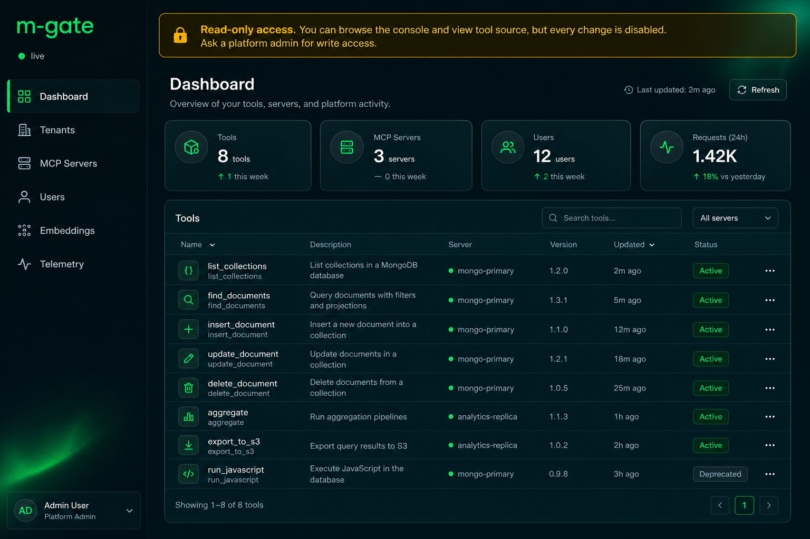
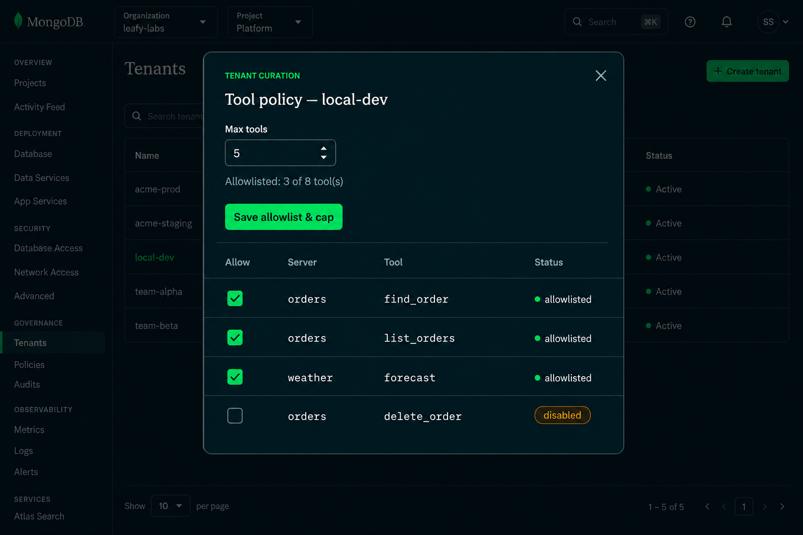
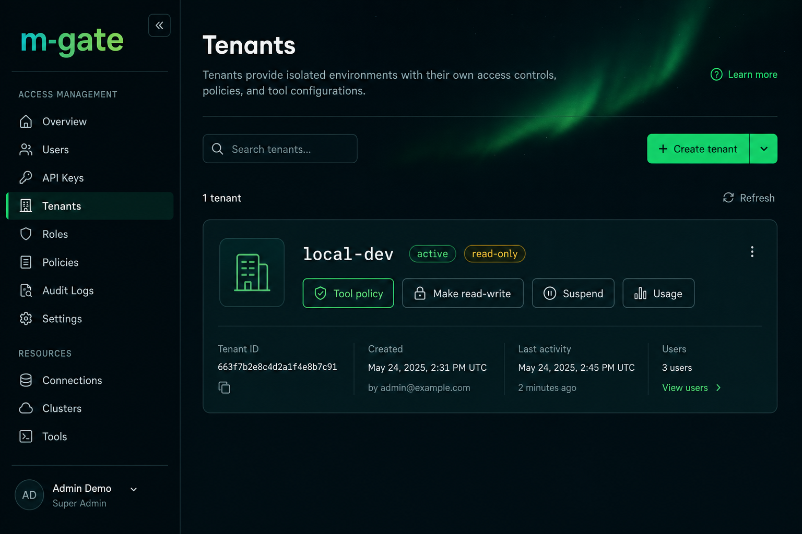
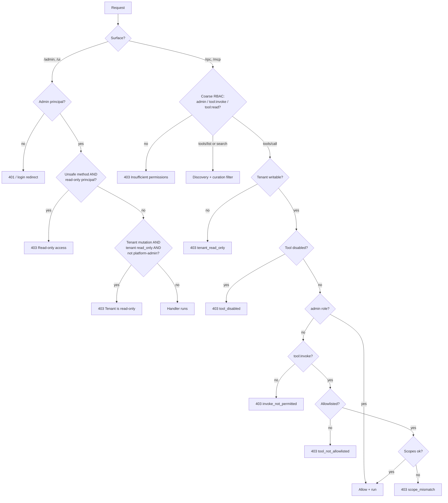

# Read-only mode: safely showcase a tenant

Hand a teammate, customer, or auditor a login that lets them **explore everything
and change nothing**. Read-only mode freezes a tenant against every mutation and
invocation while keeping it fully discoverable, and ships a one-click *viewer*
identity that is read-only on both the admin console **and** the MCP data plane.

> Server-side enforcement is the security boundary. The console hides mutating
> affordances as a courtesy, but the real guard is a `403` returned by the
> gateway — see [§ How it's enforced](#how-its-enforced). For the full auth model
> see [AUTH.md](AUTH.md); for the endpoint reference see [docs/API.md](docs/API.md).

---

## TL;DR

```bash
# 1. Curate what the tenant can see/run (allowlist + cap; optional)
curl -sX PUT localhost:8000/admin/tenants/local-dev/tool-policy \
  -H "Authorization: Bearer $PLATFORM_ADMIN" -H 'content-type: application/json' \
  -d '{"allowlist":["orders/find_order","orders/list_orders","weather/forecast"],"max_tools":25}'

# 2. Freeze the tenant (tools/call + tenant config edits now 403; discovery still works)
curl -sX POST localhost:8000/admin/tenants/local-dev/read-only \
  -H "Authorization: Bearer $PLATFORM_ADMIN" -d '{"reason":"Q3 customer demo"}'

# 3. Mint a read-only viewer identity (console login + discover-only MCP token)
curl -sX POST localhost:8000/admin/users/viewer \
  -H "Authorization: Bearer $PLATFORM_ADMIN" -d '{}'

# …later, lift the freeze
curl -sX POST localhost:8000/admin/tenants/local-dev/read-write \
  -H "Authorization: Bearer $PLATFORM_ADMIN"
```

Net effect: the audience can browse the console, read tool source, and
`tools/list` / `tools/search` the curated catalog — but **cannot** call a tool or
change a single setting. You (platform-admin) keep full control and lift the
freeze whenever you want.

---

## Three building blocks

Read-only mode is three small, orthogonal controls that compose:

| Control | What it does | Scope | Who sets it |
| --- | --- | --- | --- |
| **Read-only tenant** (`read_only` flag) | Freezes a whole tenant: blocks `tools/call` and tenant-scoped config edits. Tenant stays `active` and fully discoverable. | one tenant | platform-admin |
| **Viewer identity** (`viewer` + `tool:read` roles) | A login that is read-only on the console *and* discover-only over MCP. | one user | platform / tenant-admin |
| **Tool curation** (`allowlist`, `max_tools`, `disabled_tools`) | Narrows *which* tools a tenant can discover/run, independent of the freeze. | one tenant | tenant-admin (frozen when read-only) |

`read_only` is **orthogonal to `status`**: a read-only tenant is still `active`
(unlike `suspended`/`deleted`, which cut off discovery too). It freezes writes
without going dark.

---

## What a viewer sees

When a `viewer` signs in, a sticky amber banner makes the constraint obvious and
every mutating control is hidden. The catalog still loads — curated down to
exactly what the tenant policy exposes.



The banner copy is driven by `GET /admin/whoami` (`is_read_only` for a viewer,
`tenant_read_only` for a frozen tenant), so a *full admin* working inside a frozen
tenant sees a different message ("Tenant is read-only…") than a *viewer* ("Read-only
access…").

---

## Walkthrough: showcase a tenant in 3 steps

As a **platform-admin**, from the console (or the equivalent `/admin` calls).

### 1. Curate the surface (optional but recommended)

Open **Tenants → Tool policy** and pick the handful of tools the audience should
see. An **empty allowlist means unrestricted** (curation is opt-in), so you only
ever curate when you want to. Set a `max_tools` cap to bound registration, and
flip the per-tool **disabled** switch to hard-kill anything risky — a disabled
tool is hidden and refused for *everyone, including admins*.



A tool is **available** (discoverable + invocable) when it is *not* in
`disabled_tools` **and** (the allowlist is empty **or** it matches the allowlist,
including `server/*` wildcards). Curation filters **discovery and invocation**
together, so a curated showcase only ever surfaces the curated set.

### 2. Freeze the tenant

Open **Tenants** and click **Make read-only** (an optional reason is recorded for
the audit trail). The tenant gains a `read-only` badge; `tools/call` and
tenant-scoped config edits now return `403`, while discovery keeps working. Click
**Make read-write** to lift it at any time.



### 3. Hand out a viewer login

Click **Users → Create viewer user**. The single credential it returns carries
`user` + `viewer` + `tool:read`, so it is read-only on **both** planes at once:

- **Console** — logs into the admin UI read-only (browse the UI + tool source);
  every mutation `403`s.
- **MCP** — `Generate token` mints a `tool:read` bearer (plus a paste-ready Cursor
  `mcp.json`) that can `tools/list` / `tools/search` the curated catalog, but
  `tools/call` is rejected with `invoke_not_permitted`.

---

## Roles & principals

Hand out the narrowest role that does the job:

| Role | Console (`/admin`, `/ui`) | Data plane (`/rpc`, `/mcp`) | Intended for |
| --- | --- | --- | --- |
| `platform-admin` | full read/write, **all tenants** | full | operators |
| `admin` (tenant-admin) | full read/write, **own tenant** | full | tenant owners |
| `viewer` | **read-only** (loads UI + tool source; every mutation `403`) | — | safe showcase / auditors |
| `tool:invoke` | — | `tools/list` + `tools/search` + **`tools/call`** | apps & agents that run tools |
| `tool:read` | — | `tools/list` + `tools/search` only (**`tools/call` → `403`**) | discover-only MCP tokens |
| `user` | authenticated, no console | — (needs an invoke/read role) | base identity |

The one-click **Create viewer user** combines `viewer` + `tool:read` into one
credential. A full admin that *also* carries `viewer` is never downgraded
(`is_read_only_principal` = has `viewer` **and not** any admin role).

---

## What exactly is frozen

When a tenant is `read_only`, these are refused for tenant-admins
(**platform-admin always bypasses** — they own the freeze and may need to
reconfigure or lift it):

| Surface | Operation | Result when frozen |
| --- | --- | --- |
| Data plane | `tools/call` (`/rpc` + `/mcp`) | `403` / `tenant_read_only` (before authz, quota, downstream) |
| Control plane | server create / patch / delete / enable / disable | `403` "Tenant is read-only; mutations are disabled." |
| Control plane | per-tool enable / disable, tool-policy `PUT` | `403` |
| Control plane | server env (secrets) `PUT`, egress allowlist `PUT` | `403` |
| Control plane | user create / demo / viewer / update / delete | `403` |

**Still allowed while frozen** (deliberately): all `GET`s (UI load, tool-source
view, catalog, exports), token minting, and self-service password change — none
mutate tenant state, and the data plane is already frozen.

A **viewer principal** is even stricter: a single RBAC choke point refuses *every*
unsafe method on `/admin` (`403` "Read-only access: mutations are disabled."),
regardless of which tenant they target.

---

## How it's enforced

Two independent gates, mirrored across both data-plane surfaces, with the console
purely cosmetic on top.



The per-call decision order in `authorize_tool_call` is deliberate: **`tool_disabled`
is checked before the admin bypass**, so a disabled tool is an absolute kill-switch
that blocks everyone, while `invoke_not_permitted` is what keeps a `tool:read`
viewer discover-only.

**Code map** (the security boundary lives in these files):

| Concern | Where |
| --- | --- |
| `read_only` flag, `assert_tenant_writable`, cache | [`services/tenant_status.py`](services/tenant_status.py) |
| allowlist / `max_tools` / `disabled_tools`, discovery filter | [`services/tenant_tool_policy.py`](services/tenant_tool_policy.py) |
| per-call invoke + allowlist + disabled checks | [`services/authorization.py`](services/authorization.py) |
| data-plane freeze + discovery filter | [`gateway/routers/rpc.py`](gateway/routers/rpc.py), [`gateway/mcp_server.py`](gateway/mcp_server.py) |
| viewer / read-only principal flags | [`gateway/middleware/auth.py`](gateway/middleware/auth.py) |
| read-only mutation choke point + coarse gate | [`gateway/middleware/rbac.py`](gateway/middleware/rbac.py) |
| control-plane writable guard | [`gateway/routers/admin/_common.py`](gateway/routers/admin/_common.py) (`_require_tenant_writable`) |

---

## API reference

| Method & path | Auth | Notes |
| --- | --- | --- |
| `POST /admin/tenants/{id}/read-only` | platform-admin | Optional body `{"reason":"…"}`. |
| `POST /admin/tenants/{id}/read-write` | platform-admin | Lifts the freeze. |
| `GET /admin/tenants/{id}/tool-policy` | tenant-admin | Returns `allowlist`, `max_tools`, `disabled_tools`, and `available_tools` (the full catalog with per-tool `allowlisted`/`disabled` flags). |
| `PUT /admin/tenants/{id}/tool-policy` | tenant-admin | Body `{"allowlist":[…],"max_tools":N}`. Refused when read-only (platform-admin bypasses). |
| `POST /admin/tools/{server}/{name}/disable` · `/enable` | tenant-admin | Per-tool kill-switch overlay. Refused when read-only. |
| `POST /admin/servers/{name}/disable` · `/enable` | tenant-admin¹ | Mounts/unmounts a virtual server. Refused when read-only. |
| `POST /admin/users/viewer` | platform / tenant-admin | One-click read-only viewer identity. Refused when read-only. |
| `GET /admin/whoami` | any admin principal | Includes `is_read_only` (viewer) and `tenant_read_only` (frozen tenant). |

¹ Tenant-admins may toggle their own `tenant`-origin servers; `platform`-origin
servers require platform-admin.

**Settings:** `PLATFORM_VIEWER_ROLE` (default `viewer`) names the read-only console
role. `read_only` / curation changes take effect within
`TENANT_STATUS_CACHE_TTL_SECONDS` across replicas (immediately on the acting node).

---

## Errors & troubleshooting

| Symptom | Meaning | Fix |
| --- | --- | --- |
| `tools/call` → `403` `reason=tenant_read_only` (JSON-RPC `FORBIDDEN`, `-32003`) | The tenant is frozen read-only. | **Make read-write** (platform-admin). Discovery still works while frozen. |
| `tools/call` → `403` `reason=invoke_not_permitted` | The token is discover-only (`tool:read`, e.g. a viewer). | Use an account with `tool:invoke` to run tools. |
| `tools/call` → `403` `reason=tool_not_allowlisted` | The tool is outside the tenant allowlist. | Add it in **Tool policy** (or clear the allowlist for unrestricted). |
| `tools/call` → `403` `reason=tool_disabled` | The tool is disabled for the tenant (blocks everyone, incl. admins). | Re-enable it in **Tool policy**. |
| `403 {"detail":"Read-only access: mutations are disabled."}` | You're signed in as a `viewer` (read-only console). | Sign in as an admin to make changes. |
| `403 {"detail":"Tenant is read-only; mutations are disabled."}` | You're a tenant-admin editing a frozen tenant. | A platform-admin must lift the freeze (or make the change themselves). |
| `422 …max-tools cap…` | A server registration would exceed `max_tools`. | Raise the cap in **Tool policy** or register fewer tools. |

---

## Tested behavior

Read-only mode is covered end-to-end by the offline unit suite:

- `tests/test_tenant_status.py` — `read_only` set/clear, cache, `assert_tenant_writable`.
- `tests/test_tenant_tool_policy.py` — allowlist matching (exact + `server/*`), `max_tools`, disabled overlay, discovery filter.
- `tests/test_authorization.py` — `invoke_not_permitted`, `tool_not_allowlisted`, admin bypass, disabled-blocks-everyone.
- `tests/test_readonly_admin.py` — read-only toggle, tool-policy GET/PUT, server/tool enable-disable, `max_tools` at registration, and the control-plane freeze for servers **and user management**.
- `tests/test_middleware.py` — viewer → admin principal + read-only mutation `403`; `tool:read` clears the coarse gate but `tools/call` stays forbidden.
- `tests/test_admin_demo_user.py` — viewer-user creation (`user` + `viewer` + `tool:read`) and `whoami` surfacing.

```bash
pytest -q -m "not integration and not load"
```
