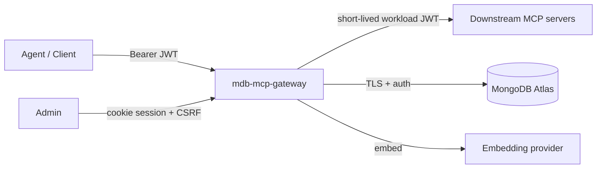

# Security Policy

This document describes the security model of the MongoDB MCP Gateway, the
controls it ships with, how to report a vulnerability, and — just as importantly —
**what it deliberately does not do** because those concerns are owned by the layers
around it.

Companion documents:

- [`NETWORK-SECURITY.md`](NETWORK-SECURITY.md) — trust boundaries, TLS, egress, and
  the perimeter controls handled **outside** the product.
- [`PRODUCTION.md`](PRODUCTION.md) — production deployment, hardening, and operations.
- [`DEPLOYMENT.md`](DEPLOYMENT.md) — step-by-step deploy paths (Compose / container / k8s / Helm).

---

## Reporting a vulnerability

**Please do not open a public GitHub issue for security problems.**

Report privately through one of:

- GitHub → **Security** tab → **Report a vulnerability** (private advisory), or
- email **`security@your-org.example`** *(replace with your real security contact before publishing this repo)*.

Include: affected version/commit, a description, reproduction steps or a proof of
concept, and the impact you observed. We aim to acknowledge within **2 business days**
and to provide a remediation timeline after triage. Please give us a reasonable
disclosure window before publishing details. We credit reporters who request it.

---

## Supported versions

This is a reference implementation; security fixes land on `main`. Pin to a commit or
tagged image for production and track `main`/`CHANGELOG.md` for security-relevant
changes. There is no long-term support branch.

| Version | Supported |
| --- | --- |
| `main` (latest) | ✅ |
| Older tags / commits | ❌ (upgrade to latest) |

---

## What the gateway is (trust model)

The gateway is a **policy enforcement point and reverse proxy** between AI agents
(upstream) and MCP tool servers (downstream), backed by MongoDB Atlas for its control
plane, catalog, cache, and audit telemetry.

Core trust assumptions:

- **Upstream callers are untrusted** until a request passes authentication and
  authorization. Identity comes from a verified bearer JWT (or an admin session).
- **The gateway is trusted by downstream servers** as a workload identity — it
  authenticates to each downstream with a short-lived token it mints itself
  (see *Downstream credential brokering* below). End-user authorization is enforced
  at the gateway **before** the downstream call.
- **MongoDB Atlas is the source of truth** for catalog, sessions, rate-limit buckets,
  audit telemetry, and the admin-managed embedding config. Its own access controls
  (TLS, SCRAM/X.509, network access list) are part of the security boundary.
- **The network perimeter is trusted to terminate TLS and filter traffic** (see
  [`NETWORK-SECURITY.md`](NETWORK-SECURITY.md)). The gateway speaks plain HTTP on its
  listen port and expects to sit behind an ingress/load balancer/service mesh.

---

## Built-in security controls

All references point at the code that implements the control.

### Authentication

> For the full end-to-end picture (request pipeline, settings reference,
> recipes), see [`AUTH.md`](AUTH.md).

- **Security is always enforced** — there is no "off" mode. Two modes via
  `AUTH_MODE` (`config/settings.py`): `hs256` (shared-secret JWT, the default) and
  `jwks` (asymmetric RS256 verified against a JWKS). Mint ready-to-use scoped
  tokens for managed users straight from the admin console (Users → Generate token).
- Bearer tokens are verified in `gateway/middleware/auth.py`. Issuer (`JWT_ISSUER`)
  and audience (`JWT_AUDIENCE`) are enforced when configured.
- **JWKS resolver hardening**: key cache with TTL; an unknown `kid` triggers a single
  out-of-band refresh, **throttled** to at most once per `JWKS_MIN_REFRESH_SECONDS`, so
  a flood of bogus `kid`s cannot amplify into a request storm against your IdP.
- **Fail classification**: a *bad token* returns `401`; a *JWKS-unavailable* condition
  returns `503` (retryable, server-side) so "users sent bad tokens" is never confused
  with "our IdP is down". The client-facing body stays opaque; the precise reason is
  emitted as a metric label + structured log only.
- **Admin sessions** (`services/admin_session.py`): HS256-signed session token in an
  **HttpOnly** cookie, `Secure` when served over HTTPS, `SameSite=Lax`, default 8h TTL.
  The token embeds the principal's `tenant_id` + `roles`, which the auth middleware
  hydrates into `request.state`; only admin-tier roles become admin principals.
  CSRF comparisons use constant-time `hmac.compare_digest`.
- **User store** (`services/users.py`): control-DB `users` collection backs admin-console
  logins. Passwords are hashed with PBKDF2-HMAC-SHA256 (`services/passwords.py`); plaintext
  is never stored and the hash is never returned by the API. Login resolves against this
  store first; the env `ADMIN_EMAIL`/`ADMIN_PASSWORD` pair survives only as a bootstrap
  superuser fallback.
- **Inbound MCP-client auth** (`gateway/routers/auth.py`): MCP clients connecting to the
  gateway's own surface (`/rpc`, `/mcp`) can authenticate with username/password:
  - `POST /auth/token` — OAuth2 Resource Owner Password Credentials grant. Exchanges
    username + password (resolved by the same `resolve_login_principal` used by the admin
    login) for a short-lived bearer (the signed session token), returned as
    `{access_token, token_type, expires_in}`. Works in every `AUTH_MODE`.
  - Optional HTTP Basic directly on `/rpc`/`/mcp` behind `MCP_BASIC_AUTH_ENABLED` (default
    off): credentials are decoded and resolved per request; failures return `401` with a
    `WWW-Authenticate: Basic` challenge.
  - **OAuth is bring-your-own-IdP**: the gateway is an OAuth2/OIDC *resource server* via
    `AUTH_MODE=jwks` and does **not** implement an authorization server. When OAuth metadata
    is advertised (`AUTH_MODE=jwks` or `OAUTH_METADATA_ENABLED=true`),
    `GET /.well-known/oauth-protected-resource` (RFC 9728) describes the configured issuer
    and bearer 401s carry a `WWW-Authenticate: Bearer resource_metadata=...` discovery hint.
  - Authorization is unchanged: both `/rpc` and the FastMCP `/mcp` meta-tool surface require
    the principal to carry `admin` or `tool:invoke` (`gateway/middleware/rbac.py`).

### Authorization

- **Role hierarchy**: `platform-admin` → `tenant-admin` (role `admin`) → `user`. Only a
  platform-admin may grant the `platform-admin` role, manage a platform-admin account, or
  manage users/servers across tenants; a tenant-admin is confined to its own tenant via
  `gateway/routers/admin/_common.py::_resolve_target_tenant`.
- **Coarse RBAC** (`gateway/middleware/rbac.py`): the two tool-invocation surfaces are held
  at parity — **both `/rpc` and the mounted `/mcp` meta-tool app** require the `admin` or
  `tool:invoke` role, honor the account kill-switch, and hydrate roles from
  `session_context`; `/admin` and the admin `/ui` require an admin principal.
- **Per-tool scope enforcement** (`services/authorization.py`): per-call
  `authorize_tool_call` checks the caller's `scopes`/`groups` against the tool's required
  scopes — not just at discovery time. This runs on **both** the `/rpc` `tools/call` path
  and the `/mcp` `call_downstream_tool` meta-tool, so the tool must exist in the tenant
  catalog and the caller must satisfy its scope before the gateway proxies the call. `admin`
  is an explicit override; tools with no required scope are open.
- **Pinning does not bypass discovery scope** (`services/hybrid_search.py`): a tool flagged
  `metadata.always_included` is pinned to the top of search results, but the pin fetch runs
  the **same** identity-bound scope filter as the ranked arms. A caller never sees a pinned
  tool they could not otherwise discover, and pinning grants no extra reach at `tools/call`.
- **Quota, metering & audit parity** (`services/usage_metering.py`,
  `services/data_plane.py`, `services/telemetry_logger.py`): after authorization, **both**
  surfaces enforce the tenant usage quota (`/mcp` raises `ToolError` `quota_exceeded`),
  meter the billable call through the shared `record_billable_call`, and write an
  `audit_telemetry` row for the outcome under one `method="tools/call"` label. `/mcp` is
  therefore not a path to bypass quotas, escape metering, or avoid the audit trail.
- **CSRF protection** (`gateway/middleware/rbac.py`): cookie-authenticated state-changing
  admin requests (`POST/PUT/PATCH/DELETE` under `/admin`) require a matching
  double-submit CSRF token. Bearer-authenticated API calls are exempt (no ambient cookie).

### Multi-tenant isolation

- **Physical database-per-tenant** (`database/mongo.py`): each tenant's data lives in a
  separate database named `tenant_<sanitized>_<sha256[:8]>`. The hash suffix makes the
  mapping collision-safe (`tenant-a`, `tenant.a`, `tenant_a` cannot collide).
- The semantic cache, tool catalog, and session context are all tenant-scoped; cache
  lookups are gated by `tenant_id` so one tenant can never read another's cached results.
- **Tenant binding on both invocation surfaces**: `/rpc` always derives `tenant_id` from the
  verified token claim (never overridable). The `/mcp` meta-tools (`gateway/mcp_server.py`)
  do the same — they read the gateway-verified `request.state` via FastMCP's
  `get_http_request()`. When auth is enabled, a `tenant_id` argument that does not match the
  authenticated tenant is **rejected** (`ToolError` `cross_tenant_forbidden`) rather than
  silently honored, so the meta-tool surface cannot be used to reach across tenants.
  Cross-tenant work stays on the platform-admin `/admin` API.
- `AUTO_PROVISION_TENANTS=false` makes tenant creation an explicit operator step where
  tenant ids come from untrusted callers.
- Server registration now carries an `origin` marker (`platform` or `tenant`):
  tenant-origin registrations are forbidden from using `stdio` / host commands and must
  use publicly routable HTTP/SSE endpoints. This blocks tenant-triggered host process
  execution and private-network SSRF at registration time.

### Network egress controls (per-tenant allowlists)

The gateway's only outbound surface is its proxy to registered downstream MCP servers
(`streamable_http`/`sse`); the code sandbox has no network at all. Outbound egress to
those downstreams is governed by a **two-gate allowlist** so an operator can restrict,
per tenant, exactly which hosts/networks the gateway may reach:

- **Global ceiling** (`EGRESS_GLOBAL_ALLOWLIST`, `config/settings.py`): a deployment-wide
  set of allowed host globs (`*.corp.example`), exact hosts, IP literals, and CIDRs.
- **Per-tenant allowlist** (`services/tenant_egress.py`): stored on the tenant control
  doc and managed via `PUT /admin/tenants/{tenant_id}/egress-allowlist`. When both are
  set, an endpoint must satisfy **both** (the tenant list can only narrow within the
  global ceiling). `EGRESS_DEFAULT_DENY=true` flips to a fully locked "deny unless listed"
  posture.
- **Gate 1 — registration** (`gateway/routers/admin/servers.py::_apply_server_policy`):
  saving a server whose endpoint is not permitted fails fast with `422`, so operators get a
  clear error instead of a runtime failure.
- **Gate 2 — connect (authoritative, rebinding-proof)**
  (`services/egress_transport.py`): on **every** outbound connect the policy is
  re-resolved, the host is re-resolved via DNS, each resolved IP is screened against the
  SSRF denylist **and** the allowlist, and the connection is **pinned to the validated
  IP** (the request URL host is rewritten to that IP while the original `Host` header and
  TLS SNI are preserved). This closes the DNS-rebinding / TOCTOU window where a name that
  passed validation later resolves to an internal address.
- The SSRF denylist (loopback, link-local, private, reserved, unspecified, CGNAT) is a
  single shared definition (`services/server_guard.py::ip_is_disallowed`) used by both
  gates, so they can never drift. Blocked connections are surfaced as protocol-safe
  downstream errors and counted via `gateway_egress_blocks_total{stage}`
  (`register`/`connect`).

### Code-backed tool sandbox execution

- Users may author Python functions as tools (`transport="code"`). Execution remains
  gated behind `CODE_TOOL_EXECUTION_ENABLED` (default off). When enabled, code tools
  run through the WebAssembly executor (`CODE_EXECUTOR=wasm`) in a **fresh worker
  subprocess per call**; they are not proxied to downstream HTTP/SSE/stdio sessions.
- **Encrypted at rest:** authored `raw_code` is encrypted before persistence using the
  same tenant-secret cipher as embedding API keys (`services/code_tools.py` →
  `services/embedding_config` → `database/encryption.py`): a per-tenant Queryable
  Encryption DEK when QE is enabled, a deployment-wide Fernet key otherwise. Source is
  redacted from list responses (a `has_raw_code` flag) and is **never copied into the
  searchable tool catalog** — only the description is embedded.
- **Authoring-time lint** (`lint_code_tool`) is a defense-in-depth gate, *not* a security
  boundary (the sandbox is): it caps source size, AST-rejects dangerous imports
  (`os`, `sys`, `subprocess`, `socket`, `ctypes`, …), `eval`/`exec`/`compile`/`open`, and
  classic dunder escape chains, and requires pinned PyPI specs (`name==version`),
  rejecting URL/VCS/file/local/range specifiers.
- **Runtime isolation controls:** the sandbox worker sets WASI deny-by-default
  capabilities (no inherited env, no host network sockets, only a preopened job dir),
  plus per-call fuel (CPU), linear-memory cap (`store.set_limits`), wall-clock deadline
  (epoch interruption + a parent-side kill), output-size cap, POSIX rlimits backstop, and
  both per-tenant **and** a process-wide concurrency semaphore
  (`SANDBOX_MAX_GLOBAL_CONCURRENCY`) so many tenants cannot collectively exhaust the host.
  Each call tears down (or, for a warm worker, recycles) on timeout/error.
- **Bounded result frames (no memory-DoS):** the guest's stdout/stderr are read
  back capped at the output limit, and the *entire* emitted result frame is hard-capped
  (`services/sandbox_errors.frame_budget_bytes`). An over-budget result fails **closed**
  with an `output_limit` error instead of streaming an unbounded line back to the parent;
  the parent's stream-reader buffer is sized from the same formula so a legitimate near-cap
  result is never silently truncated.
- **Warm-pool parity:** a pooled (`SANDBOX_POOL_SIZE>0`) worker is long-lived but keeps the
  same per-call isolation — every job runs in a fresh wasm `Store`. Cumulative POSIX limits
  (CPU/address-space) are omitted on the resident worker (they would eventually kill a
  healthy worker); instead it gets non-cumulative ceilings (output file size with `SIGXFSZ`
  ignored so an over-limit write fails the *job* not the worker, and a descriptor cap), and
  any worker that times out, crashes, overruns the frame buffer, or hits an unexpected error
  is **always** killed and replaced — never returned to serve a later caller.
- **Server env injection:** per-server code-tool env values are stored encrypted in the
  tenant DB (`server_secrets`) and injected into sandbox runtime as `context.env`,
  never into gateway process environment variables.
- **Dependency installation is deny-by-default:** a code tool's pinned `requirements`
  are installed with host `pip` *before* the wasm jail, so a source build could execute
  `setup.py` on the host. The executor therefore (a) refuses any distribution not in the
  operator allowlist `SANDBOX_ALLOWED_REQUIREMENTS` (empty by default ⇒ stdlib-only code
  tools) and (b) installs **wheels only** (`--only-binary=:all: --no-deps`), so no source
  build runs on the host — allowlisted package code only executes later, inside the sandbox.
  The pinned-spec authoring lint is *not* a substitute for this; the allowlist is the boundary.

### Human-in-the-loop destructive-action approvals

- Tools can declare `metadata.requires_confirmation=true` and an `action_type`
  (`read`/`write`/`destructive`). On `tools/call`, the gateway halts execution and
  creates a TTL-backed `pending_actions` record (`tenant_id`, requester, tool, args,
  expiry, status).
- Approval is a second-person control: only tenant-admin/platform-admin can
  approve/reject, and requesters cannot decide their own actions.
- Approved actions are argument-bound: the caller must re-submit the same
  `server`/`tool`/`arguments` with `confirmation_id`. Any mismatch is rejected.
- Pending actions auto-expire via TTL and become non-executable.
- Approve/reject decisions are appended to `audit_telemetry` with approver and
  action metadata for forensic traceability.

### Downstream credential brokering (JIT)

- Downstream auth is intentionally minimal. The gateway brokers only a **workload
  identity**, selected per server via `metadata.auth.scheme`:
  - `jwt` (default): gateway-minted short-lived RS256 workload identity
  - `none`: no transport credential — the **downstream service or the tenant** presents
    its own authentication (vendor API keys, basic auth, OAuth, mTLS, etc.)
- Third-party credentials (API keys, passwords, OAuth client secrets) are deliberately
  **not** brokered per-server by the gateway: they belong to the downstream/tenant, not
  to the gateway's control plane. Use `scheme=none` and terminate that auth downstream.
- Credentials are cached per `(tenant, server)` and rotated/reconnected via the same
  near-expiry logic used by the warm-client pool. **Credential material is never logged.**
- Credentialed (`jwt`) downstream `http://` endpoints are rejected by default at
  save/connect time unless `DOWNSTREAM_ALLOW_INSECURE_CREDENTIALS=true`.
- The **bundled dev signing key is rejected** when `ENVIRONMENT=production` — you must
  configure your own `DOWNSTREAM_JWT_PRIVATE_KEY(_FILE)`.

### Guardrails / data-loss prevention

- `gateway/middleware/guardrails.py` runs on `/rpc` and the mounted `/mcp` surface:
  - **Request size limit** (`REQUEST_MAX_BYTES`, default 256 KiB): rejected via the
    declared `Content-Length` *before* buffering, with a post-read backstop → `413`.
  - **Inbound prompt-injection / jailbreak screening** with a deterministic regex floor,
    plus an optional semantic classifier (`GUARDRAIL_ML_ENABLED`) over a versioned
    signature corpus.
  - **Outbound PII redaction** of responses, with an optional Presidio NER fallback
    (`GUARDRAIL_PII_NER_ENABLED`).
  - **Resilience controls**: `GUARDRAIL_FAIL_MODE` (`open`/`closed`), timeout, and a
    circuit breaker so a slow/broken classifier can't take down the request path.

### Abuse / availability controls

- **Distributed rate limiting** (`gateway/middleware/ratelimit.py`): per
  `(tenant, client-ip)` sliding window, backed by MongoDB and synchronized to the DB
  server clock so all replicas agree on window boundaries. Emits
  `X-RateLimit-*`/`Retry-After`. *See the client-IP caveat in
  [`NETWORK-SECURITY.md`](NETWORK-SECURITY.md).*
- **Hard downstream deadline** (`DOWNSTREAM_TIMEOUT_MS`, default 2000ms) with
  protocol-safe JSON-RPC error frames, so a hung tool can't pin a worker.

### Secrets handling

- **File-backed secrets**: every sensitive value has a `*_FILE` companion
  (`MONGODB_URI_FILE`, `JWT_SECRET_FILE`, `ADMIN_PASSWORD_FILE`,
  `ADMIN_SESSION_SECRET_FILE`, `EMBEDDING_API_KEY_FILE`, `EMBEDDING_SECRET_FILE`,
  `DOWNSTREAM_JWT_PRIVATE_KEY_FILE`, `ATLAS_PASSWORD_FILE`), so you can mount them as
  files instead of putting them in the environment (`config/settings.py`).
- **Embedding API keys are encrypted at rest** (Fernet, keyed by `EMBEDDING_SECRET`) in
  the control DB and always masked in API responses.
- Secrets are never written to logs or telemetry; auth failures are logged by *category*
  only, and downstream tokens are never logged.

### Queryable Encryption (field-level, KMS-backed)

- `routing_registry` secret-bearing fields (`env`, `command`, `args`, `metadata`)
  can be protected with MongoDB Queryable Encryption (QE) using DEKs in
  `encryption.__keyVault` (`database/encryption.py`).
- DEKs are wrapped by a customer master key managed outside MongoDB:
  - `KMS_PROVIDER=aws`: AWS KMS (or LocalStack KMS for local dev).
  - `KMS_PROVIDER=local`: local 96-byte master key for no-external-KMS demos.
- With QE enabled, these fields are encrypted client-side before writes and
  transparently decrypted for authorized application reads. Raw DB reads return
  ciphertext.
- Current scope intentionally excludes `audit_telemetry` because it is a
  time-series collection and QE does not support time-series collections.

### Fail-closed production safety

Auth is always enforced (there is no open mode to disable). When
`ENVIRONMENT=production`, the gateway additionally **refuses to start** unless
(`config/settings.py::_validate_prod_safety`):

- `hs256`: `JWT_SECRET` is ≥16 chars and not a known weak value.
- `jwks`: `JWT_ISSUER` and `JWT_AUDIENCE` are set, plus `JWKS_URI` or `JWKS_LOCAL_PATH`.
- `CORS_ALLOW_ORIGINS` is **not** `*`.
- If the admin UI is enabled: `ADMIN_EMAIL` is set, `ADMIN_PASSWORD` ≥12 chars (not weak),
  `ADMIN_SESSION_SECRET` ≥16 chars (not weak).
- Downstream JWT brokering is not using the bundled dev signing key.

### Container / runtime hardening

- The image runs as a **non-root** user (uid 10001), multi-stage build, with a healthcheck
  (`Dockerfile`).
- The Kubernetes manifests (`deploy/k8s/`) set `runAsNonRoot`, `readOnlyRootFilesystem`,
  drop **all** capabilities, `allowPrivilegeEscalation: false`, `seccompProfile:
  RuntimeDefault`, resource limits, a PodDisruptionBudget, and a default-deny
  NetworkPolicy.

### Observability for security

- Structured JSON logs with request IDs (`LOG_JSON`), Prometheus metrics (`/metrics`),
  and optional OpenTelemetry tracing (`ENABLE_TRACING`).
- Auth failures, guardrail events, rate-limit decisions, and downstream errors are all
  surfaced as metrics so you can alert on credential-stuffing, injection attempts, and
  abuse.

---

## Out of scope (owned by other layers)

The gateway intentionally **does not** implement these — they are handled at the
infrastructure/perimeter layer and are documented in
[`NETWORK-SECURITY.md`](NETWORK-SECURITY.md):

- **TLS termination / HTTPS** for inbound traffic — terminate at the ingress, load
  balancer, or service mesh.
- **IP allowlisting / denylisting, WAF, DDoS protection, L3/L4 firewalling, geo-blocking**
  — enforce with cloud security groups, the ingress controller, a WAF, or a mesh.
- **The identity provider itself** — the gateway *verifies* JWTs but does not issue
  end-user credentials; bring your own IdP for `hs256`/`jwks`.
- **Secret storage backend** — the gateway *consumes* secrets (env or file mounts); use
  a real secret manager (Kubernetes Secrets + KMS, Vault, cloud secret managers).
- **Database hardening** — Atlas network access lists, encryption at rest, backups, and
  user/role management are configured in Atlas. For field-level confidentiality
  against privileged DB access, enable Queryable Encryption in the gateway.
- **Downstream MCP server security** — each downstream is responsible for verifying the
  workload JWT the gateway presents and enforcing its own controls.

---

## Hardening checklist (summary)

See [`PRODUCTION.md`](PRODUCTION.md) for the full, annotated checklist. The essentials:

- [ ] `ENVIRONMENT=production` (turns on fail-closed validation).
- [ ] A real `AUTH_MODE` (`jwks` recommended) with issuer + audience.
- [ ] Explicit `CORS_ALLOW_ORIGINS` (never `*`).
- [ ] Strong admin credentials and a stable `ADMIN_SESSION_SECRET` (or disable the UI).
- [ ] A dedicated `DOWNSTREAM_JWT_PRIVATE_KEY(_FILE)` (not the bundled dev key).
- [ ] A stable `EMBEDDING_SECRET` (key-encryption secret — see the caveat in PRODUCTION.md).
- [ ] If `QE_ENABLED=true`: configure `KMS_PROVIDER` + key material (`AWS_KMS_KEY_ARN(_FILE)` or `QE_LOCAL_MASTER_KEY(_FILE)`), and back up `encryption.__keyVault`.
- [ ] Secrets mounted as files / from a secret manager, never baked into images or ConfigMaps.
- [ ] TLS terminated in front of the gateway; egress restricted (NetworkPolicy).
- [ ] Atlas reached over TLS with auth and a locked-down network access list.
