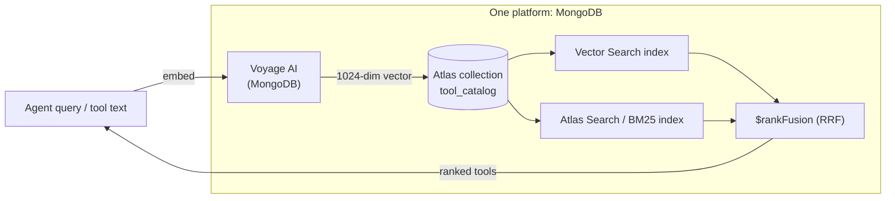
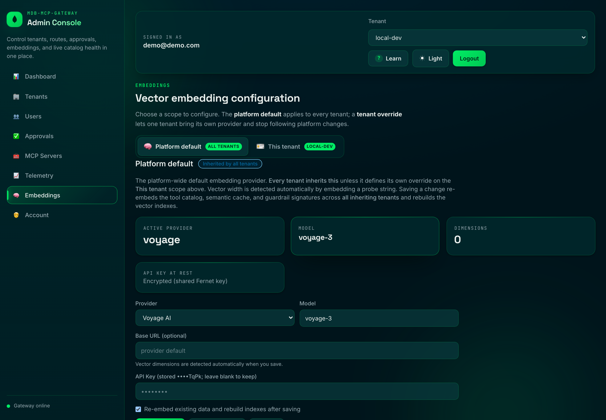

# Voyage AI in the MCP Gateway: one vendor, one query, one retrieval stack

> A masterclass on why this gateway runs its embeddings on **Voyage AI**, and how
> that choice closes the last gap in the project's core thesis: *the whole
> retrieval stack — embed, store, index, and fuse — lives on one platform.*

Voyage AI is **part of MongoDB** (MongoDB acquired Voyage AI and folded it into
the Atlas [AI Search and Retrieval](https://www.mongodb.com/products/platform/ai-search-and-retrieval)
platform). That single fact is why this isn't just "we picked an embedding
provider." It's the architectural punchline.

---

## 1. The thesis this completes

The rest of this repo argues one idea relentlessly (see [m-gate.md](m-gate.md) and
[blog.md](blog.md)): a tool call is a document, an embedding is "just an array of
floats" that belongs in the same document, and hybrid search collapses from *four*
systems (search engine + vector DB + fusion service + sync pipeline) down to **one
`$rankFusion` query on one Atlas collection**.

But there was always one piece sitting *outside* that collapsed stack: the
embedding model itself. You stored vectors in MongoDB, you fused them in MongoDB —
but the model that *produced* them was a third-party dependency from a different
vendor, with its own account, billing, SLA, and roadmap.

Voyage AI removes that seam. The model that turns text into vectors is now from the
same company as the database that stores them and the query engine that fuses them.



Embed -> store -> index -> fuse. Every arrow now lands inside MongoDB. That is the
"elegant fit": Voyage isn't bolted on, it finishes the diagram.

---

## 2. Where embeddings actually live in this gateway

Embeddings are not a single feature here — they are the connective tissue under
*three* surfaces, and **all three are produced by one Voyage model** so they share
one vector space:

- **`tool_catalog`** — every tool's name/description/server is embedded so an agent
  can route by meaning via hybrid search (`services/hybrid_search.py`).
- **`semantic_cache`** — expensive results are looked up by embedding similarity,
  not exact-match, so paraphrased calls hit cache.
- **`guardrail_signatures`** — the prompt-injection corpus is embedded so the
  semantic classifier can catch novel phrasings of known attacks.

Because one model feeds all three, a model change is a *data migration*, and the
gateway treats it as one (more on that in section 6).

---

## 3. How Voyage plugs in (no SDK, no special-casing)

The gateway reaches all cloud providers over plain HTTP behind one interface, so
Voyage is ~30 lines and shares the same cache, retry, and circuit-breaker
machinery as everyone else:

```332:366:services/embeddings.py
class VoyageEmbeddingService(BaseHttpEmbeddingService):
    """Voyage AI embeddings via ``POST /v1/embeddings``."""

    DEFAULT_BASE_URL = "https://api.voyageai.com/v1"

    def __init__(
        self,
        *,
        settings: Settings,
        model: str,
        api_key: str,
        base_url: str | None = None,
        dimensions: int = 0,
    ) -> None:
        super().__init__(settings=settings)
        self._model = model
        self._api_key = api_key
        self._base_url = (base_url or self.DEFAULT_BASE_URL).rstrip("/")
        self._dimensions = int(dimensions or 0)

    @property
    def model_id(self) -> str:
        return self._model

    @property
    def dimensions(self) -> int:
        return self._dimensions

    async def _request_embeddings(self, texts: list[str]) -> list[list[float]]:
        if not self._api_key:
            raise ValueError("Voyage AI API key is required.")
        headers = {"Authorization": f"Bearer {self._api_key}"}
        payload: dict[str, Any] = {"model": self._model, "input": texts}
        body = await self._post_json(f"{self._base_url}/embeddings", json=payload, headers=headers)
        return self._data_embeddings(body)
```

What you get for free by being a first-class provider:

- **No vendor SDK to pin or upgrade** — just `httpx` against the REST API.
- **Caching + retries + circuit breaker** from the shared base class, so a Voyage
  blip degrades gracefully instead of failing the request path.
- **Dimensions are detected, not declared.** The default model is `voyage-3`, and
  the vector width is measured by embedding a probe string on first use — so the
  Atlas vector index `numDimensions` can never drift out of sync with the data. If
  that probe ever fails for a cloud provider, the gateway **refuses to guess a
  width** (it never reuses Ollama's 768) and fails loudly on index-building paths,
  so a wrong-width index can never be created:

```22:29:services/embeddings.py
# Per-provider default model used when the operator does not pick one explicitly.
PROVIDER_DEFAULT_MODELS: dict[str, str] = {
    "ollama": "nomic-embed-text",
    "openai": "text-embedding-3-small",
    "azure_openai": "",  # Azure addresses a *deployment*, supplied separately.
    "voyage": "voyage-3",
    "gemini": "text-embedding-004",
}
```

- **Keys encrypted at rest.** The Voyage API key is stored Fernet-encrypted in the
  control DB (keyed by `EMBEDDING_SECRET`) and masked in every API response.
- **Runtime-swappable.** Provider/model/key are editable from the admin panel at
  `/ui -> Embeddings` (control DB wins over env), so you can move dev -> Voyage
  without a redeploy.

The admin panel makes the active provider obvious — here the platform default is
running on Voyage (`voyage-3`), with the key encrypted at rest:



---

## 4. The payoff: hybrid search where the model and the engine are the same vendor

The core retrieval is a single `$rankFusion` aggregation that runs a Voyage-vector
arm and an Atlas-BM25 arm and fuses them with Reciprocal Rank Fusion, server-side,
in one round trip:

```js
db.tool_catalog.aggregate([
  { $rankFusion: {
      input: { pipelines: {
        vectorPipeline:   [ { $vectorSearch: { index: "hybrid-vector-search", path: "embedding",
                                                queryVector: voyageEmbed(query), numCandidates: 100, limit: 20 } } ],
        fullTextPipeline: [ { $search: { index: "hybrid-full-text-search",
                                         text: { query: query, path: ["name","description","server"] } } },
                            { $limit: 20 } ]
      } },
      combination: { weights: { vectorPipeline: 0.5, fullTextPipeline: 0.5 } }
  } },
  { $project: { name: 1, description: 1, score: { $meta: "score" } } },
  { $limit: 5 }
])
```

The vector arm's recall (Voyage understands *intent*) and the lexical arm's
precision (BM25 nails *exact tokens* like tool names and IDs) cover each other's
blind spots. The point of this doc: **both halves are now MongoDB.** One vendor for
the model, the index, and the fusion math — one bill, one support contract, one
roadmap, and a model co-designed with the database it feeds.

---

## 5. Choosing a Voyage model

`voyage-3` (1024-dim) is the default and a great general choice. Voyage also ships
specialized and tiered models you can select per deployment (or per tenant) from
the admin panel; pick based on the axis you care about:

- **`voyage-3-lite`** — lower dimensionality / cost / latency. A strong fit for a
  small box (e.g. a 1 vCPU Render instance) where the query-time embed is on the
  hot path.
- **`voyage-3`** — balanced quality/cost default.
- **`voyage-3-large` / Voyage 4 series** — top retrieval accuracy when quality
  matters more than cost.
- **`voyage-code-3`** — code-domain model; relevant if your catalog grows
  code-heavy tool descriptions or you start embedding tool source.
- **`voyage-finance-2` / `voyage-law-2`** — domain models for vertical tenants.

Because dimensions are auto-detected and the index is rebuilt at the detected
width, switching models is a config change plus a background reprovision — never a
hand-edited index.

---

## 6. Operational model (what changes when you change models)

- **Every vector is stamped with its model identity** — `embedding_version` is
  literally `model_id:dimensions` (e.g. `voyage-3:1024`) — so lookups are
  version-aware and stale-space reads can't sneak in:

```50:51:services/embeddings.py
def embedding_version_for(service: EmbeddingService) -> str:
    return f"{service.model_id}:{service.dimensions}"
```

- **Changing provider/model auto-reprovisions everything** that depends on the
  vector space: re-embed every tenant's `tool_catalog`, drop/recreate the vector
  indexes at the new width, refresh the semantic cache, and re-embed the guardrail
  corpus. Search degrades to lexical-only while indexes rebuild (it never
  hard-fails), and progress is tracked at `GET /admin/embedding/status`.
- **Keep `EMBEDDING_SECRET` stable.** It encrypts the stored Voyage key; rotating
  it makes the saved key undecryptable and you'd re-enter it in the panel.
- **Resilience:** retries + circuit breaker + lexical fallback mean a Voyage outage
  drops you to BM25-only routing rather than taking the gateway down. The fallback
  is always lexical — the gateway never silently swaps in a *different* embedding
  model (e.g. Ollama), which would mix vector spaces and corrupt results.

---

## 7. Where this goes next (masterclass roadmap)

Two of these are grounded in the current code and are easy, high-leverage wins:

- **Use Voyage's `input_type` hint.** Today the request body sends only
  `{model, input}` (see `_request_embeddings` above, line 364). Voyage supports
  `input_type="document"` when embedding the catalog and `input_type="query"` when
  embedding a search — an asymmetry that measurably improves retrieval. Threading
  a `document`/`query` flag from the catalog-sync vs. search paths into the payload
  is a small, self-contained enhancement.
- **Add a Voyage reranker as a post-fusion stage.** RRF gives a strong fused
  ordering; a Voyage reranker over the top-K fused candidates would sharpen the
  final shortlist for hard queries — and, again, it's the *same vendor* as the
  store and the embedder, so it stays inside the one-platform story.
- **Per-tenant / domain models.** The embedding config is already tenant-aware;
  a code-heavy tenant could run `voyage-code-3` while others stay on `voyage-3`.
- **Multimodal tools.** Voyage's multimodal models open the door to embedding
  non-text tool artifacts (screenshots, diagrams) into the same catalog.

---

## 8. Quickstart (this repo)

The fastest path is the **Voyage drop-in**: set a single env var and the gateway
auto-selects *and* authenticates Voyage for you (no `EMBEDDING_PROVIDER` needed,
model `voyage-3`, vector width auto-detected). `docker compose` reads it straight
from your local `.env`, and Ollama is never contacted while the key is set.

```bash
VOYAGE_API_KEY=pa-...             # that's it — provider auto-resolves to voyage
```

After `docker compose up`, confirm it took in the admin panel at `/ui -> Embeddings`
(or `GET /admin/embedding`) — **active provider** should read `voyage`:


Equivalent explicit form (and what you set on Render/another host), still fully
overridable by the admin panel at runtime:

```bash
EMBEDDING_PROVIDER=voyage
EMBEDDING_MODEL=voyage-3          # 1024-dim; width auto-detected
EMBEDDING_API_KEY=pa-...          # explicit key wins over VOYAGE_API_KEY
EMBEDDING_SECRET=<stable-random>  # encrypts the stored key; set once, keep stable
```

Precedence is intentionally crisp so the active model is never ambiguous:

1. An **explicit** `EMBEDDING_PROVIDER` always wins — including `ollama`. Pinning a
   provider can never be silently flipped by a stray key.
2. With the provider **unset**, a lone `VOYAGE_API_KEY` auto-selects Voyage;
   otherwise the offline `ollama` default applies.
3. `EMBEDDING_API_KEY` wins over `VOYAGE_API_KEY`, and the Voyage key never leaks
   into another provider's config.

While Voyage is the resolved provider, **Ollama is never consulted or contacted** —
its `OLLAMA_*` settings (including width) are inert. Prefer `VOYAGE_API_KEY_FILE`
(or `EMBEDDING_API_KEY_FILE`) for secret mounts in production.

Then bootstrap so the catalog is embedded with Voyage and the indexes are built:

```bash
python -m scripts.bootstrap
```

Verify routing actually uses the vector arm:

```bash
curl -X POST http://localhost:8000/rpc \
  -H "Content-Type: application/json" \
  -d '{"jsonrpc":"2.0","id":"1","method":"tools/search",
       "params":{"query":"look up a purchase by its id","limit":3,"mode":"vector"}}'
```

See [DEPLOYMENT.md](DEPLOYMENT.md#configure-embeddings) for the full provider
reference and [PRODUCTION.md](PRODUCTION.md) for hardening.
