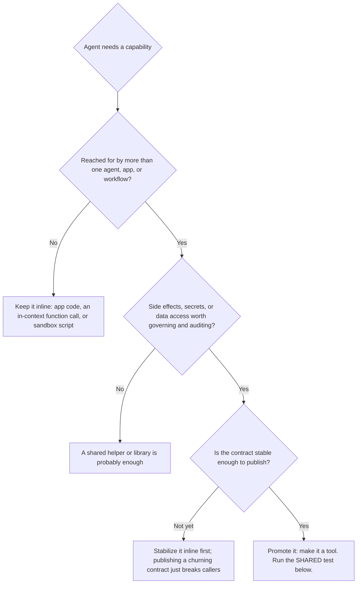

# A Tool Is a Microservice for Agents

### We've seen this movie before.

> A field guide for designing tools, servers, and catalogs for AI agents — and the argument for why this discipline pays off *now* more than it ever has. When to build a tool and when to just call a function, when to ship something portable, how to combine tools, and how to design a catalog the agent can actually find its way around.

Every hard problem in agent tooling is one that software has already solved once, under a different name. This guide makes that case in full and turns it into practice — a set of decisions you can apply on Monday, each one borrowed from an era that already learned the lesson the expensive way.

A note on the examples: throughout, the guide points at one concrete reference implementation — a hybrid-search MCP gateway backed by a document database — not because you need that exact stack, but because principles are cheap and a system you can point at is not. Read the gateway snippets as *proof the principle holds*, not as a dependency. The judgment is portable to any agent stack you build.

---

## 1. The pattern we've seen before

Here is the uncomfortable secret of the Model Context Protocol: almost none of its hard problems are new. We have lived this exact movie before — several times — and we already know how it ends.

Every era of software re-learns the same lesson about how to *package a capability* so other people can use it without re-implementing it. The ladder is always the same:

| Then (for humans and services) | Now (for agents) | The force driving it |
| --- | --- | --- |
| A **function** in your file | A step the model writes **in-context** | Don't repeat yourself |
| A **library** you import | A **reusable prompt / helper** | Share within a codebase |
| A **REST/RPC API** | An **MCP tool** | Share across a boundary |
| A **microservice** | An **MCP server** | Own a capability, deploy it |
| An **API gateway** | An **MCP gateway** | Govern many of them at once |

Read the two middle columns side by side and the resemblance stops being cute and starts being useful. The questions a backend team asked in 2015 — *should this be a function or a service? how granular should our endpoints be? how do we keep the API catalog discoverable? how do we stop the gateway from becoming a dumping ground?* — are the **exact** questions an agent-tooling team asks today. The nouns changed. The judgment didn't.

So the throughline of this whole guide is one line:

> **A tool is a microservice for agents.**

Treat it like one. Everything good we know about API and service design — single responsibility, stable contracts, honest side effects, discoverable catalogs, thin gateways — transfers directly. Everything we learned to *avoid* — god-services, chatty interfaces, leaky abstractions, catalog sprawl — transfers too. MCP didn't invent these problems. It inherited them, which is good news: we already have the answers.

That's the reassuring half. The next section is the urgent half — why the discipline that was merely *tidy* in the API era is *leverage* in the agent era, and why the cheapest time to apply it is right now. After that, the answers, in the order you'll need them.

---

## 2. The clock just sped up: why getting this right early wins

There's a temptation to file all of this under *good hygiene* — nice to have, worth doing once you get around to it. That framing was defensible when an agent called a tool the way a human clicks a button: occasionally, deliberately, one at a time. While tool calling today is often still sequential by default, that era is already ending, and the teams who haven't noticed are about to learn it from their token bills.

Watch a modern coding agent work — Cursor, Claude Code, the others — and you're watching the next decade in miniature. It doesn't read one file and wait. It reads ten at once. It runs a search, a test, and a type-check in parallel, fans the results into the next edit, and chains a dozen tool calls into one autonomous stretch without pausing for a human. The agent isn't a careful clicker anymore. It's a *scheduler* — issuing calls at machine speed, in parallel, down branching trees of possibility. That's not a research demo. It's shipping software, today.

And it is only getting faster. Every model generation widens the context window, lifts the rate limit, and lengthens the leash — more calls, more concurrency, deeper chains, less supervision between them. The number of times your tool gets invoked per unit of work isn't creeping up. It's compounding.

Here is the part that turns hygiene into leverage. **Every property of a tool gets multiplied by throughput.**

- A bloated 14k-token response isn't a one-time annoyance — it's 14k tokens times the fan-out, drowning a dozen parallel branches at once.
- A vague description isn't one wrong pick — it's a wrong pick propagated down a branching plan, where each bad choice seeds more bad choices beneath it.
- A tool that isn't safe to call twice isn't a rare double-write — it's a race the instant the agent retries a slow call while the first is still in flight, which under parallelism is *constantly*.
- A missing scope check isn't one quiet leak — it's a leak a tireless agent will find faster than any human pen-tester, because it's probing thousands of paths while you sleep.

The cost of a poorly designed tool used to be paid once, slowly, by one caller. It is now paid *per call* — and calls are heading up by orders of magnitude. Bad design no longer stays bad-but-bounded. It scales at exactly the rate the agent does.

Furthermore, **the client is no longer human.** We are entering an era where systems increasingly interact directly with AI instead of people. This shift is already visible in search and retrieval: when an LLM needs supporting documents or context, the queries it issues to a vector database or search engine are fundamentally different from what a human would type. They are distributed differently, they are highly structured, and they don't contain spelling mistakes. Designing a tool today means designing for a machine that interacts with your system in ways a human never would.

Now the good news, and it's the whole reason to be optimistic: **we have built systems for machine-paced, massively parallel, deeply chained calls before.** That is precisely what the move from hand-wired APIs to microservice meshes *was*. The disciplines that made that survivable — stable contracts, idempotency, backpressure, honest error semantics, thin gateways, real observability — aren't open research questions. They're a settled body of engineering knowledge, and they map onto agent tools almost line for line. You are not the first engineer to face thousands of concurrent callers hammering one interface. You're just the first to have an LLM holding the phone.

There's a sharper version of that lesson, learned in a sibling shift that rhymes with this one. When the industry moved from handcrafted server *pets* to immutable *cattle* — machines you regenerate on a whim instead of nursing by hand — the surprise was that cheaper, faster regeneration demanded **more** discipline, not less. Once a box was disposable, *mutation became the enemy of understanding*, and rigor relocated: away from babying the server, toward defining what "correct" meant and proving it continuously. Charity Majors makes exactly this case for the AI era — [AI demands *more* engineering discipline, not less](https://charitydotwtf.substack.com/p/ai-demands-more-engineering-discipline). The reflex when tools suddenly get good — *the agent writes the implementation now, why sweat the contract?* — is precisely backwards. Cheap implementation **raises** the value of a sharp contract; it never lowers it. (We'll follow that thread to its conclusion in Section 11.)

Which makes the winning move the *cheap* one — and it's only available right now, during adoption. **Design the tool well while you have five tools and one agent, not five hundred tools and a fleet.** A clean contract costs you an afternoon today. Retrofitting one onto a tool a parallel agent already calls ten thousand times an hour is a *migration*: versioning, dual-running, breaking changes you have to coordinate across every caller that grew to depend on the old shape. Adoption is the single cheapest moment in the entire lifecycle to set the contract — and it's the one moment you only get once.

So the thesis of this guide isn't "be tidy." It's this: the agents are about to call your tools far more, far faster, and far more in parallel than they do today, and the bill for every design decision scales right alongside them. The discipline that controls that bill already exists — we earned it the last time call volume exploded. Spend it early and it compounds in your favor. Skip it and it compounds against you, at exactly the rate the models improve.

> **Design for the agent you'll have in eighteen months, not the one you're demoing today.** It will be faster, more parallel, and less supervised — and it will treat your tool's contract as law. Write a contract worth obeying, while it's still cheap to write.

---

## 3. Tool, or just a function call?

The first and most over-thought decision. Teams reach for an MCP tool the moment a capability appears, the same way teams once reached for a microservice the moment a noun appeared. Both instincts are wrong, and for the same reason: most capabilities don't need to cross a boundary.

If the model can accomplish something by reasoning, by writing a few lines in a sandbox, or by your application calling its own code, **that is not a tool** — it's a function call, and it should stay one. Tools are how an agent reaches across a boundary to a capability it cannot or should not own itself. Reaching across a boundary has a cost: a schema in the prompt, a round trip, a thing to version, a thing to secure. You pay that cost for a reason, not by reflex.

The cheapest way to keep yourself honest is the **rule of three**:

> **Inline once, helper twice, tool thrice.**

The first time you need a capability, write it inline. The second time, factor it into a shared helper. Only the third time — when it's clearly something multiple callers reach for and re-implementing it keeps hurting — do you promote it to a tool. Premature toolmaking is the agent-era version of premature microservices: you pay the boundary tax forever to save a cost you only imagined.



Notice the tree never asks "is it useful?" Everything is useful. It asks whether the capability has crossed the threshold where the *boundary itself* earns its keep — reuse, governable side effects, a contract worth publishing. Below that line, simpler is genuinely better, and that's by design.

---

## 4. The SHARED test

So you've decided a capability belongs on the far side of a boundary. The next question is whether it deserves to be a *shareable, portable service* — a real MCP tool that other agents and other teams can adopt — or whether it's just internal plumbing wearing a tool costume.

A capability is ready to ship when it is **SHARED**:

- **S — Stable contract.** Its inputs and outputs are well-defined and won't churn on every call. If the shape is still moving weekly, it's app logic that hasn't settled, not a tool. Publishing it just hands your instability to everyone downstream.
- **H — Headless.** It is callable by a machine with no human-in-the-loop assumptions: declared, typed inputs and structured outputs. "Open a dialog and wait for a click" is not a tool. "Return the data the dialog would have shown" is.
- **A — Auditable side effects.** It does something worth governing — writes data, spends money, sends a message, touches the outside world. A pure, trivial transform rarely needs to be a tool; the model can just do it. The moment an action has *consequences*, you want it behind a boundary where it can be authorized, logged, and rate-limited.
- **R — Reusable.** More than one agent, workflow, or application would reach for it. This is the single strongest signal — reuse is the entire reason boundaries exist. One caller forever? Keep it inline.
- **E — Encapsulated.** It hides its own credentials, state, and complexity behind the contract. The caller says *what* it wants, never *how* — no passing in API keys, no leaking the database connection, no "set this global first." If the caller has to understand your internals, you haven't built a tool, you've built a leak.
- **D — Discoverable.** It can be described well enough that another agent finds it by intent, not just by knowing its exact name. If you can't write a one-line description that distinguishes it from its neighbors, the agent won't be able to either (more on this in Section 7).

The punchline:

> **If it's SHARED, ship it.** If it misses a letter, you've found the work to do before you publish — or the reason it should stay a plain function call.

Portability is the quiet payoff of passing the test. A tool that is genuinely SHARED isn't welded to one runtime. In the reference implementation, that's literal: a tool authored inside the gateway can be exported as a self-contained, runnable [FastMCP](https://github.com/jlowin/fastmcp) project that runs *unmodified* outside it. A tool that can't be lifted out of its host was never really a service — it was a function with extra steps.

---

## 5. Designing the tool: contract first

Once it's a tool, it's an interface other people build on. Borrow the API-design discipline wholesale.

**Single responsibility.** One tool, one job, named for that job. `get_current_weather` and `get_forecast` beat one `weather` tool with a `mode` flag, because the agent selects tools by *meaning*, and two clear meanings rank better than one fuzzy one. This is the "small, focused endpoint" lesson, re-learned.

**Declare your inputs; structure your outputs.** Typed, named parameters with descriptions — not a single `payload: string` the model has to guess the shape of. Return structured objects, not prose the next step has to re-parse. The model is your client; write the contract for a client.

**Be honest about what it does.** Side effects are part of the contract, not an implementation detail. This gateway makes that explicit with `action_type`, declared per tool:

- `read` — safe, no mutations.
- `write` — inserts/updates.
- `destructive` — deletes and irreversible actions.

That single field drives real enforcement (the sandbox DB bridge refuses operations above a tool's declared level) and is exactly the kind of honesty an agent needs to reason about risk. For the genuinely dangerous ones, gate execution behind human approval (`metadata.requires_confirmation`) rather than hoping the model is careful. Declaring a destructive tool as `read` to "keep it simple" is the tool-design equivalent of a `GET` that deletes records — the bug that launched a thousand incident reviews.

**Mind the output, not just the input.** Token bloat has two halves, and most people only watch one. A tool that dumps a 14,000-token raw API response back into the context window is as harmful as a bloated catalog — it just fails on the way out instead of the way in. Return the distilled answer: drop nulls, cap arrays, truncate oversized strings, and always leave an escape hatch (`truncated: true`, a `next_cursor`) so the agent can ask for more if it actually needs it. Trim what you send *and* what you return.

**Fail in the protocol, not around it.** When something goes wrong, return a structured error the agent can reason about — a code, a message, and machine-readable `data` — not a raw stack trace or a silent empty result. A good error tells the model whether to retry, pick a different tool, or give up and explain. (The reference gateway normalizes downstream failures into standard JSON-RPC error frames for exactly this reason.)

**Make it safe to call twice.** This is the principle that quietly becomes load-bearing as agents parallelize (Section 2). An agent that retries a slow call, or fans out a plan across branches, *will* invoke your `write` tool more than once with the same intent — not occasionally, but routinely. A read is naturally idempotent; a write is not, unless you make it so. Accept an idempotency key, dedupe on a natural identifier, or design the operation as an upsert so the second call is a no-op instead of a second charge. The human-paced world got away with ignoring this because retries were rare and serial. The machine-paced world does not, because they're constant and concurrent.

---

## 6. Combining tools: compose, don't conglomerate

The instinct when a workflow needs five steps is to build one tool that does all five. Resist it. That's how you get the god-service — the 2015 mistake with a 2026 logo.

**Prefer many small tools that compose over one big tool that does everything.** Small, single-purpose tools are easier to describe (so they rank better), easier to reuse (so they earn their boundary), and easier to recombine into workflows you didn't anticipate. A `track_click` tool and a `get_click_stats` tool are worth more apart than a `manage_clicks` tool is worth together, because the next workflow only needs one of them.

Then you have a choice the microservice world named long ago:

- **Choreography** — let the agent chain the tools itself, deciding each next step from the last result. Maximally flexible; costs a round trip and some context per hop.
- **Orchestration** — a higher-level tool calls the smaller ones internally and returns one consolidated result. Fewer hops, less context churn, a cleaner contract for common paths — at the cost of a little flexibility.

Use choreography for open-ended exploration; use orchestration for the well-trodden multi-step paths you already know agents take. This choice gets *more* consequential as agents parallelize (Section 2): choreography's per-hop cost — a round trip, a slice of context — is paid every time, and a faster agent simply pays it more often and across more branches. Collapsing a known five-step path into one orchestrated tool doesn't just tidy the contract; it removes four round trips that would otherwise multiply across every concurrent branch that walks that path. In the reference gateway, server-side orchestration is first-class: a code tool can call its siblings in the same tenant via `context.tools`, so you compose small tools into a workflow with no glue service and no extra network hops:

```python
def track_and_report(target: str, source: str = "web") -> dict:
    recorded = context.tools.analytics.track_click(target=target, source=source)
    stats = context.tools.analytics.get_click_stats(limit=5)
    return {"recorded": recorded, "leaderboard": stats.get("top_targets", [])}
```

The thing that keeps this from becoming a back door: every composed call is **re-authorized**. A sibling call is re-checked against the *original* caller's scopes, restricted to code tools in the same tenant, refuses confirmation-gated tools, and is bounded by a depth and call budget so nothing can fan out or recurse forever. Composition without re-authorization is just privilege escalation with nicer syntax — the gateway treats an internal hop with the same suspicion as a front-door call.

> **Rule of thumb:** a tool should do one thing; a *workflow* combines tools. If you're tempted to add a sixth parameter that changes what the tool fundamentally *is*, you wanted two tools.

---

## 7. Designing the catalog: the description is the API

Here's the part that has no real pre-agent equivalent, and the part teams most underestimate. In the old world, a developer read your API docs, understood them, and wrote integration code once. In the agent world, the **catalog entry itself is the integration** — the model decides whether to call your tool based on nothing but its name and description, fresh, on every single turn.

It's also where the loudest complaint about MCP turns out to be misdirected. Teams burned by "MCP token bloat" — an official server that injects its entire binder on connect, ~90 tools and 20k-plus tokens before the agent does one useful thing — are blaming the *protocol* for an *implementation* choice. MCP never said "send the whole menu every turn." Handing over the full catalog up front is the modern equivalent of `SELECT *` on a million-row table to answer a single lookup: the query language was never the problem — *asking for everything* was. And the fix is the one databases settled decades ago — retrieve what you need. Lazy-load a tool's detail only when the agent reaches for it, or treat selection as a search (AWS's Bedrock AgentCore now ships semantic tool search as a checkbox). Either way the move is identical: stop dumping the binder, and let the agent query the catalog the way you'd query any other large collection.

That changes how you write. The catalog isn't documentation that describes the tool; it's the *retrieval surface* the agent searches. And good gateways search it with **hybrid retrieval** — a lexical (BM25) arm that matches exact tokens fused with a semantic (vector) arm that matches intent (the reference gateway does it in a single fused query). Design every entry to feed *both* arms:

- **Name for the lexical arm.** Put the exact, identifier-shaped tokens here — `find_order`, `get_current_weather`. This is what a query like "call `find_order`" or "look up order A-417" latches onto. Names should be specific and literal, not clever.
- **Describe for the semantic arm.** Write the description in the *user's* language of intent — the words someone would use when they don't know your tool exists. `find_order` should describe itself as "look up a customer purchase by its order ID," because that's what the agent's query will sound like, and that's what the embedding matches against. Keep in mind that **agent-generated queries differ from human queries**: they are often more precise, lack spelling mistakes, and are structured around the context they are trying to retrieve. Your descriptions should be rich enough to match this machine-level precision.

> **The description is the API.** Write it for the search, not for the spec sheet.

A worked contrast:

```jsonc
// Weak: the agent can't find this, and can't tell it apart from its neighbors.
{ "name": "proc1", "description": "Processes the request." }

// Strong: literal name for lexical match, intent-rich description for semantic match.
{
  "name": "find_order",
  "description": "Look up a customer purchase by its order ID. Returns status, line items, and totals. Use when a user asks about an existing order, receipt, or purchase.",
  "scopes": ["orders", "readonly"],
  "metadata": { "action_type": "read" }
}
```

A few more catalog principles, all of them lessons re-learned from API catalogs:

- **Granularity is discoverability.** Many small, sharply-described tools out-rank a few broad ones, because each has a clear meaning to match against. Catalog sprawl is real, but vague mega-tools are worse — the agent picks the *plausible* tool instead of the *right* one.
- **Metadata is routing, not decoration.** `scopes` aren't just for security; in this gateway they're pushed *into* the search query, so a caller who lacks a scope never even sees the tool — you can't mis-route to what you can't discover. Tag tools with the metadata your gateway can route on.
- **Version and deprecate deliberately.** A tool's contract is a promise. Changing inputs/outputs under a stable name breaks callers silently. Introduce `v2`, deprecate `v1` in its description, and let the catalog carry both during the transition — same as you'd version an API.
- **Pin sparingly.** Most gateways let you force a tool to appear on every turn regardless of relevance (here, `metadata.always_included`). It's the right tool for a house help/policy tool — but every pin is a schema the agent pays for on *every* call. Pins spend the prompt budget; treat them like a standing cost, not a free feature.

---

## 8. Anti-patterns (the ones you'll actually hit)

A quick do/don't, each a familiar ghost from the API era:

| Anti-pattern | What it looks like | Do this instead |
| --- | --- | --- |
| **The god-tool** | One `manage_*` tool with a `mode` flag that changes everything it does | Split by meaning into single-purpose tools |
| **The chatty tool** | A workflow that forces 6 round trips for one outcome | Orchestrate the common path server-side |
| **The leaky tool** | Caller must pass credentials, set globals, or know internals | Encapsulate; the contract says *what*, never *how* |
| **The lying description** | "Processes data" — vague, or worse, doesn't match behavior | Describe real intent in the user's words |
| **The duplicate** | Three near-identical tools nobody can choose between | Consolidate, or sharpen each description to disambiguate |
| **The unguarded blade** | A `destructive` action declared `read`, no confirmation | Declare `action_type` honestly; gate with confirmation |
| **The payload dump** | Returns the raw 14k-token upstream response | Distill output; cap, truncate, paginate with an escape hatch |

If a tool exhibits two or more of these, it usually means it failed the SHARED test (Section 4) and got shipped anyway.

---

## 9. When *not* to reach for any of this

Best practices include knowing when the practice doesn't apply. Don't build tools — or stand up a gateway — when the situation doesn't earn it:

- **One or two tools, one agent.** The schemas fit in the prompt; just connect directly. A gateway's machinery (search, sandbox, catalog, audit) is overhead you don't need yet.
- **The capability is pure reasoning.** If the model can just *do* it, a tool only adds a round trip and a thing to maintain.
- **You need hard fault isolation.** A shared front door is a shared dependency. A tool that must stay up when everything else is down belongs on its own connection.

The gateway pattern — and most of this guide — earns its complexity at *scale and multiplicity*: many tools, many agents, real security and audit requirements. Below that threshold, simpler wins. The honest test is the one from Section 2 inverted: if the agents calling your handful of tools aren't going to multiply, parallelize, or chain in ways that make a thin direct connection painful, you don't yet need the machinery. Build it the day the call volume tells you to, not before.

---

## 10. Keep the surface area small: the gateway is just documents

If Section 9 was about *whether* to build a gateway, this is about *how* — and it's the oldest lesson in distributed systems: **every system you add is a system you have to operate.** Scale it, secure it, back it up, monitor it, and — worst of all — keep it in sync with the others. The API era learned this the hard way when one "simple" service quietly spawned a search cluster, a cache, a vector store, and a warehouse, all lashed together by sync jobs that drifted apart at 3 a.m. The agent era is walking the same path, only faster.

Look at what a gateway actually has to store: a **registry** of tools and servers, the **config** and scopes that govern them, the **search** indexes that route to them (lexical *and* vector), the **telemetry** that measures them (latency and token cost — naturally time-series), the **audit history** of every call, and often the **secrets** for downstream auth. Build that the obvious way and you've stood up five or six different databases, each understanding only a slice of the problem, reconciled by glue nobody wanted to write.

Here's the move — the same realization that runs through this whole guide: **those aren't five kinds of data. They're one shape, viewed many ways.** A tool call is a document. A tool definition is a document. An embedding is an array of floats — native JSON. A scope is a field. A latency sample is a document in motion; the audit trail is the same document at rest. The fragmentation was never inherent to the problem. It was an artifact of storing one shape across engines that each spoke only part of it.

That's why the document model feels less like a design choice and more like the *quietly inevitable* one — and why the reference implementation runs on MongoDB. The shape of an MCP request is nested, polymorphic, and self-describing — the shape of a document — and native BSON maps onto polymorphic tool schemas with no rigid migration in sight. A new server arriving tomorrow with a twelve-field config object is a *drop-in*, not an `ALTER TABLE` and a held breath. Once the catalog lives there, everything else a gateway needs rides the same engine: hybrid search (lexical + vector fused in one query), time-series telemetry for latency and cost, Queryable Encryption for downstream secrets, graph lookups for tool relationships, history for replay. Not five products in uneasy lockstep — one operational model.

And that's the payoff that's easy to undervalue until you're the one paged for it: not a feature you bought, but **surface area you no longer have to operate, reason about, or keep from quietly drifting apart.** It's the thin-gateway principle (Section 1) applied one level down, to storage — the fewer moving parts between an agent and its tools, the less there is to fail, to secure, and to explain at 3 a.m. You don't earn that by being clever. You earn it by storing the protocol in the shape it already has.

---

## 11. The implementation is disposable; the contract is not

One more shift is bearing down on tool design, and it's the one that turns this guide from good advice into survival gear: **the agent is going to write — and rewrite — your tools' implementations.** Cheaply, constantly, and soon. Which forces a question every team will face shortly: in a world where the code behind a tool is regenerable on demand, what exactly are you committing to?

Chad Fowler's answer — the one Charity Majors built her case on — is that regenerable code stops being an asset and starts behaving like a cache: *"a materialized view of understanding, useful while current, disposable when stale."* He offers a test worth stealing wholesale, the **Deletion Test**: imagine deleting the entire implementation. The reason that feels unthinkable is rarely the code itself — it's that you don't know the required behavior, the invariants that must hold, or how you'd tell a correct rewrite from a broken one. Those aren't code problems. They're *evaluation* problems. And code only feels precious when it's the **only** place that knowledge lives.

A well-designed tool is the cure, because it moves the knowledge out of the implementation and onto the boundary. Look back at what this guide has asked you to make explicit: a stable contract (Section 4), honest and declared side effects (Section 5), an idempotency guarantee (Section 5), a description that states intent (Section 7), an audit trail of every call (Section 10). Those are exactly the commitments that have to survive when the code beneath them is thrown away and regenerated — the *spec* a new implementation must still satisfy, the thing you review *instead of* the two hundred lines nobody should have to read. A tool whose implementation you can delete and regenerate without fear is a tool you genuinely understand. A tool you're afraid to delete is one whose contract you never actually wrote down.

This is also where rigor goes once it leaves the code. Human brains are poor validators — nitpicky, forgetful, lulled by repetition — and a parallel agent emitting implementations will outrun any human quality gate. So you stop betting on review-by-reading and start betting on *evidence*: the audit trail is your eval set, every recorded call a labeled example of whether the regenerated tool still honors its contract. Test in production, because production is where the contract is actually kept. That isn't a lowering of standards. It's relocating them to where they can be enforced at machine scale — the same move the pets-to-cattle shift forced on infrastructure, now forced on the tools themselves.

And none of it makes the promise soft. The caller may be nondeterministic; the contract must not be. Nobody wants a payment that completes *most* of the time, or a tool whose behavior quietly drifts between regenerations. **Make the implementation disposable so the contract can be absolute.** That's the discipline the next era rewards — and, true to the rest of this guide, it's one we already earned the last time the cost of producing the artifact fell through the floor.

---

## 12. The throughline

A tool is a microservice for agents. That one analogy carries almost everything in this guide: promote a capability across a boundary only when reuse and governable side effects earn it (the rule of three, the SHARED test); design the contract like an API (single responsibility, honest side effects, idempotent writes, disciplined payloads); compose small tools instead of conglomerating big ones; treat the catalog as a retrieval surface where the description *is* the API — and query it for what you need instead of dumping the binder; run the whole thing on as few moving parts as the data allows, because it was always just documents; and write the contract to outlive the implementation, because the code behind a tool is becoming disposable and the promise is the part that must endure. None of it is new. We've seen this movie before — we just have new actors.

And the new actors are getting faster. That's the whole reason to act now rather than later (Section 2): the agent calling your tools today is the slowest, most cautious, most serial version of it you will ever ship against. Tomorrow it calls more, in parallel, with longer chains and less supervision — and every design decision you make is a coefficient that gets multiplied by that throughput. The discipline in this guide is how you make the coefficient work for you. It isn't speculative; it's the same discipline that carried us through the last time call volume outran human pace. We paid for those lessons once. The move is to spend them early, while a clean contract still costs an afternoon instead of a migration.

If you want the engineering underneath the examples — why a tool call was always a document, how hybrid search fuses keyword and meaning in one query, how scope and audit ride the same rails — that's the subject of the companion essays this guide travels with. But you don't need them to start. You need the judgment, and the judgment is here.

Build the tool the agent can find, trust, and reuse — and build it now, while it's cheap. The rest is plumbing you've already learned how to lay.

---

## Appendix · The new SQL injection: the model is an untrusted client

If this guide had a villain, here is its origin story — and, fittingly, we've seen this one before too.

In 1998 the industry learned the hard way never to concatenate user input straight into a database query. SQL injection wasn't exotic; it was the *default* mistake, and it took a decade of breaches to make "parameterize your queries" reflexive. In 2026 we are relearning the identical lesson one layer up: never feed an agent-generated string into an executable system as though the agent vouched for it.

There's a psychological trap baked into the architecture, and it's worth naming because it's smart engineers who fall into it. Because the agent is "intelligent," follows your system prompt, and speaks in fluent intent, it *feels* like a trusted backend component — a colleague calling your service. It is nothing of the sort. **The agent is an untrusted client, and its tool payloads are user input.** Every byte it hands you came, ultimately, from somewhere you don't control.

That's not paranoia; it's the threat model. Agents read the open world — web pages, pull requests from strangers, customer emails, search results — which makes them structurally susceptible to prompt injection. An attacker doesn't need to breach your network. They just need to leave a malicious instruction somewhere your agent will read it, and let the agent carry the payload across your beautifully designed tool boundary *for* them. The agent is the confused deputy; your tool is the door it's been talked into opening. A `search_database` tool that interpolates a query string, or a `run_script` tool that executes agent-authored bash outside a hermetic sandbox, is not a tool. It's a remote-code-execution vulnerability with a friendly description — and you handed the model the keys.

The reassuring part is the reassurance that runs through this entire guide: **we already built the defenses, for exactly this caller, a long time ago.** They are the disciplines of the public-facing web API, and they transfer without translation.

- **Validate strictly at the boundary — content, not just shape.** Schema validation (`user_id` is an integer) is the floor, not the ceiling. Validate the *content*: prefer strict enums over open-ended strings, bound lengths and ranges, and reject payloads carrying shell metacharacters, stray line breaks, or escape sequences the tool has no business receiving. It's the input-side twin of the output discipline in Section 5 — distrust what crosses the wire in *both* directions.
- **Parameterize, never interpolate.** If your tool fronts a database, a system shell, or a downstream API, treat the agent's arguments exactly like data from an anonymous web form, because that is precisely what they are. Bind parameters; never build a command by gluing strings around agent-supplied values. The 1998 fix is the 2026 fix, unchanged.
- **Enforce isolation in the tool, not the prompt.** You cannot instruct an agent "only touch Tenant A's data" and call that a security boundary — a prompt is a suggestion, not a sandbox. The tool must derive the *verified* execution context (who is the human behind this agent?) and enforce, in code, that the requested action is permitted for that identity, no matter how sweetly the agent asks. This is why the reference gateway binds scope to a verified token rather than a self-asserted header, and why every composed sibling call is *re-authorized* against the original caller (Section 6): composition without re-authorization is privilege escalation with nicer syntax.

Look closely and this is just the dark mirror of the SHARED test's **A** and **E** (Section 4). "Auditable side effects" and "Encapsulated" were never mere tidiness — they were the security boundary all along. A tool that declares its `action_type` honestly, gates the dangerous path behind confirmation, and refuses to act outside the caller's verified scope is a tool an injected prompt simply *cannot* weaponize, because the dangerous capability was never reachable by asking nicely in the first place.

And recall the multiplier from Section 2: this untrusted client doesn't rattle your doorknob once and go home like a human attacker. It probes at machine speed, in parallel, tirelessly — and it will find the one tool you left interpolating strings faster than any pen-tester on the payroll.

> **An agent is a brilliantly articulate, endlessly gullible user that executes at machine speed.** Do not trust it to govern itself. Put the boundary where it has always belonged — inside the tool's contract, validating every byte that crosses the wire.
